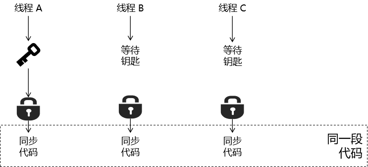

# 第一节 synchronized

## 1、基本工作机制




## 2、同步方法和同步代码块区别

同步方法示例如下：

```java
public synchronized int sum(int i, int j) {
    return i + j;
}
```


同步代码块示例如下：

```java
    public int sum(int i, int j) {

        int result = 0;

        synchronized (this) {
            reuslt = i + j;
        }

        return reuslt;
    }
```


所以它们的区别体现在两个方面：

|          | 同步方法（非静态） | 同步方法（静态）  | 同步代码块         |
| -------- | ------------------ | ----------------- | ------------------ |
| 锁定范围 | 整个方法体         | 整个方法体        | 代码块范围内       |
| 锁定对象 | this               | 当前类的Class对象 | 可以由程序员来指定 |


## 3、锁定对象相关测试

### ①第一种情况

- 两个线程访问同一个对象的两个非静态同步方法。

> 结果：按照调用的顺序执行。
>
> 原因：两个非静态同步方法被调用时，都需要用this来开锁。在两个线程中的this都指向同一个对象，也就是当前对象。所以第一个方法如果不执行完，不释放this（开锁的钥匙），那么第二个方法就不能拿this去开锁，就需要一直等着。


#### [1]主体程序

```java
public class Demo05Sync {

    public synchronized void method01() {

        try {TimeUnit.SECONDS.sleep(1);} catch (InterruptedException e) {}

        System.out.println("非静态同步方法一执行");
    }

    public synchronized void method02() {
        System.out.println("非静态同步方法二执行");
    }

}
```


#### [2]测试程序

```java
// 1、创建 Demo05Sync 的一个对象
Demo05Sync demo05Sync = new Demo05Sync();

// 2、创建并开启两个线程

try {TimeUnit.SECONDS.sleep(1);} catch (InterruptedException e) {}

new Thread(()->{

    demo05Sync.method01();

}).start();

new Thread(()->{

    demo05Sync.method02();

}).start();
```


### ②第二种情况

- 线程A：访问同步方法，睡4秒
- 线程B：访问非同步方法

> 结果：线程B先打印数据
>
> 原因：两个线程不存在竞争关系，线程B访问非同步方法，不需要等待锁释放，可以直接执行。


#### [1]主体程序

```java
public class Demo05Sync {

    public synchronized void method01() {

        try {TimeUnit.SECONDS.sleep(4);} catch (InterruptedException e) {}

        System.out.println("非静态同步方法一执行");
    }

    public void method02() {
        System.out.println("非静态非同步方法二执行");
    }

}
```


#### [2]测试程序

```java
// 1、创建 Demo05Sync 的一个对象
Demo05Sync demo05Sync = new Demo05Sync();

// 2、创建并开启两个线程
try {TimeUnit.SECONDS.sleep(1);} catch (InterruptedException e) {}

new Thread(()->{

    demo05Sync.method01();

}).start();

new Thread(()->{

    demo05Sync.method02();

}).start();
```


### ③第三种情况

- 线程A：对象A调用同步方法A，睡4秒
- 线程B：对象B调用同步方法B，不睡

> 结果：先看到线程B的打印
>
> 原因：两个线程调用的方法都需要开锁，但是它们各自拿着自己的钥匙，可以自己开锁，不必等别人释放锁。


#### [1]主体程序

```java
public class Demo05Sync {

    public synchronized void method01() {

        try {TimeUnit.SECONDS.sleep(4);} catch (InterruptedException e) {}

        System.out.println("非静态同步方法一执行");
    }

    public synchronized void method02() {
        System.out.println("非静态同步方法二执行");
    }

}
```


#### [2]测试程序

```java
// 1、创建 Demo05Sync 的两个对象
Demo05Sync demo05Sync01 = new Demo05Sync();
Demo05Sync demo05Sync02 = new Demo05Sync();

// 2、创建并开启两个线程
try {TimeUnit.SECONDS.sleep(1);} catch (InterruptedException e) {}

new Thread(()->{

    demo05Sync01.method01();

}).start();

new Thread(()->{

    demo05Sync02.method02();

}).start();
```


### ④第四种情况

- 线程A：类名调用静态同步方法A，睡4秒
- 线程B：类名调用静态同步方法B，不睡

> 结果：先看到A线程的打印
>
> 原因：调用静态同步方法时，需要使用类.class对象来开锁。第一个线程释放锁，第二个线程才能拿到锁去执行方法。


#### [1]主体程序

```java
public class Demo05Sync {

    public static synchronized void method01() {

        try {TimeUnit.SECONDS.sleep(4);} catch (InterruptedException e) {}

        System.out.println("非静态同步方法一执行");
    }

    public static synchronized void method02() {
        System.out.println("非静态同步方法二执行");
    }

}
```


#### [2]测试程序

```java
// 创建并开启两个线程
try {TimeUnit.SECONDS.sleep(1);} catch (InterruptedException e) {}

new Thread(()->{

    Demo05Sync.method01();

}).start();

new Thread(()->{

    Demo05Sync.method02();

}).start();
```


### ⑤总结

| 静态同步方法           | 非静态同步方法 |
| ---------------------- | -------------- |
| 用『类.class对象』开锁 | 用『this』开锁 |


在调用方法时，根据下面的思路来判断：

- 首先判断方法是否上锁
  - 没上锁：直接执行
  - 上了锁
    - 开锁钥匙类型
      - 类.class
      - this
    - 检查钥匙在谁的手里
      - 在自己手里：直接开锁
      - 在别人手里：等


[回目录](index.html) [下一节](verse02.html)