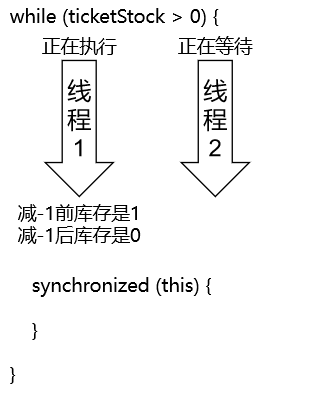
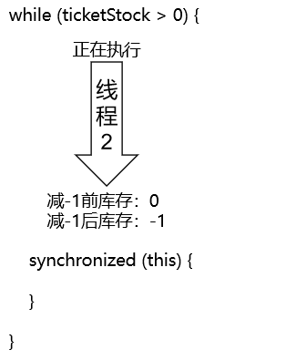

# 第二节 卖票

## 1、完全不加锁的情况

```java
public class SaleTicketDemo01NoLock {

    public static void main(String[] args) {

        // 1.创建Ticket对象，作为各个线程争抢的资源
        Ticket ticket = new Ticket();

        // 2.开启5个线程，在5个线程中分别执行卖票操作
        for (int i = 0; i < 5; i++) {

            new Thread(()->{

                ticket.saleTicket();

            }, "thread" + i).start();

        }

    }

}

class Ticket {

    private int ticketStock = 100;

    public void saleTicket() {

        while (ticketStock > 0) {

            try {
                TimeUnit.MILLISECONDS.sleep(100);
            } catch (InterruptedException e) {
                e.printStackTrace();
            }

            System.out.println(Thread.currentThread().getName() + " 现在还有" + (--ticketStock) + "张票");
        }

    }

}
```


当前情况的问题：

- 重复数据
- 库存出现负数

> thread3 现在还有10张票
> thread0 现在还有9张票
> thread2 现在还有9张票
> thread3 现在还有8张票
>
> ……
>
> thread1 现在还有2张票
> thread3 现在还有1张票
> thread2 现在还有0张票
> thread0 现在还有-1张票
> thread3 现在还有-2张票
> thread1 现在还有-3张票
> thread4 现在还有-4张票


## 2、在while里面加锁

```java
while (ticketStock > 0) {
    synchronized (this) {
        try {
            TimeUnit.MILLISECONDS.sleep(100);
        } catch (InterruptedException e) {
            e.printStackTrace();
        }

        System.out.println(Thread.currentThread().getName() + " 现在还有" + (--ticketStock) + "张票");
    }
}
```

运行结果：前面提到的线程安全问题仍然存在。


原因分析：线程 2 完成了 while 的条件判断之后，进入 while 遇到了同步锁，开始等等执行时机；然后等轮到线程 2 执行时，库存已经被减到 0 了；同时，线程 2 也不需要做 while 的条件判断，在库存为 0 的基础上继续 -1。






## 3、用同步代码块把while包起来

```java
synchronized (this) {
    while (ticketStock > 0) {
        try {
            TimeUnit.MILLISECONDS.sleep(100);
        } catch (InterruptedException e) {
            e.printStackTrace();
        }

        System.out.println(Thread.currentThread().getName() + " 现在还有" + (--ticketStock) + "张票");
    }
}
```


这么修改之后，确实没有线程安全问题了，但是也完全没有体现出多线程并发执行的效果。

> 原因：第一个线程把所有任务都完成了，其他线程没有任务可做了。


## 4、修改代码，多线程协同卖票

解决办法：

- 在卖票的方法中不进行循环
- 调用一次卖票的方法只卖一张票，而且是在同步代码块中
- 在线程中执行循环

```java
public class SaleTicketDemo02Synch {

    public static void main(String[] args) {

        // 1.创建资源对象：TicketSynch（被各个线程锁争抢的资源对象）
        TicketSynch ticket = new TicketSynch();

        // 2.创建5个线程
        for (int i = 0; i < 5; i++) {

            new Thread(()->{

                // 3.在线程内部循环卖票
                for (int j = 0; j < 22; j++) {

                    // 4.调用卖票方法
                    ticket.saleTicket();
                }

            }, "thread"+i).start();

        }

    }

}

class TicketSynch {

    // 车票的库存数量
    private int tickectStock = 100;

    // 声明一个卖票的方法
    public void saleTicket() {

        // 使用同步代码块给代码加锁
        synchronized (this) {
            if(tickectStock > 0) {

                try {
                    TimeUnit.MILLISECONDS.sleep(100);
                } catch (InterruptedException e) {
                    e.printStackTrace();
                }

                System.out.println(Thread.currentThread().getName() + " 现在正在出售" + tickectStock + "号的车票，还剩" + (--tickectStock) + "张");
            }else{
                System.out.println(Thread.currentThread().getName() + " 卖完啦！！！");
            }
        }

    }

}
```


[上一节](verse01.html) [回目录](index.html) [下一节](verse03.html)