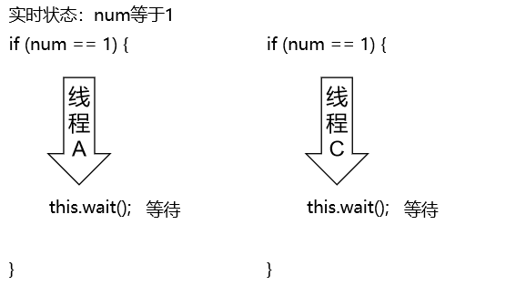
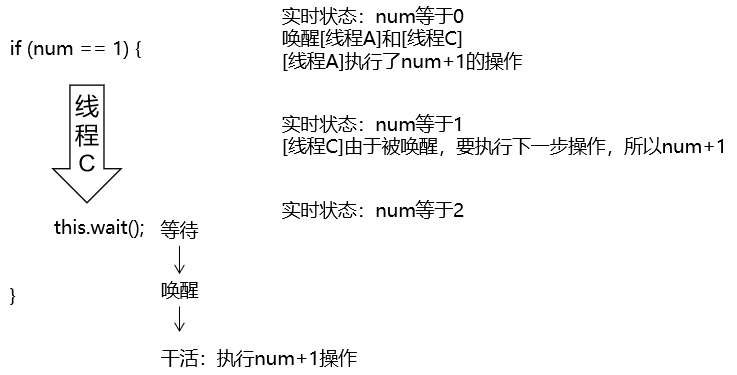
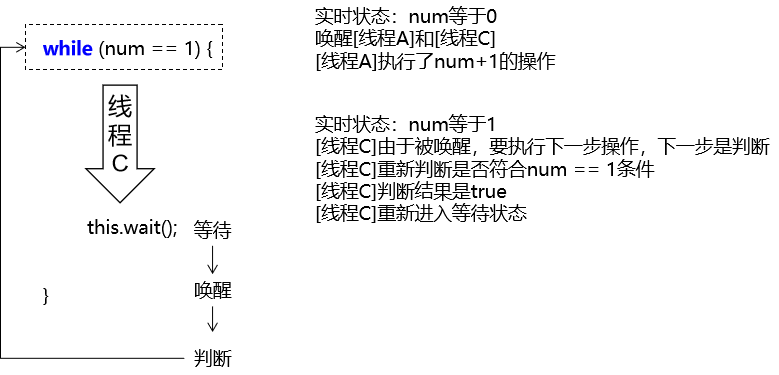

# 第二节 虚假唤醒


## 1、提出问题

把上面代码中的两个线程扩展到四个线程：

```java
        // 创建两个线程
        new Thread(()->{
            for (int i = 0; i < 10; i++) {
                demo.incr();
            }
        }, "[线程A]").start();

        new Thread(()->{
            for (int i = 0; i < 10; i++) {
                demo.decr();
            }
        }, "[线程B]").start();

        new Thread(()->{
            for (int i = 0; i < 10; i++) {
                demo.incr();
            }
        }, "[线程C]").start();

        new Thread(()->{
            for (int i = 0; i < 10; i++) {
                demo.decr();
            }
        }, "[线程D]").start();
```


打印效果如下：

> ###### ……
>
> [线程B]num=0<br/>
> [线程C]num=1<br/>
> [线程A]num=2<br/>
> [线程A]num=3<br/>
> [线程A]num=4<br/>
> [线程A]num=5<br/>
> [线程A]num=6<br/>
> [线程A]num=7<br/>
> [线程A]num=8<br/>
> [线程A]num=9<br/>
> [线程C]num=10<br/>
> [线程C]num=11<br/>
>
> ……


## 2、分析问题






## 3、解决问题

解决线程虚假唤醒的问题，关键在于把 if 判断改成while判断：




## 4、小结

虚假唤醒情况的关键点：

- 关键点1：线程是经过了一次判断后，进入到代码块中才被wait()进入等待状态
- 关键点2：线程在等待期间，判断条件其实已经不满足了
- 关键点3：if 判断的正常的下一步不是再次判断，而是继续执行代码块后面的代码
- 关键点4：while判断的正常的下一步是再次判断，从而杜绝了『条件不满足但还是执行操作』的情况


[上一节](verse01.html) [回目录](index.html) [下一节](verse03.html)