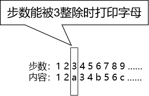

# 第四节 定制通信


使用两个线程打印：12a34b56c78d……

- 线程A：负责打印数字
- 线程B：负责打印字母


## 1、思路分析




## 2、代码

```java
public class O14PrintDigitalAlphabet {

    // 声明一个成员变量用于规定步数
    private int step = 1;

    // 声明一个成员变量作为要打印的数字
    private int number = 1;

    // 声明一个成员变量作为要打印的字符
    private char alphabet = 'a';

    // 创建Lock对象和Condition对象
    private Lock lock = new ReentrantLock();
    private Condition conditionDigital = lock.newCondition();
    private Condition conditionAlphabet = lock.newCondition();

    // 声明一个方法用于打印数字
    public void printDigital() {

        try {

            // 执行锁定
            lock.lock();

            // 执行判断
            while (step % 3 == 0) {

                // 步数能够被3整除时不打印数字，所以当前线程等一会儿
                conditionDigital.await();

            }

            // 干活
            // 工作1：打印当前number
            // 工作2：number++
            System.out.println(Thread.currentThread().getName() + " number=" + number++);

            // 工作3：step++
            step++;

            // 唤醒打印字母的线程
            conditionAlphabet.signal();

        }catch (InterruptedException e){}
        finally {

            // 解除锁定
            lock.unlock();

        }

    }

    // 声明一个方法用于打印字母
    public void printAlphabet() {

        try {

            // 执行锁定
            lock.lock();

            // 执行判断
            while (step % 3 != 0) {

                // 步数不能被3整除时不打印字母，所以当前线程等一会儿
                conditionAlphabet.await();

            }

            // 干活
            // 工作1：打印当前字母
            // 工作2：alphabet++
            System.out.println(Thread.currentThread().getName() + " alphabet=" + alphabet++);

            // 工作3：step++
            step++;

            // 唤醒打印数字的线程
            conditionDigital.signal();

        }catch (InterruptedException e){}
        finally {

            // 解除锁定
            lock.unlock();

        }

    }

    public static void main(String[] args) {

        // 创建资源对象
        O14PrintDigitalAlphabet demo = new O14PrintDigitalAlphabet();

        // 创建两个线程
        new Thread(()->{

            for (int i = 0; i < 52; i++) {
                demo.printDigital();
            }

        }, "thread-digital").start();

        new Thread(()->{

            for (int i = 0; i < 26; i++) {
                demo.printAlphabet();
            }

        }, "thread-alphabet").start();

    }


}
```


[上一节](verse03.html) [回目录](index.html) [下一节](verse05.html)