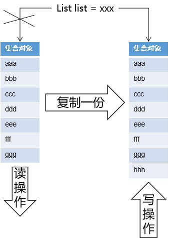

# 第一节 List集合


## 1、使用ArrayList

```java
// 创建被测试的List集合对象
// 具体集合类型ArrayList：抛出java.util.ConcurrentModificationException异常
List<String> list = new ArrayList<>();

// 在多个线程中对这个List集合执行读写操作
for (int i = 0; i < 5; i++) {

    new Thread(()->{

        for (int j = 0; j < 3; j++) {

            // 向集合对象写入数据
            list.add(UUID.randomUUID().toString().replace("-","").substring(0, 5));

            // 打印集合对象，等于是读取数据
            System.out.println(list);

        }

    },"thread"+i).start();

}
```


## 2、各种方案比较

```java
// 创建被测试的List集合对象
// 具体集合类型ArrayList：抛出java.util.ConcurrentModificationException异常
// 具体集合类型Vector：不会抛异常，线程安全，但是这个类太古老
// Collections.synchronizedList(new ArrayList<>())：不会抛异常，但是锁定范围大，性能低
// public void add(int index, E element) { synchronized (mutex) {list.add(index, element);} }
// public E get(int index) { synchronized (mutex) {return list.get(index);} }
// 具体集合类型CopyOnWriteArrayList：使用了写时复制技术，兼顾了线程安全和并发性能
List<String> list = new CopyOnWriteArrayList<>();
```


## 3、写时复制技术



- 使用写时复制技术要向集合对象中写入数据时：先把整个集合复制一份
- 将新数据写入复制得到的新集合
- 再让指向集合的变量指向新复制的集合

优缺点：

- 优点：兼顾了性能和线程安全，允许同时进行读写操作
- 缺点：由于需要把集合对象整体复制一份，所以对内存的消耗很大


对应类中的源代码：

- 所在类：java.util.concurrent.CopyOnWriteArrayList

```java
    public boolean add(E e) {
        final ReentrantLock lock = this.lock;
        lock.lock();
        try {
            Object[] elements = getArray();
            int len = elements.length;
            Object[] newElements = Arrays.copyOf(elements, len + 1);
            newElements[len] = e;
            setArray(newElements);
            return true;
        } finally {
            lock.unlock();
        }
    }
```


[回目录](index.html) [下一节](verse02.html)