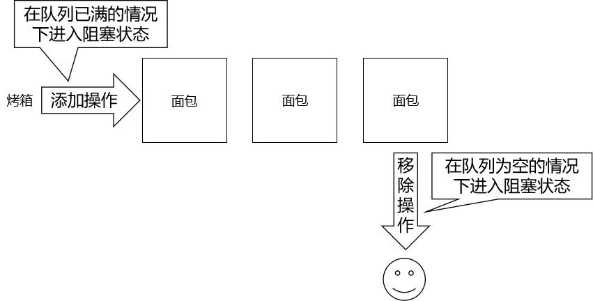
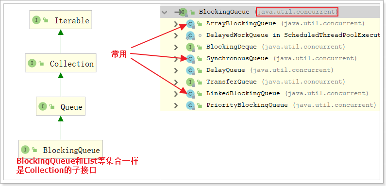

# 第一节 阻塞队列

阻塞队列是线程池的核心组件，了解阻塞队列为学习线程池打好基础。


## 1、概念

### ①阻塞


在某些情况下会挂起线程（即阻塞），一旦条件满足，被挂起的线程又会自动被唤起


### ②BlockingQueue



BlockingQueue即阻塞队列，是java.util.concurrent下的一个接口，因此不难理解，BlockingQueue是为了解决多线程中数据高效安全传输而提出的。从阻塞这个词可以看出，在某些情况下对阻塞队列的访问可能会造成阻塞。被阻塞的情况主要有如下两种：

- 当队列<span style="color:blue;font-weight:bold;">满</span>了的时候进行<span style="color:blue;font-weight:bold;">入队列</span>操作
- 当队列<span style="color:blue;font-weight:bold;">空</span>了的时候进行<span style="color:blue;font-weight:bold;">出队列</span>操作


因此，当一个线程试图对一个已经满了的队列进行入队列操作时，它将会被阻塞，除非有另一个线程做了出队列操作；同样，当一个线程试图对一个空队列进行出队列操作时，它将会被阻塞，除非有另一个线程进行了入队列操作。


阻塞队列主要用在生产者/消费者的场景，下面这幅图展示了一个线程生产、一个线程消费的场景：


为什么需要BlockingQueue？好处是我们不需要关心什么时候需要阻塞线程，什么时候需要唤醒线程，因为这一切BlockingQueue都给你一手包办了。在concurrent包发布以前，在多线程环境下，我们每个程序员都必须去自己控制这些细节，尤其还要兼顾效率和线程安全，而这会给我们的程序带来不小的复杂度。


## 2、BlockingQueue接口




BlockingQueue接口主要有以下7个实现类：

- ArrayBlockingQueue：由数组结构组成的有界阻塞队列。
- LinkedBlockingQueue：由链表结构组成的有界（但大小默认值为integer.MAX_VALUE）阻塞队列。
- PriorityBlockingQueue：支持优先级排序的无界阻塞队列。
- DelayQueue：使用优先级队列实现的延迟无界阻塞队列。
- SynchronousQueue：不存储元素的阻塞队列，也即单个元素的队列。
- LinkedTransferQueue：由链表组成的无界阻塞队列。
- LinkedBlockingDeque：由链表组成的双向阻塞队列。


BlockingQueue接口有以下方法：

|      | 抛出异常  | 特定值   | 阻塞   | 超时               |
| ---- | --------- | -------- | ------ | ------------------ |
| 插入 | add(e)    | offer(e) | put(e) | offer(e,tiem,unit) |
| 移除 | remove()  | poll()   | take() | poll(time,unit)    |
| 检查 | element() | peek()   | 不可用 | 不可用             |


详细说明如下：

> add()
> - 正常执行返回true，
> - 当阻塞队列满时，再往队列里add插入元素会抛IllegalStateException:Queue full

> element()
> - 正常情况：返回阻塞队列中的第一个元素
> - 当阻塞队列空时：再调用element()检查元素会抛出NoSuchElementException

> remove()
> - 正常执行：返回阻塞队列中的第一个元素并删除这个元素
> - 当阻塞队列空时：再往队列里remove()移除元素会抛NoSuchElementException

> offer(e)
>
> - 成功：true
> - 失败：false

> poll()
>
> - 队列中有元素：返回删除的元素
> - 队列中无元素：返回null

> peek()
>
> - 队列中有元素：返回队列中的第一个元素
> - 队列中无元素：返回null

> put(e)
>
> - 队列未满：添加成功
> - 队列已满：线程阻塞等待，直到能够添加为止

> take()
>
> - 队列非空：获取队列中的第一个元素
> - 队列为空：线程阻塞等待，直到队列非空时获取第一个元素

> offer(e,tiem,unit)
>
> 如果试图执行的操作无法立即执行，该方法调用将会发生阻塞，直到能够执行，但等待时间不会超过给定值。  返回true或false以告知该操作是否成功

> poll(time,unit)
>
> 如果试图执行的操作无法立即执行，该方法调用将会发生阻塞，直到能够执行，但等待时间不会超过给定值。


## 3、测试代码

```java
// 创建一个BlockingQueue对象
BlockingQueue<String> breadShop = new ArrayBlockingQueue<>(3);

// 创建一个线程用于存放出炉的面包
new Thread(()->{

    while (true) {

        try {
            TimeUnit.SECONDS.sleep(3);

            String bread = UUID.randomUUID().toString().replace("-", "").substring(0, 5);

            System.out.println("面包出炉：" + bread + " 货架情况：" + breadShop);

            breadShop.put(bread);

        } catch (InterruptedException e) {
            e.printStackTrace();
        }

    }

}).start();

// 创建一个线程用于卖面包
new Thread(()->{

    while (true) {

        try {
            TimeUnit.SECONDS.sleep((int)(Math.random()*10));

            String bread = breadShop.take();

            System.err.println("面包卖出：" + bread + " 货架情况：" + breadShop);

        } catch (InterruptedException e) {
            e.printStackTrace();
        }

    }

}).start();
```


[回目录](index.html) [下一节](verse02.html)