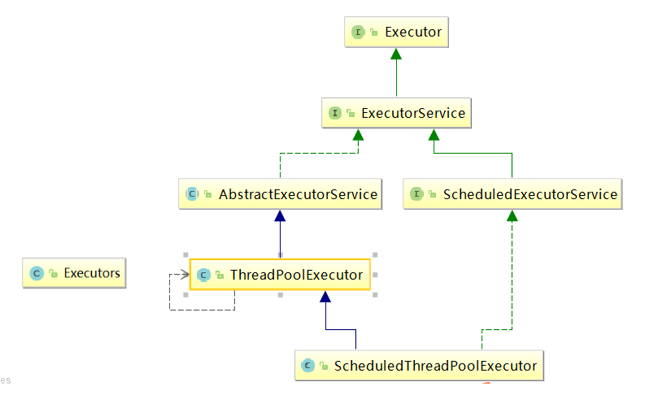

# 第二节 线程池的概念与架构

## 1、基本概念

线程池的优势：线程池做的工作主要是控制运行的线程数量，处理过程中将任务放入队列，然后在线程创建后启动这些任务，如果线程数量达到了最大数量，超出数量的线程排队等候，等其他线程执行完毕，再从队列中取出任务来执行。
它的主要特点为：线程复用；控制最大并发数；管理线程。

- 降低资源消耗。通过重复利用已创建的线程降低线程创建和销毁造成的销耗。
- 提高响应速度。当任务到达时，任务可以不需要等待线程创建就能立即执行。
- 提高线程的可管理性。线程是稀缺资源，如果无限制的创建，不仅会销耗系统资源，还会降低系统的稳定性，使用线程池可以进行统一的分配，调优和监控。

## 2、架构说明

Java中的线程池是通过Executor框架实现的，该框架中用到了Executor，ExecutorService，ThreadPoolExecutor这几个类。

Executor接口是顶层接口，只有一个execute方法，过于简单。通常不使用它，而是使用ExecutorService接口：

[上一节](verse01.html) [回目录](index.html) [下一节](verse03.html)