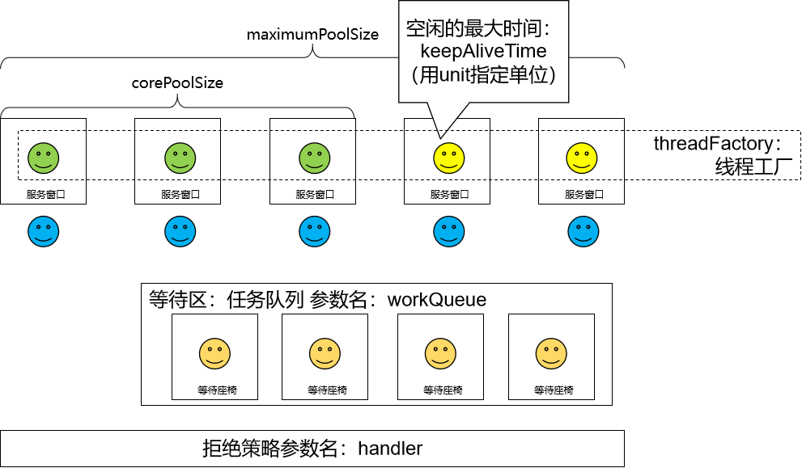

# 第四节 线程池的7个重要参数

```java
    public ThreadPoolExecutor(int corePoolSize,
                              int maximumPoolSize,
                              long keepAliveTime,
                              TimeUnit unit,
                              BlockingQueue<Runnable> workQueue,
                              ThreadFactory threadFactory,
                              RejectedExecutionHandler handler) {
        if (corePoolSize < 0 ||
            maximumPoolSize <= 0 ||
            maximumPoolSize < corePoolSize ||
            keepAliveTime < 0)
            throw new IllegalArgumentException();
        if (workQueue == null || threadFactory == null || handler == null)
            throw new NullPointerException();
        this.acc = System.getSecurityManager() == null ?
                null :
                AccessController.getContext();
        this.corePoolSize = corePoolSize;
        this.maximumPoolSize = maximumPoolSize;
        this.workQueue = workQueue;
        this.keepAliveTime = unit.toNanos(keepAliveTime);
        this.threadFactory = threadFactory;
        this.handler = handler;
    }
```

- corePoolSize：线程池中的常驻核心线程数
- maximumPoolSize：线程池中能够容纳同时执行的最大线程数，此值必须大于等于1
- keepAliveTime：多余的空闲线程的存活时间。当前池中线程数量超过corePoolSize时，当空闲时间达到keepAliveTime的线程会被销毁，直到剩余线程数量等于corePoolSize
- unit：keepAliveTime的时间单位
- workQueue：任务队列，被提交但尚未被执行的任务
- threadFactory：表示生成线程池中工作线程的工厂， 用于创建线程，一般默认的即可
- handler：拒绝策略处理器。当任务队列已满，工作线程也达到了maximumPoolSize，新增的工作任务将按照某个既定的拒绝策略被拒绝执行。





[上一节](verse03.html) [回目录](index.html) [下一节](verse05.html)