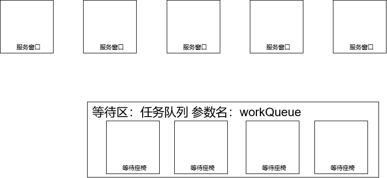
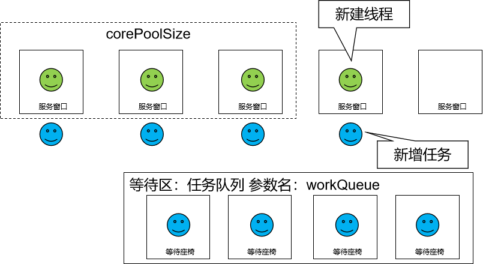
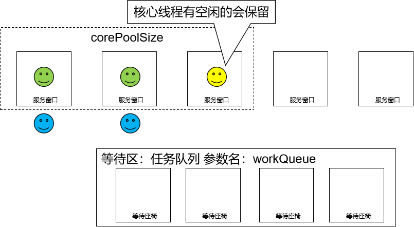

# 第五节 线程池的拒绝策略

重要的事情说三遍——以下重要！以下重要！以下重要！

- 【反直觉】刚创建线程池时，线程池中的线程数为零。

  

- 当调用execute()方法添加一个请求任务时，线程池会做出如下判断：
  - 如果正在运行的线程数量小于corePoolSize，那么马上创建线程运行这个任务；

    

    ……

    

  - 【反直觉】如果正在运行的线程数量大于或等于corePoolSize，那么将这个任务放入队列；

    

    ……

    

  - 【反直觉】如果这个时候队列满了且正在运行的线程数量还小于maximumPoolSize，那么还是要创建非核心线程立刻运行这个任务；

    

  - 如果队列满了且正在运行的线程数量大于或等于maximumPoolSize，那么线程池会启动饱和拒绝策略来执行。

    

- 当一个线程完成任务时，它会从队列中取下一个任务来执行。

  

- 当一个线程空闲的时间超过keepAliveTime时，线程池会判断：
  - 当前运行线程数大于corePoolSize：空闲时间超时线程会被停掉

    

  - 当前运行线程数小于等于corePoolSize：无动作（所以线程池的所有任务完成后，它最终会收缩到corePoolSize的大小。）

    

[上一节](verse04.html) [回目录](index.html) [下一节](verse06.html)