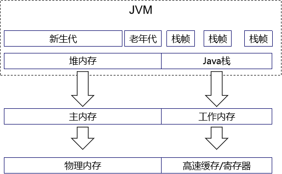
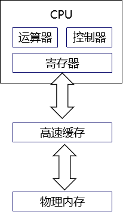

# 第七章 Java内存模型

## 1、主内存和工作内存

## 2、物理内存、高速缓存、寄存器、CPU

## 3、多线程环境下操作的属性

- 可见性：每个线程都有自己的工作内存；每个线程在自己的工作内存中修改变量的值，其他线程未必能够看到修改后的变量值。在Java中volatile、synchronized和final实现可见性。volatile只能让被他修饰内容具有可见性，但不能保证它具有原子性。
- 原子性：即不可分割性。比如 a=0；（a非long和double类型） 这个操作是不可分割的，那么我们说这个操作是原子操作。再比如：a++； 这个操作实际是a = a + 1；是可分割的，所以他不是一个原子操作。非原子操作都会存在线程安全问题，需要使用同步技术（sychronized）或者锁（Lock）来让它变成一个原子操作。一个操作是原子操作，那么我们称它具有原子性。Java的concurrent包下提供了一些原子类，我们可以通过阅读API来了解这些原子类的用法。比如：AtomicInteger、AtomicLong、AtomicReference等。
- 有序性：Java的有序性跟线程相关。一个线程内部所有操作都是有序的，如果是多个线程所有操作都是无序的。因为JMM的工作内存和主内存之间存在延迟，而且java会对一些指令进行重新排序。volatile和synchronized可以保证程序的有序性，很多程序员只理解这两个关键字的执行互斥，而没有很好的理解到volatile和synchronized也能保证指令不进行重排序。

[上一章](../chapter06/index.html) [回目录](../index.html) [下一章](../chapter08/index.html)