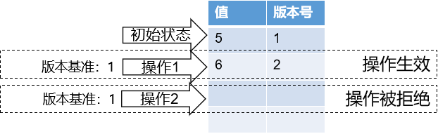
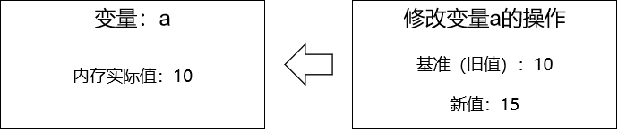
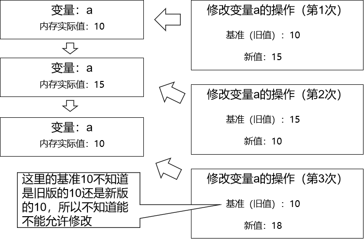

# 第九章 CAS

## 1、乐观锁工作机制



> 初始状态：明天休息		版本：0
> 变更操作：明天户外拓展	版本：1
> 变更操作：明天补课		版本基准：0
> 更新基准：更新到版本1
> 变更操作：明天补课		版本基准：1


## 2、CAS概念

CAS：Compare and swap，比较并交换。



当我们想基于CAS机制修改变量a的时候：

- 将作为修改基准的旧值和内存实际值进行比较
  - 一致：接受修改
  - 不一致：不接受修改


## 3、CAS测试代码

```java
AtomicInteger atomicNumber = new AtomicInteger(5);

boolean updateResult = atomicNumber.compareAndSet(5, 666);
System.out.println("修改结果：" + updateResult + " 当前值：" + atomicNumber.get());

updateResult = atomicNumber.compareAndSet(5, 777);
System.out.println("修改结果：" + updateResult + " 当前值：" + atomicNumber.get());

updateResult = atomicNumber.compareAndSet(666, 777);
System.out.println("修改结果：" + updateResult + " 当前值：" + atomicNumber.get());
```

打印结果：

> 修改结果：true 当前值：666
> 修改结果：false 当前值：666
> 修改结果：true 当前值：777


## 4、CAS和自旋

CAS是解决多线程并发安全问题的一种乐观锁算法。因为它在对共享变量更新之前，会先比较当前值是否与更新前的值一致，如果一致则更新，如果不一致则循环执行（称为<span style="color:blue;font-weight:bold;">自旋锁</span>），直到当前值与更新前的值一致为止，才执行更新。
Unsafe类是CAS的核心类，提供硬件级别的原子操作（目前所有CPU基本都支持硬件级别的CAS操作）。

```java
// 对象、对象的地址、预期值、修改值
public final native boolean compareAndSwapInt(Object var1, long var2, int var4, int var5);
```


## 5、ABA问题



进一步说明：

```java
public class Person{

    private int num = 5;
    private String personName;

}
```

以num的值作为基准，运用CAS机制。

- 第一次修改：
  - 基准旧值：5
  - 新值：10
  - personName：tom
  - 操作能够被接受
- 第二次修改：
  - 基准旧值：10
  - 新值：5
  - personName：jerry
  - 操作能够被接受
- 第三次修改：
  - 基准旧值：5
  - 新值：666
  - personName：harry
  - 当前操作无法判断是基于旧版还是新版

> 当一个类中除了作为基准的数据之外还有其他数据也被连带修改，那么CAS机制中的ABA问题就有可能导致代码出错。


## 6、CAS机制的缺点

- **开销大**：在并发量比较高的情况下，如果反复尝试更新某个变量，却又一直更新不成功，会给CPU带来较大的压力
- **ABA问题**：当变量从A修改为B再修改回A时，变量值等于期望值A，但是无法判断是否修改，CAS操作在ABA修改后依然成功——但此时无法识别是否是基于旧版的不该接受的修改。
- **不能保证代码块的原子性**：CAS机制所保证的只是一个变量的原子性操作，而不能保证整个代码块的原子性。


## 7、CAS原子性、有序性验证

```java
public class CASAtumicTest {

    private static AtomicInteger number = new AtomicInteger(0);

    public int incr() {

        return number.incrementAndGet();
    }

    public static void main(String[] args) {

        CASAtumicTest casAtumicTest = new CASAtumicTest();

        for (int i = 0; i < 1000; i++) {

            new Thread(()->{

                System.out.println("number = " + casAtumicTest.incr());

            }).start();

        }

    }

}
```

打印效果：

> number = 244
> number = 239
> number = 240
> number = 1000
> number = 998
> number = 999
> number = 997

结论：

- CAS能够为变量提供局部的原子性
- CAS不能提供有序性


[上一章](../chapter08/index.html) [回目录](../index.html)