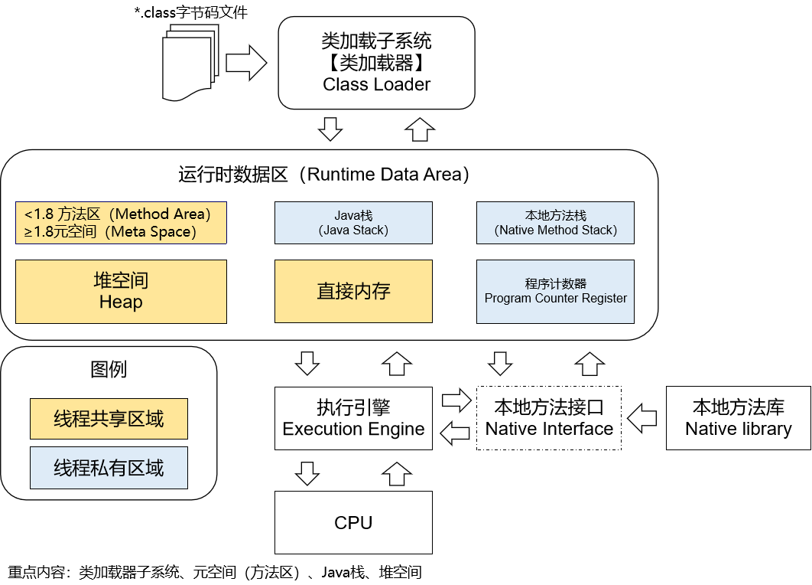

# 第二节 JVM工作的总体机制

## 1、Java源程序编译运行过程

Java源程序→编译→字节码文件→放到JVM上运行

## 2、JVM工作的总体机制

总体机制的粗略描述：

- 第一步：使用类加载器子系统将 *.class 字节码文件加载到 JVM 的内存
- 第二步：在 JVM 的内存空间存储相关数据
- 第三步：在执行引擎中将 *.class 字节码文件翻译成 CPU 能够执行的指令
- 第四步：将指令发送给CPU执行

## 3、JVM落地产品

- Sun公司的HotSpot
- BEA公司的JRockit
- IBM公司的J9 VM

[上一节](verse01.html) [回目录](index.html)