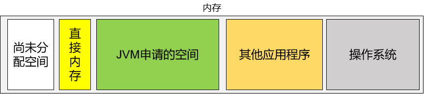

# 第三章 总体机制中不重要的部分

## 1、本地方法栈

专门负责在本地方法运行时，提供栈空间，存放本地方法每一次执行时创建的栈帧。

```java
public static native void yield();
```


## 2、程序计数器

也叫PC寄存器（<span style="color:blue;font-weight:bold;">P</span>rogram <span style="color:blue;font-weight:bold;">C</span>ounter Register）。用于保存程序执行过程中，下一条即将执行的指令的地址。也就是说能够保存程序当前已经执行到的位置。


## 3、执行引擎

作用：用于执行字节码文件中的指令。

执行指令的具体技术：

- 解释执行：第一代JVM。
- 即时编译：JIT，第二代JVM。
- 自适应优化：目前Sun的Hotspot JVM采用这种技术。吸取了第一代JVM和第二代JVM的经验，在一开始的时候对代码进行解释执行， 同时使用一个后台线程监控代码的执行。如果一段代码经常被调用，那么就对这段代码进行编译，编译为本地代码，并进行执行优化。若方法不再频繁使用，则取消编译过的代码，仍对其进行解释执行。
- 芯片级直接执行：内嵌在芯片上，用本地方法执行Java字节码。


## 4、直接内存




### ①作用

提高特定场景下性能。


### ②应用场景

直接内存并不是虚拟机运行时数据区的一部分，也不是Java 虚拟机规范中定义的内存区域。在JDK1.4 中新加入了NIO(New Input/Output)类，引入了一种基于通道（Channel）与缓冲区（Buffer）的 I/O 方式，它可以使用native 函数库直接分配堆外内存，然后通过一个存储在 Java 堆中的 DirectByteBuffer 对象作为这块内存的引用进行操作。这样能在一些场景中显著提高性能，因为避免了在 Java 堆和 Native 堆中来回复制数据。
本机直接内存的分配不会受到 Java 堆大小的限制，受到本机总内存大小限制。
配置虚拟机参数时，不要忽略直接内存防止出现 OutOfMemoryError 异常。


### ③直接内存（堆外内存）与堆内存比较

直接内存申请空间耗费更高的性能，当频繁申请到一定量时尤为明显。直接内存 I/O 读写的性能要优于普通的堆内存，在多次读写操作的情况下差异明显。


[上一章](../chapter02/index.html) [回目录](../index.html) [下一章](../chapter04/index.html)