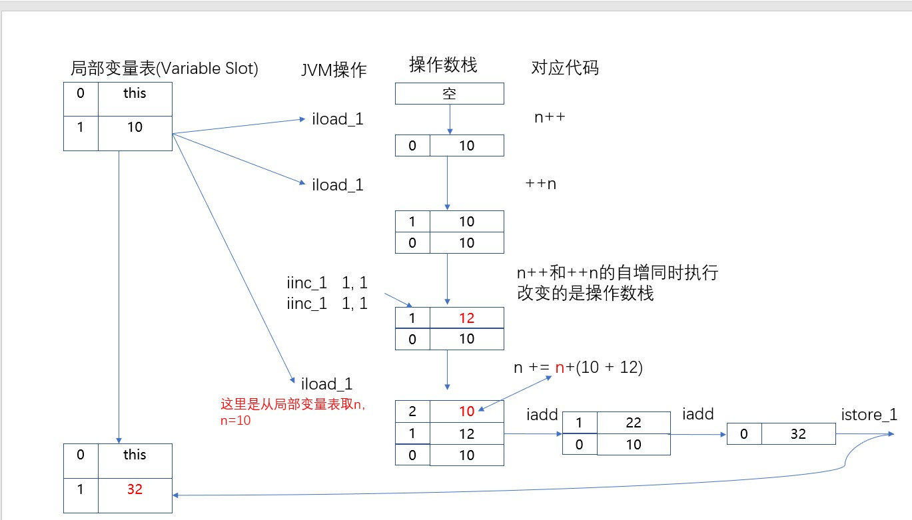

# 第二节 栈帧

## 1、栈帧存储的数据

方法在本次执行过程中所用到的局部变量、动态链接、方法出口等信息。


## 2、栈帧的结构

- 局部变量表：方法执行时的参数、方法体内声明的局部变量
- 操作数栈：存储中间运算结果，是一个临时存储空间
- 帧数据区：保存访问常量池指针，异常处理表


## 3、典型案例

请预测下面代码打印的结果：34

```java
int n = 10;
n += (n++) + (++n);
System.out.println(n);
```

实际执行结果：32

使用javap命令查看字节码文件内容：

> D:\record-video-original\day03\code><span style="color:blue;font-weight:bold;">javap -c Demo03JavaStackExample.class</span><br/>
> Compiled from "Demo03JavaStackExample.java"<br/>
> public class Demo03JavaStackExample{<br/>
> public Demo03JavaStackExample();<br/>
> Code:<br/>
>  0: aload_0<br/>
>  1: invokespecial #1                  // Method java/lang/Object."&lt;init&gt;: ()V<br/>
>  4: return<br/>
>
> public static void main(java.lang.String[]);<br/>
> Code:<br/>
>  0: bipush        10<br/>
>  2: istore_1<br/>
>  3: iload_1<br/>
>  4: iload_1<br/>
>  5: iinc          1, 1<br/>
>  8: iinc          1, 1<br/>
> 11: iload_1<br/>
> 12: iadd<br/>
> 13: iadd<br/>
> 14: istore_1<br/>
> 15: getstatic     #2                  // Field java/lang/System.out:Ljava/io/PrintStream;<br/>
> 18: iload_1<br/>
> 19: invokevirtual #3                  // Method java/io/PrintStream.println:(I)V<br/>
> 22: return<br/>
> }


内存执行过程分析：




[上一节](verse01.html) [回目录](index.html) [下一节](verse03.html)