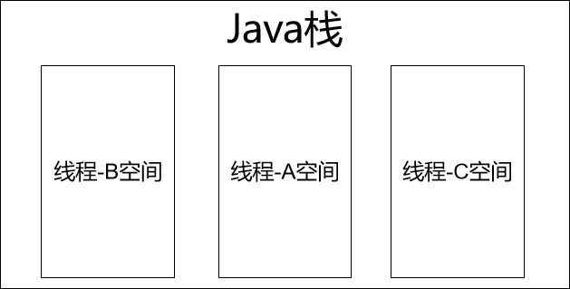

# 第四节 栈空间的线程私有验证

## 1、提出问题

某一个线程抛出『栈溢出异常』，会导致其他线程也崩溃吗？从以往的经验中我们判断应该是不会，下面通过代码来实际验证一下。


## 2、代码

```java
new Thread(()->{
    while(true) {

        try {
            TimeUnit.SECONDS.sleep(2);

            System.out.println(Thread.currentThread().getName() + " working");
        } catch (InterruptedException e) {
            e.printStackTrace();
        }
    }
}, "thread-01").start();

new Thread(()->{
    while(true) {

        try {
            TimeUnit.SECONDS.sleep(2);

            // 递归调用一个没有退出机制的递归方法
            methodInvokeToDie();

            System.out.println(Thread.currentThread().getName() + " working");
        } catch (InterruptedException e) {
            e.printStackTrace();
        }
    }
}, "thread-02").start();

new Thread(()->{
    while(true) {

        try {
            TimeUnit.SECONDS.sleep(2);

            System.out.println(Thread.currentThread().getName() + " working");
        } catch (InterruptedException e) {
            e.printStackTrace();
        }
    }
}, "thread-03").start();
```


## 3、结论

02线程抛异常终止后，01和03线程仍然能够继续正常运行，说明02抛异常并没有影响到01和03，说明线程对栈内存空间的使用方式是彼此隔离的。每个线程都是在自己独享的空间内运行，反过来也可以说，这个空间是当前线程私有的。




[上一节](verse03.html) [回目录](index.html)