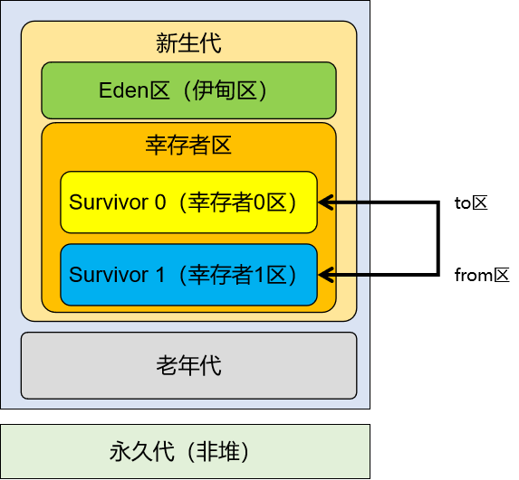
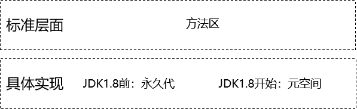

# 第一节 概述

## 1、堆空间组成部分

## 2、堆空间工作机制

- 新创建的对象会被放在Eden区
- 当Eden区中已使用的空间达到一定比例，会触发Minor GC
- 每一次在Minor GC中没有被清理掉的对象就成了幸存者
- 幸存者对象会被转移到幸存者区
- 幸存者区分成from区和to区
- from区快满的时候，会将仍然在使用的对象转移到to区
- 然后from和to这两个指针彼此交换位置

> 口诀：复制必交换，谁空谁为to

- 如果一个对象，经历15次GC仍然幸存，那么它将会被转移到老年代
- 如果幸存者区已经满了，即使某个对象尚不到15岁，仍然会被移动到老年代
- 最终效果：
  - Eden区主要是生命周期很短的对象来来往往
  - 老年代主要是生命周期很长的对象，例如：IOC容器对象、线程池对象、数据库连接池对象等等
  - 幸存者区作为二者之间的过渡地带
- 关于永久代：
  - 从理论上来说属于堆
  - 从具体实现上来说不属于堆

## 3、永久代在各个JDK版本之间的演变

| &nbsp;  | 永久代                   | 常量池   |
| ------- | ------------------------ | -------- |
| ≤JDK1.6 | 有                       | 在方法区 |
| =JDK1.7 | 有，但开始逐步“去永久代” | 在堆     |
| ≥JDK1.8 | 无                       | 在元空间 |

## 4、方法区、元空间、永久代之间关系

[回目录](index.html) [下一节](verse02.html)