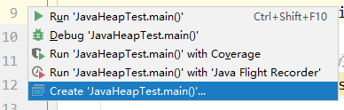
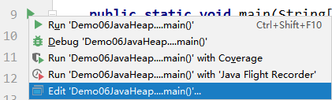
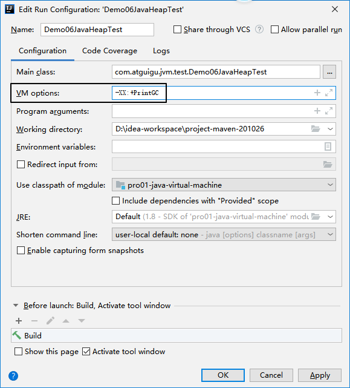
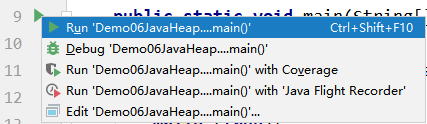

# 第二节 实验

Java代码：

```java
List<Object> list = new ArrayList<>();

while (true){
    list.add(new Object());
}
```

附加JVM运行参数：

- 新创建参数设置：




- 修改参数设置：




- 设置参数：




- 运行程序的操作还是和以前一样：




[上一节](verse01.html) [回目录](index.html) [下一节](verse03.html)