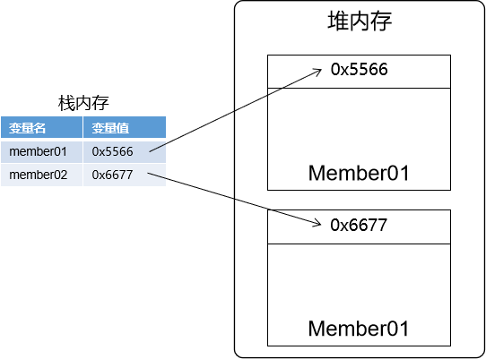
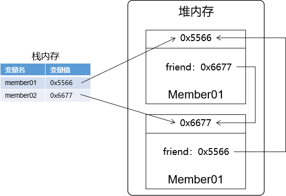
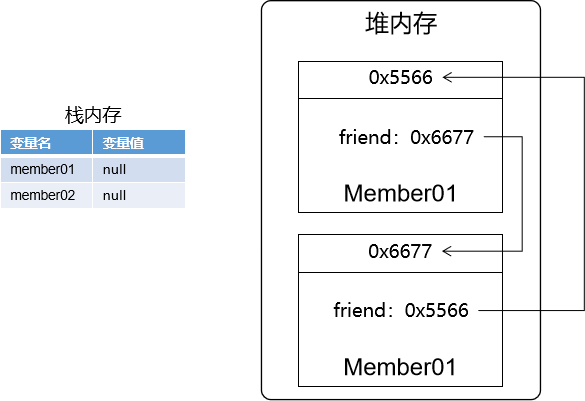
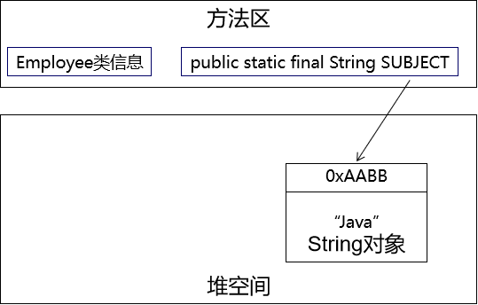
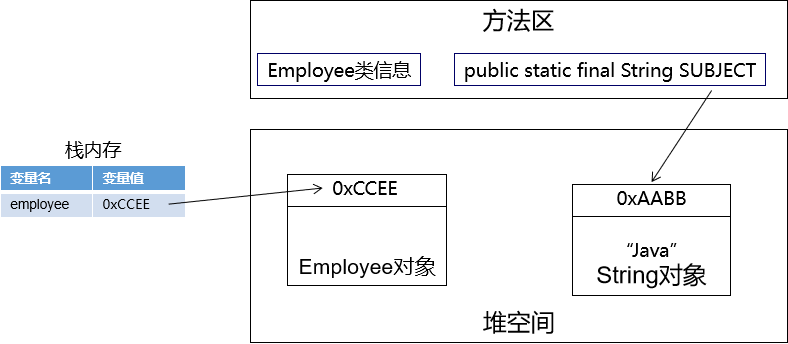

# 第二节 标记垃圾对象


## 1、引用计数法（不采用）

引用计数法是在对象每一次被引用时，都给这个对象专属的『引用计数器』+1。

当前引用被取消时，就给这个『引用计数器』-1。

当前『引用计数器』为零时，表示这个对象不再被引用了，需要让GC回收。

可是当对象之间存在交叉引用的时候，对象即使处于应该被回收的状态，也没法让『引用计数器』归零。

```java
        Member member01 = new Member();
        Member member02 = new Member();
```




```java
        member01.setFriend(member02);
        member02.setFriend(member01);
```




```java
        member01 = null;
        member02 = null;
```




## 2、GC Roots可达性分析

核心原理：判断一个对象，是否存在从『堆外』到『堆内』的引用。

请看下面的例子：

### ①加载Employee类

```java
class Employee {
    public static final String SUBJECT = new String("Java");
}
```




### ②创建Employee对象并赋值给变量

```java
    public static void main(String[] args) {

        // 1.创建Employee对象，并赋值给employee变量
        Employee employee = new Employee();

    }
```




[上一节](verse01.html) [回目录](index.html) [下一节](verse03.html)