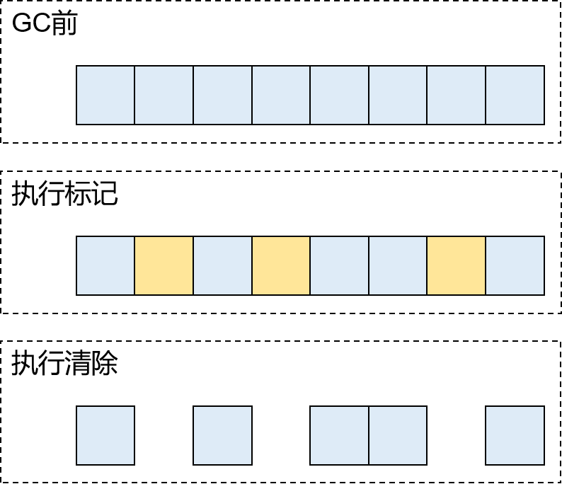
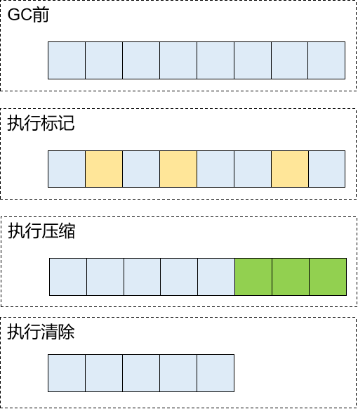
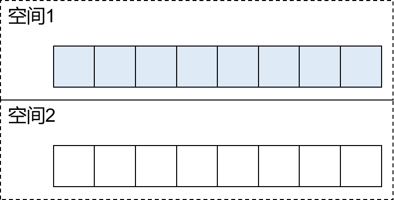
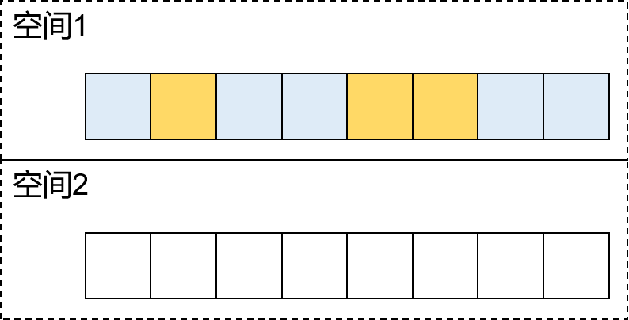
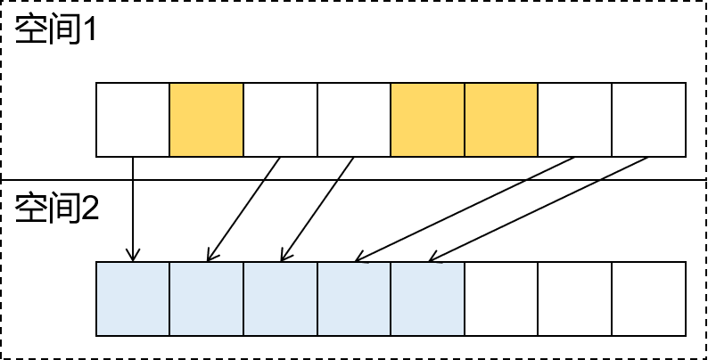

# 第三节 垃圾回收算法

基本垃圾回收算法有四种：引用计数法、标记清除法、标记压缩法、复制算法。现代流行的垃圾收集算法一般是由这四种中的其中几种算法相互组合而成。例如：分代算法、分区算法。

> 这里又看到一个『引用计数法』，但是和前面提到的不一样：
>
> 前面『引用计数法』：是标记垃圾对象的一种方法
>
> 这里『引用计数法』：是执行垃圾回收的一种方法

## 1、基本算法：引用计数法

引用计数算法很简单，它实际上是通过在对象头中分配一个空间来保存该对象被引用的次数。如果该对象被其它对象引用，则它的引用计数加一，如果删除对该对象的引用，那么它的引用计数就减一，当该对象的引用计数为0时，那么该对象就会被回收。 

引用计数垃圾收集机制，它只是在引用计数变化为0时即刻发生，而且只针对某一个对象以及它所依赖的其它对象。所以，我们一般也称呼引用计数垃圾收集为直接的垃圾收集机制。垃圾收集的开销被分摊到整个应用程序的运行当中了，而不是在进行垃圾收集时，要挂起整个应用的运行，直到对堆中所有对象的处理都结束。因此，采用引用计数的垃圾收集不属于严格意义上的"Stop-The-World"的垃圾收集机制。 

优点：

- 实时性较高，不需要等到内存不够时才回收
- 垃圾回收时不用挂起整个程序，不影响程序正常运行

缺点：

- 回收时不移动对象, 所以会造成内存碎片问题
- 不能解决对象间的循环引用问题

小结： 

正是由于引用计数法不能解决对象间的循环引用问题，所以事实上并没有哪一款JVM产品采用这个机制。

## 2、基本算法：标记清除法

它的做法是当堆中的有效内存空间被耗尽的时候，就会暂停、挂起整个程序（也被称为stop the world），然后进行两项工作，第一项则是标记，第二项则是清除。

- 标记：标记的过程其实就是，从根对象开始遍历所有的对象，然后将所有存活的对象标记为可达的对象。

- 清除：清除的过程将遍历堆中所有的对象，将没有标记的对象全部清除掉。

小结： 

- 优点：实现简单

- 缺点：
  - 效率低，因为标记和清除两个动作都要遍历所有的对象
  - 垃圾收集后有可能会造成大量的内存碎片，垃圾回收时会造成应用程序暂停

## 3、基本算法：标记压缩法

既然叫标记压缩算法，那么它也分为两个阶段，一个是标记(mark)，一个是压缩(compact)。所谓压缩就是把存在碎片的空间连起来。  

标记压缩算法是在标记清除算法的基础之上，做了优化改进的算法。和标记清除算法一样，也是从根节点开始，对对象的引用进行标记，在清理阶段，并不是简单的清理未标记的对象，而是将存活的对象移动到内存的一端，然后清理边界以外的垃圾，从而解决了碎片化的问题。 

标记 : 标记的过程其实就是，从根对象开始遍历所有的对象，然后将所有存活的对象标记为可达的对象。 

压缩 : 移动所有的可达对象到堆内存的同一个区域中，使他们紧凑的排列在一起，从而将所有非可达对象释放出来的空闲内存都集中在一起，通过这样的方式来达到减少内存碎片的目的。 

小结 

优点：标记压缩算法是对标记清除算法的优化，解决了碎片化的问题

缺点：还是效率问题，在标记清除算法上又多加了一步，效率可想而知了

## 4、基本算法：复制算法

复制算法的核心就是，将原有的内存空间一分为二，每次只用其中的一块，在垃圾回收时，将正在使用的对象复制到另一个内存空间中，并依次排列，然后将该内存空间清空，交换两个内存的角色，完成垃圾的回收。

小结 

- 优点1：在垃圾多的情况下(新生代)，效率较高

- 优点2：清理后，内存无碎片

- 缺点：浪费了一半的内存空间，在存活对象较多的情况下(老年代)，效率较差

执行GC前：

执行标记：

执行复制：

## 5、综合算法：分代算法

前面介绍了多种回收算法，每一种算法都有自己的优点也有缺点，谁都不能替代谁，所以根据垃圾回收对象的特点进行选择，才是明智的。

分代算法其实就是这样的，根据回收对象的特点进行选择。

- 新生代适合使用复制算法
- 老年代适合使用标记清除或标记压缩算法

## 6、综合算法：分区算法

上面介绍的分代收集算法是将对象的生命周期按长短划分为两个部分，而分区算法则将整个堆空间划分为连续的不同小区间，每个小区间独立使用，独立回收。这样做的好处是可以控制一次回收多少个小区间。在相同条件下，堆空间越大。一次GC耗时就越长，从而产生的停顿也越长。为了更好地控制GC产生的停顿时间，将一块大的内存区域分割为多个小块，根据目标停顿时间每次合理地回收若干个小区间(而不是整个堆)，从而减少一次GC所产生的停顿。

[上一节](verse02.html) [回目录](index.html) [下一节](verse04.html)