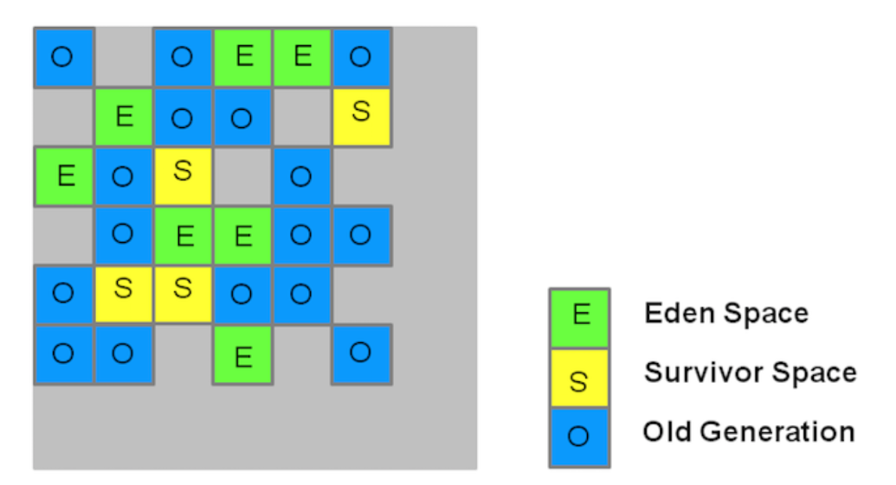

# 第四节 垃圾回收器 [了解]

## 1、串行垃圾回收器

新生代串行回收器 SerialGC：采用复制算法实现，单线程垃圾回收，独占式垃圾回收器

老年代串行回收器 SerialOldGC：采用标记压缩算法，单线程独占式垃圾回收器

## 2、并行垃圾回收器

新生代 parNew 回收器：采用复制算法实现，多线程回收器，独占式垃圾回收器。

新生代 ParallelScavengeGC 回收器：采用复制算法多线程独占式回收器

老年代 ParallelOldGC 回收器: 采用标记压缩算法，多线程独占式回收器

- CMS回收器

  CMS全称 (Concurrent Mark Sweep)，是一款并发的、使用标记-清除算法的垃圾回收器。对CPU资源非常敏感。 

  启用CMS回收器参数 ：-XX:+UseConcMarkSweepGC。 

  使用场景：GC过程短暂停顿，适合对时延要求较高的服务，用户线程不允许长时间的停顿。 

  优点：最短回收停顿时间为目标的收集器。并发收集，低停顿。 

  缺点：服务长时间运行，造成严重的内存碎片化。算法实现比较复杂。

- G1回收器

   G1(Garbage-First)是一款面向服务端应用的并发垃圾回收器, 主要目标用于配备多颗CPU的服务器治理大内存。是JDK1.7提供的一个新收集器，是当今收集器技术发展的最前沿成果之一。 

  G1计划是并发标记-清除收集器的长期替代品。 

  启用G1收集器参数：-XX:+UseG1GC启用G1收集器。 

  G1将整个Java堆划分为多个大小相等的独立区域(Region)，虽然还保留有新生代和老年代的概念，但新生代和老年代不再是物理隔离的了, 它们都是一部分Region(不需要连续)的集合。

  

  每块区域既有可能属于Old区、也有可能是Young区，因此不需要一次就对整个老年代/新生代回收。而是当线程并发寻找可回收的对象时，有些区块包含可回收的对象要比其他区块多很多。虽然在清理这些区块时G1仍然需要暂停应用线程，但可以用相对较少的时间优先回收垃圾较多的Region(这也是G1命名的来源)。这种方式保证了G1可以在有限的时间内获取尽可能高的收集效率。 

  特点：

  - 一整块堆内存被分成多个独立的区域Regions

  - 存活对象被拷贝到新的Survivor区

  - 新生代内存由一组不连续的堆heap区组成，使得可以动态调整各个区域

  - 多线程并发GC

  - young GC会有STW（Stop the world）事件

  

## 3、垃圾回收器对比

### ①新生代回收器

| 名称               | 串行/并行/并发 | 回收算法 | 适用场景          | 可以与CMS配合 |
| ------------------ | -------------- | -------- | ----------------- | ------------- |
| SerialGC           | 串行           | 复制     | 单CPU             | 是            |
| ParNewGC           | 并行           | 复制     | 多CPU             | 是            |
| ParallelScavengeGC | 并行           | 复制     | 多CPU且关注吞吐量 | 否            |

### ②老年代回收器

| 名称        | 串行/并行/并发             | 回收算法 | 适用场景              |
| ----------- | -------------------------- | -------- | --------------------- |
| SerialOldGC | 串行                       | 标记压缩 | 单CPU                 |
| ParNewOldGC | 并行                       | 标记压缩 | 多CPU                 |
| CMS         | 并发，几乎不会暂停用户线程 | 标记清除 | 多CPU且与用户线程共存 |

[上一节](verse04.html) [回目录](index.html)