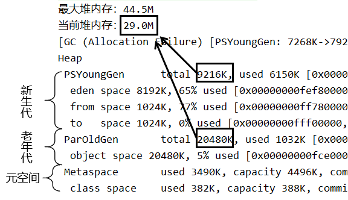
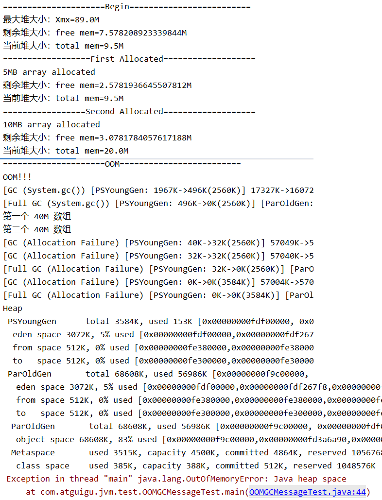

# 第九章 JVM参数设置入门

## 1、Runtime类使用案例

```java
        System.out.print("最大堆大小：");
        System.out.println(Runtime.getRuntime().maxMemory() / 1024.0 / 1024 + "M");
        System.out.print("当前堆大小：");
        System.out.println(Runtime.getRuntime().totalMemory() / 1024.0 / 1024 + "M");
        System.out.println("==================================================");

        byte[] b = null;
        for (int i = 0; i < 10; i++) {
            b = new byte[1 * 1024 * 1024];
        }
```

执行前配置参数：-Xmx50m -Xms30m -XX:+PrintGCDetails

执行看到如下信息：



新生代和老年代的堆大小之和是Runtime.getRuntime().totalMemory()


## 2、GC演示

```java
        System.out.println("=====================Begin=========================");
        System.out.print("最大堆大小：Xmx=");
        System.out.println(Runtime.getRuntime().maxMemory() / 1024.0 / 1024 + "M");

        System.out.print("剩余堆大小：free mem=");
        System.out.println(Runtime.getRuntime().freeMemory() / 1024.0 / 1024 + "M");

        System.out.print("当前堆大小：total mem=");
        System.out.println(Runtime.getRuntime().totalMemory() / 1024.0 / 1024 + "M");

        System.out.println("==================First Allocated===================");
        byte[] b1 = new byte[5 * 1024 * 1024];
        System.out.println("5MB array allocated");

        System.out.print("剩余堆大小：free mem=");
        System.out.println(Runtime.getRuntime().freeMemory() / 1024.0 / 1024 + "M");

        System.out.print("当前堆大小：total mem=");
        System.out.println(Runtime.getRuntime().totalMemory() / 1024.0 / 1024 + "M");

        System.out.println("=================Second Allocated===================");
        byte[] b2 = new byte[10 * 1024 * 1024];
        System.out.println("10MB array allocated");

        System.out.print("剩余堆大小：free mem=");
        System.out.println(Runtime.getRuntime().freeMemory() / 1024.0 / 1024 + "M");

        System.out.print("当前堆大小：total mem=");
        System.out.println(Runtime.getRuntime().totalMemory() / 1024.0 / 1024 + "M");

        System.out.println("=====================OOM=========================");
        System.out.println("OOM!!!");
        System.gc();

        System.out.println("第一个 40M 数组");
        byte[] b3 = new byte[40 * 1024 * 1024];

        System.out.println("第二个 40M 数组");
        byte[] b4 = new byte[40 * 1024 * 1024];

        System.out.println("第三个 40M 数组");
        byte[] b5 = new byte[40 * 1024 * 1024];
```

JVM参数设置成最大堆内存100M，当前堆内存10M：-Xmx100m -Xms10m -XX:+PrintGCDetails

再次运行，可以看到minor GC和full GC日志：




[上一章](../chapter08/index.html) [回目录](../index.html) [下一章](../chapter10/index.html)