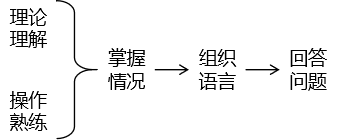

# 第十章 相关面试题 [持续更新中...]

## 1、面试回答问题过程

## 2、各个问题思路

### ①请谈谈你对 JVM 的理解?

- JVM 技术的作用：提升、优化项目性能
- JVM 结构
  - 类加载机制
  - Java栈
  - 堆
    - 新生代
      - Eden 区
      - 幸存者区：S0+S1
    - 老年代
  - 元空间
- GC
  - 垃圾对象的标记
    - 引用技术法
    - GC Roots：概念→原理（堆外指向堆内）→GC Root 对象
  - 垃圾回收算法
- JVM 常用参数

### ②Java 8 的虚拟机有什么更新？

- 永久代取消，变成元空间；

- 常量池放入到元空间。

### ③什么是OOM？

- 概念：堆内存溢出错误
- 产生原因：经过多轮 GC，连老年代都已经没了空间，还要继续创建新的对象。
- 详细过程：堆空间对象存储、GC 流程。
- 相关拓展：StackOverFlowError

### ④什么是StackOverflowError?

- 概念：栈内存溢出错误
- 产生原因：在一个线程中，栈内存分配给它的空间被不断新增的栈帧填满，没有及时释放栈帧。
- 详细过程：栈帧概念，栈帧中存储的数据，典型情况（无法退出的递归）
- 相关拓展：OOM

### ⑤ JVM 的常用参数调优你知道哪些？

| 参数名            | 参数作用                                                   |
| ----------------- | ---------------------------------------------------------- |
| -Xms              | 堆内存的初始大小                                           |
| -Xmx              | 堆内存的最大值                                             |
| -Xmn              | 新生代大小                                                 |
| -XX:PermSize      | 设置永久代(perm gen)初始值                                 |
| -XX:MaxPermSize   | 设置持久代最大值                                           |
| -Xss              | 每个线程的堆栈大小                                         |
| -XX:NewRatio      | 年轻代(包括Eden和两个Survivor区)与年老代的比值(除去持久代) |
| -XX:SurvivorRatio | Eden区与Survivor区的大小比值                               |

### ⑥谈谈 JVM 中，对类加载器你的认识？

双亲委派机制

- 类加载器分类
  - 启动类加载器
  - 扩展类加载器
  - 应用类加载器
  - 自定义加载器
- 父子关系
  - 关系一：启动类加载器是扩展类加载器的父亲
  - 关系二：扩展类加载器是应用类加载器的父亲
- 查找机制：先让父加载器查找，如果找不到再让子加载器加载
- 好处
  - 好处1：避免重复操作
  - 好处2：避免恶意替换核心 API

[上一章](../chapter09/index.html) [回目录](../index.html) [下一章](../chapter11/index.html)

