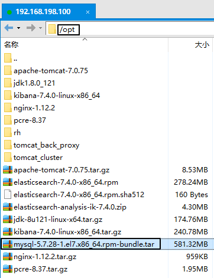
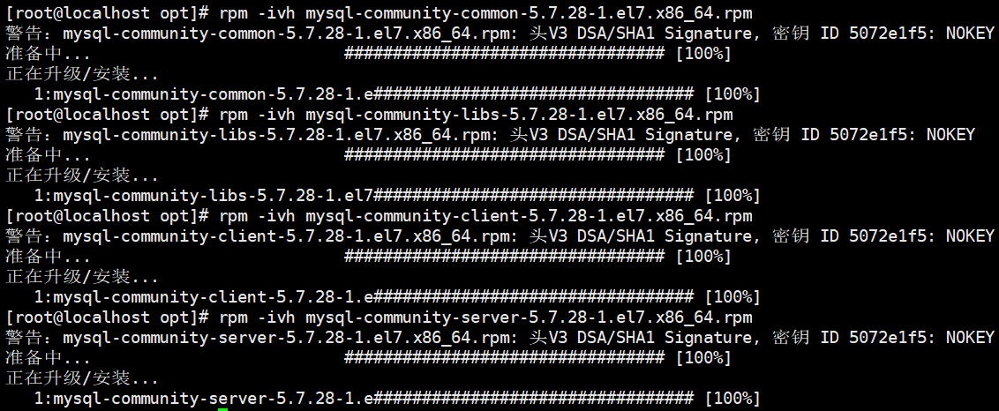
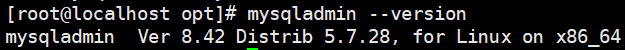
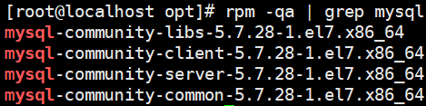

# 第二节 执行安装

## 1、上传并解压 tar 包

### ①上传 tar 包




### ②解压 tar 包

```shell
# 进入 tar 包所在的目录
cd /opt

# 解压
tar -xvf mysql-5.7.28-1.el7.x86_64.rpm-bundle.tar

# 注意：此 tar 包没有带 .gz 扩展名，所以解压命令参数中不包含 -z
# 如果带有 -z 参数会看到下面的提示：
# gzip: stdin: not in gzip format
# tar: Child returned status 1
# tar: Error is not recoverable: exiting now
```


## 2、执行安装

按顺序完成下面安装：

```shell
rpm -ivh mysql-community-common-5.7.28-1.el7.x86_64.rpm
rpm -ivh mysql-community-libs-5.7.28-1.el7.x86_64.rpm
rpm -ivh mysql-community-client-5.7.28-1.el7.x86_64.rpm
rpm -ivh mysql-community-server-5.7.28-1.el7.x86_64.rpm
```




### 3、确认

### ①查看 MySQL 版本




### ②查看 rpm 已安装软件




[上一节](verse01.html) [回目录](index.html) [下一节](verse03.html)