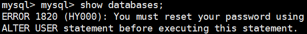

# 第三节 MySQL 服务

## 1、查看 MySQL 用户

MySQL 的安装程序在安装过程中创建了一个名为：mysql 的 Linux 系统用户。


## 2、初始化服务

### ①初始化服务

我们当前登录 Linux 系统使用的是 root 用户。而我们初始化 MySQL 服务需要使用 MySQL 创建的用户。也就是上面提到的名为：mysql 的 Linux 系统用户。

```shell
# 初始化 MySQL 服务
mysqld --initialize --user=mysql
```


### ②查看初始化密码

--initialize 选项默认以“安全”模式来初始化，则会为 root 用户生成一个密码并将该密码标记为过期。登录后你需要设置一个新的密码


root@localhost: 后面就是初始化的密码


## 3、启动服务

刚安装完成的 MySQL 服务此时不是运行状态：


但是是开机自动启动的。此时我们可以手动启动服务：


## 4、首次登录

### ①使用初始密码登录

现在我们可以使用前面我们从日志中看到的初始密码登录 MySQL。在 Enter password：后面粘贴初始密码即可。


### ②修改密码



由于此时登录使用的是已过期的密码，所以需要进行修改：

```sql
# ALTER USER '登录MySQL的用户名'@'MySQL服务器的主机地址' IDENTIFIED BY '现在要设置的密码';
ALTER USER 'root'@'localhost' IDENTIFIED BY 'atguigu';
```


修改密码后需重新登录：


此时可以执行 SQL 语句了：


[上一节](verse02.html) [回目录](index.html) [下一节](verse04.html)