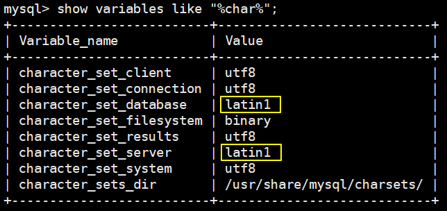
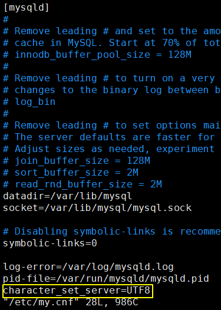
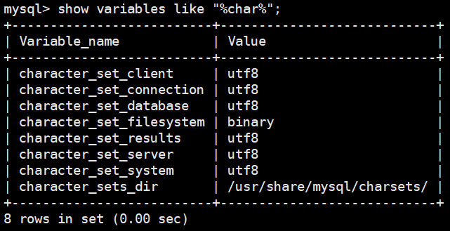

# 第五节 字符集问题

## 1、查看当前字符集设置情况

```sql
show variables like "%char%";
```




## 2、修改配置文件

```shell
vim /etc/my.cnf
```


在文件末尾增加：character_set_server=UTF8




重启 MySQL 服务。


::: warning

注意：对于修改配置文件前已创建的数据库无效。

:::


## 3、再次查看字符集设置




[上一节](verse04.html) [回目录](index.html)  [下一节](verse06.html)