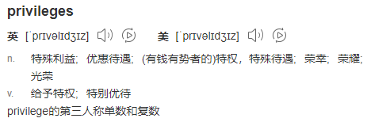
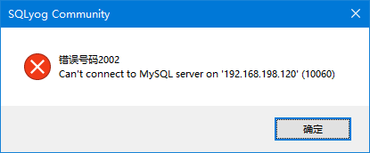
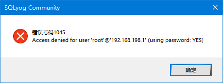
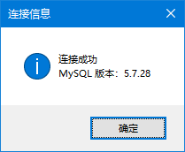

# 第七节 权限管理

通过本节的学习，大家能够让 root 用户实现远程登录即可。


## 1、授权命令

如果命令中指定的用户名不存在，则新建用户。

```sql
# 语法格式
# grant 权限1,权限2,…权限n on 数据库名称.表名称 to 用户名@用户地址 identified by ‘连接口令’;

# 给 zhang3 用户用本地命令行方式下，授予库下的所有表的插删改查的权限。
grant select,insert,delete,update on *.* to zhang3;

# 授予通过网络方式登录的用户，对所有库所有表的全部权限，密码设为atguigu.
# grant 表示：授予
# all privileges 表示：所有权限
# *.* 表示：所有数据库.所有表
grant all privileges on *.* to root@'%' identified by 'atguigu';
```





## 2、收回权限

```sql
# revoke 权限1,权限2,…权限n on 数据库名称.表名称 from 用户名@用户地址 ;
# 收回全库全表的所有权限
REVOKE ALL PRIVILEGES ON *.* FROM zhang3@'%';

# 收回 mysql 库下的所有表的插删改查权限
REVOKE select,insert,update,delete ON *.* FROM zhang3@'%';
```


## 3、查看权限

```sql
# 查看当前用户权限
show grants;

# 查看某用户的全局权限
select * from mysql.user;

# 查看某用户的某个表的权限
select * from mysql.tables_priv;
```


## 4、远程登录

### ①错误号码2002



这个错误是无法连接指定 IP 对应的主机。有可能是下面的原因：

- IP 不正确
- 端口号不正确
- Linux 防火墙在运行中并不允许 3306 端口访问


如果是防火墙的问题可以关闭防火墙服务：

```shell
# 关闭防火墙服务
systemctl stop firewalld.service

# 取消防火墙服务的开机自动启动
systemctl disable firewalld.service
```


### ②错误号码1045



这个错误提示是指访问被拒绝，需要提供密码。有可能的原因是：

- 密码不正确
- 没有授权远程登录


### ③被MySQL自己拒绝连接


这个错误信息，通常是因为当前用户没有被允许远程访问。


### ④连接成功




[上一节](verse06.html) [回目录](index.html)