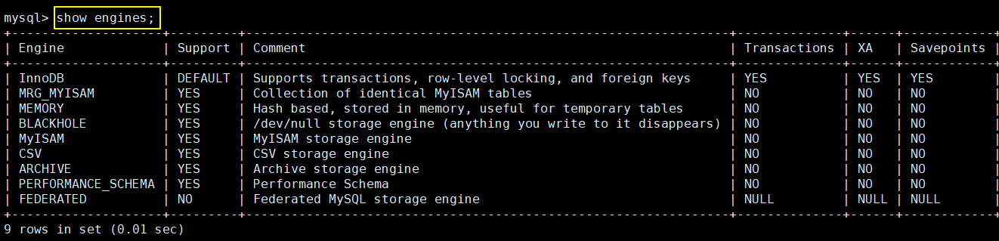
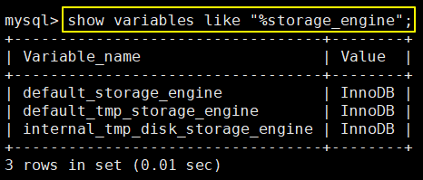

# 第三章 存储引擎

## 1、查看存储引擎

### ①查看 MySQL 支持的存储引擎

### ②查看当前默认的存储引擎

## 2、引擎介绍

### ①InnoDB

MySQL 从 5.5 版本之后，就开始默认采用 InnoDB 引擎。

::: tip

- InnoDB 是 MySQL 的默认事务型引擎。
- InnoDB 被设计用来处理大量的短期(short-lived)事务。可以确保事务的完整提交(Commit)和回滚(Rollback)。
- 如果除了增加和查询外，还需要更新和删除操作，那么应优先选择 InnoDB 存储引擎。
- 除非有非常特别的原因需要使用其他的存储引擎，否则应该优先考虑 InnoDB 引擎。

:::

### ②MyISAM

MySQL 在 5.5 版本之前，默认使用 MyISAM 引擎。

::: tip

MyISAM 提供了大量的特性，包括全文索引、压缩、空间函数(GIS)等。但 MyISAM 不支持事务和行级锁，有一个毫无疑问的缺陷就是崩溃后无法安全恢复。

- 数据文件结构：
  - .frm 存储定义表
  - .MYD 存储数据
  - .MYI 存储索引

:::

::: warning

注意：

- 静态表字段都是非变长字段，存储占用空间比动态表多。

- 非变长字段存储数据时会按照列宽补足空格，但在访问时候并不会得到这些空格。

- 如果存储数据本身后面有空格，查询时也会被去掉。

- 如果存储数据本身前面有空格，查询时不会被去掉。

- 在没有 where 条件情况下统计表 count(*) 数量，不需要全表扫描，而是直接获取保存好的值。

:::

### ③Archive

- Archive 档案存储引擎只支持 INSERT 和 SELECT 操作，在 MySQL 5.1 之前不支持索引。
- Archive 表适合日志和数据采集（档案）类应用。
- 根据英文的测试结论来看，Archive 表比 MyISAM 表要小大约 75%，比支持事务处理的 InnoDB 表小大约83%。

### ④Blackhole

- Blackhole 引擎没有实现任何存储机制，它会丢弃所有插入的数据，不做任何保存。
- 但服务器会记录 Blackhole 表的日志，所以可以用于复制数据到备库，或者简单地记录到日志。但这种应用方式会碰到很多问题，因此并不推荐。

### ⑤CSV

- CSV 引擎可以将普通的 CSV 文件作为 MySQL 的表来处理，但不支持索引。
- CSV 引擎可以作为一种数据交换的机制，非常有用。
- CSV 存储的数据直接可以在操作系统里，用文本编辑器，或者 Excel 读取。

### ⑥Memory

- 如果需要快速地访问数据，并且这些数据不会被修改，重启以后丢失也没有关系，那么使用 Memory 表是非常有用。
- Memory 表至少比 MyISAM 表要快一个数量级。

::: tip

- 数量级：两位数比个位数高一个数量级；四位数比三位数高一个数量级。
- 量级：一个体系在所有维度综合之后，超越另一个体系，就是量级的差距。比如：信息化社会的经济水平比工业化社会的经济水平高一个量级；工业化社会的经济水平比农业社会的经济水平高一个量级。

:::

### ⑦Federated

Federated 引擎是访问其他 MySQL 服务器的一个代理，尽管该引擎看起来提供了一种很好的跨服务器的灵活性，但也经常带来问题，因此默认是禁用的。

## 3、巅峰对决

下面我们将最常见的 InnoDB 和 MyISAM 两个引擎详细对比一下：

| **对比项**                                               | **MyISAM**                                                   | **InnoDB**                                                   |
| -------------------------------------------------------- | ------------------------------------------------------------ | ------------------------------------------------------------ |
| 外键   | 不支持                                                       | 支持                                                         |
| 事务   | 不支持                                                       | 支持                                                         |
| 行表锁 | 支持表锁 即使操作一条记录也会锁住整个表， 不适合高并发操作 | 支持行锁 操作时只锁某一行，不对其它行有影响， 适合高并发操作 |
| 缓存                                                     | 只缓存索引，不缓存真实数据                                   | 不仅缓存索引还要缓存真实数据， 对内存要求较高， 而且内存大小对性能有决定性的影响 |
| 系统提供预创建数据库表 给用户使用                   | 是                                                           | 否                                                           |
| 关注点                                                   | 性能：节省资源、消耗少、简单业务                             | 事务：并发写、事务、更大资源                                 |
| 默认安装                                                 | 是                                                           | 是                                                           |
| 默认使用                                                 | 否                                                           | 是                                                           |

[上一章](../chapter02/index.html) [回目录](../index.html) [下一章](../chapter04/index.html)