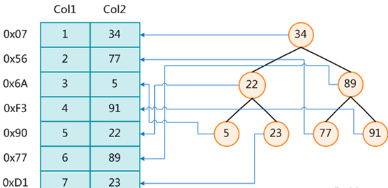

# 第一节 概述

## 1、概念

MySQL 官方对索引的定义为：索引（Index）是帮助 MySQL 高效获取数据的数据结构。 所以索引的本质就是一种数据结构。你可以简单理解为『排好序的快速查找数据结构』。

下图就是一种可能的索引方式示例：

左边是数据表，一共有两列七条记录，最左边的是数据记录的物理地址。

为了加快 Col2 的查找，可以维护一个右边所示的二叉查找树，每个节点分别包含索引键值和一个指向对应数据记录物理地址的指针，这样就可以运用二叉查找在一定的复杂度内获取到相应数据，从而快速的检索出符合条件的记录。

数据本身之外，数据库还维护着一个满足特定查找算法的数据结构，这些数据结构以某种方式指向数据， 这样就可以在这些数据结构的基础上实现高级查找算法，这种数据结构就是索引。

一般来说索引本身也很大，不可能全部存储在内存中，因此索引往往以索引文件形式存储在磁盘上。

## 2、评价

### ①优点

- 类似大学图书馆建书目索引，提高数据检索的效率，降低数据库的 IO 成本

- 通过索引列对数据进行排序，降低数据排序的成本，降低了 CPU 的消耗

### ②缺点

- 实际上索引也是一张表，该表保存了主键字段与索引字段，并指向实体表的记录，所以索引列也是要占用空间的

- 虽然索引大大提高了查询速度，同时却会降低更新表的速度，如对表进行 INSERT、UPDATE 或 DELETE。 因为更新表时，MySQL 不仅要保存数据，还要保存一下索引文件。每次更新时，如果被更新的字段上添加了索引，那么不仅要修改字段本身，还要修改它建立的索引。

[回目录](index.html) [下一节](verse02.html)