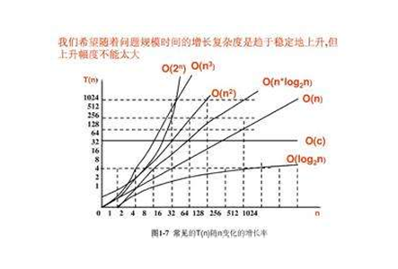
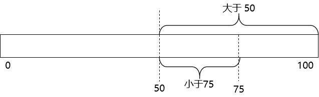
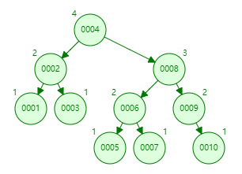
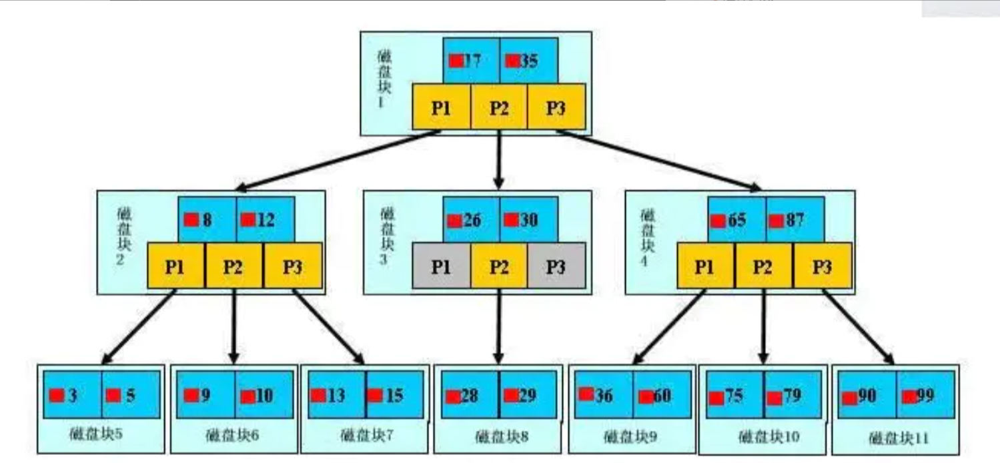

# 第二节 结构

## 1、时间复杂度

同一问题可用不同算法解决，而一个算法的质量优劣将影响到算法乃至程序的效率。算法分析的目的在于选择合适算法和改进算法。


我们希望随着问题规模的增长，复杂度是趋于稳定地上升，但上升幅度不能太大。




## 2、数据结构基础概念

### ①链表

#### [1]单向链表


#### [2]双向链表


### ②树

#### [1]根节点


#### [2]叶子节点


#### [3]父子关系节点


### ③二分查找




## 2、HASH

加速查找速度的数据结构，常见的有两类：

- 哈希：查询/插入/修改/删除的平均时间复杂度都是 O(1)，例如 HashMap；

- 树：查询/插入/修改/删除的平均时间复杂度都是 O(log2N)，例如平衡二叉搜索树；

可以看到，不管是读请求，还是写请求，哈希类型的索引，都要比树型的索引更快一些。


那为什么，索引结构要设计成树型呢？

想想<span style="color:blue;font-weight:bold;">范围</span>/<span style="color:blue;font-weight:bold;">排序</span>等其它 SQL 条件：

哈希型的索引，时间复杂度会退化为 O(n) 而树型的<span style="color:blue;font-weight:bold;">『有序』</span>特性，依然能够保持 O(log2N)  的高效率。

备注：InnoDB 不支持哈希索引。


## 3、普通二叉树

二叉树的特点：

- 一个节点只能有两个子节点，也就是一个节点度不能超过 2

- <span style="color:blue;font-weight:bold;">左子节点</span><span style="color:red;font-weight:bold;">小于</span><span style="color:blue;font-weight:bold;">本节点</span>；<span style="color:blue;font-weight:bold;">右子节点</span><span style="color:red;font-weight:bold;">大于等于</span><span style="color:blue;font-weight:bold;">本节点</span>。比我大的向右，比我小的向左。


对该二叉树的节点进行查找

- 深度为 1 的节点的查找次数为 1，


- 深度为 2 的节点的查找次数为 2，


- 深度为 N 的节点的查找次数为 N，


结论：因此其平均查找次数为 (1+2+2+3+3+3) / 6 = 2.3 次


## 4、平衡二叉树

<span style="color:blue;font-weight:bold;">平衡二叉树</span>（Balanced Binary Tree）又被称为 AVL 树（有别于 AVL 算法），且具有以下性质：

它是一棵空树或它的左右两个子树的<span style="color:blue;font-weight:bold;">高度差的绝对值不超过 1</span>，并且左右两个子树都是一棵平衡二叉树。

这个方案很好的解决了二叉查找树退化成链表的问题。把插入、查找、删除操作的最好情况和最坏情况的时间复杂度都维持在 O(logN)。但是频繁旋转会使插入和删除牺牲掉 O(logN) 左右的时间，不过相对二叉查找树来说，时间上稳定了很多。



平衡二叉树大部分操作和二叉查找树类似，主要不同在于插入删除的时候平衡二叉树的平衡可能被改变，并且只有从那些插入点到根结点的路径上的结点的平衡性可能被改变，因为只有这些结点的子树可能变化。


## 5、BTree（重点）

### ①概念

BTree 即 B 树，B 即 Balanced，平衡的意思。

<span style="color:blue;font-weight:bold;">B 树的阶</span>：节点的最多子节点个数。

B 树的搜索，从根结点开始，对节点内的关键字（有序）序列进行二分查找，如果命中则结束，否则进入查询关键字所属范围的儿子节点；重复，直到所对应的儿子指针为空，或已经是叶子节点, 关键字集合分布在整棵树中, 即叶子节点和非叶子节点都存放数据, 搜索有可能在非叶子节点结束,其搜索性能等价于在关键字全集内做一次二分查找。


### ②加载机制问题

思考一个问题，索引树会一次性加载吗？

数据库索引是存储在磁盘上的。如果数据本身很大，相应的索引也会很大——好比新华字典字数多必然导致目录厚。当我们利用索引查询时候，是不可能将全部几个 G 的索引都加载进内存的。更好的方案是：逐一加载每一个<span style="color:blue;font-weight:bold;">磁盘页</span>，因为磁盘页对应着索引树的节点。




### ③Page（页）

Page 是 InnoDB 存储的最基本结构，也是 InnoDB 磁盘管理的最小单位。与数据库相关的所有内容都存储在 Page 结构里。

Page 分为几种类型：

- 数据页（BTree Node）
- Undo页（Undo Log Page）
- 系统页（System Page）
- 事务数据页（Transaction System Page）


每个数据页的大小为 16kb，每个 Page 使用一个 32 位的 int 值来表示，正好对应 InnoDB 最大 64TB 的存储容量(16kb * 2^32=64tib)。


下面的语句可以查看系统中 InnoDB 的 Page 大小：

```sql
show global status like 'Innodb_page_size';
```


### ④Block（块）

系统从磁盘读取数据到内存时是以磁盘块（block）为基本单位的，位于同一个磁盘块中的数据会被一次性读取出来，而不是需要什么取什么。

InnoDB 存储引擎中有页（Page）的概念。系统一个磁盘块的存储空间往往没有这么大，因此 InnoDB 每次申请磁盘空间时都会是若干地址连续磁盘块来达到页的大小 16 KB。InnoDB 在把磁盘数据读入到内存时会以页为基本单位。在查询数据时如果一个页中的每条数据都能有助于定位数据记录的位置，这将会减少磁盘 I/O 次数，提高查询效率。


### ⑤BTree 的查询流程

每个节点占用一个盘块的磁盘空间，一个节点上有两个升序排序的关键字和三个指向子树根节点的指针，指针存储的是子节点所在磁盘块的地址——也就是数据的物理地址。

模拟查找关键字 29 的过程：

- 根据根节点找到磁盘块 1，读入内存。【磁盘 I/O 操作第 1 次】
- 比较关键字 29 在区间（17,35），找到磁盘块 1 的指针 P2。
- 根据 P2 指针找到磁盘块 3，读入内存。【磁盘 I/O 操作第 2 次】
- 比较关键字 29 在区间（26,30），找到磁盘块 3 的指针 P2。
- 根据 P2 指针找到磁盘块 8，读入内存。【磁盘 I/O 操作第 3 次】
- 在磁盘块 8 中的关键字列表中找到关键字 29。

分析上面过程，发现需要 3 次磁盘 I/O 操作，和 3 次内存查找操作。由于内存中的关键字是一个有序表结构，可以利用二分法查找提高效率，所以 3 次磁盘 I/O 操作是影响整个 BTree 查找效率的决定因素。


## 6、B+Tree（重点）

B+ 树是 B 树的变体，也是一种多路搜索树。B+ 树的搜索与 B 树也基本相同，区别是 B+ 树只有达到叶子节点才命中（B 树可以在非叶子结点命中），其性能也等价于在关键字全集做一次二分查找。

这是因为 B+ 树要求：<span style="color:blue;font-weight:bold;">所有数据都只能在叶子节点</span>，并且把所有叶子节点组合成了一个链表，且链表中的关键字(数据)恰好是有序的。

这样一来，所有关键字也就都出现在叶子节点组成的链表中了。

因此不可能在非叶子节点命中，<span style="color:blue;font-weight:bold;">非叶子节点相当于是叶子节点的索引，叶子节点相当于是存储（关键字）数据的数据层</span>。


通常在 B+Tree 上有两个头指针：一个指向根节点，另一个指向关键字最小的叶子节点。而且所有叶子节点（即数据节点）之间是一种链式环结构。 因此可以对 B+Tree 进行两种查找运算：一种是对于主键的范围查找和分页查找，另一种是从根节点开始，进行随机查找。

InnoDB 存储引擎中页的大小为 16KB，一般表的主键类型为 INT（占用 4 个字节）或 BIGINT（占用 8 个字节），指针类型也一般为 4 或 8 个字节，也就是说一个页（B+Tree 中的一个节点）中大概存储 16KB/(8B+8B)=1K 个键值（因为是估值，为方便计算，这里的 K 取值为 10^3）。也就是说一个深度为 3 的 B+Tree 索引可以维护 10^3 × 10^3 × 10^3 = 10 亿条记录。

实际情况中每个节点可能无法填充满，因此在数据库中，B+Tree 的高度一般都在 2~4 层。MySQL 的 InnoDB 存储引擎在设计时是将根节点常驻内存的，也就是说查找某一键值的行记录时最多只需要 1~3 次磁盘 I/O 操作。


BTree 和 B+Tree 的对比：

- B 树结构图中可以看到每个节点中不仅包含数据的 key 值，还有 data 值。而每一个页的存储空间是有限的，如果 data 数据较大时将会导致每个节点（即一个页）能存储的 key 的数量很小，当存储的数据量很大时同样会导致 B 树的深度较大，增大查询时的磁盘 I/O 次数进而影响查询效率。
- B+ 树中，所有数据记录节点都是按照键值大小顺序存放在同一层的叶子节点上，而非叶子节点上只存储 key 值信息，这样可以大大加大每个节点存储的 key 值数量，降低 B+ 树的高度。这样一来，访问磁盘的 I/O 的次数就会减少。


[上一节](verse01.html) [回目录](index.html) [下一节](verse03.html)