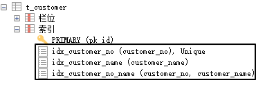

# 第五章 MySQL 索引语法

## 1、概念介绍

| 索引类型 | 索引特点                                                     |
| -------- | ------------------------------------------------------------ |
| 单值索引 | 即一个索引只包含单个列，一个表可以有多个单值索引（也叫单列索引） |
| 唯一索引 | 索引列的值必须唯一，但允许有空值，空值可以有多个             |
| 主键索引 | 设定为主键后数据库会自动建立索引，InnoDB 为聚簇索引          |
| 复合索引 | 即一个索引包含多个列                                         |


::: tip

平时我们提到『主键』时，通常都是『主键约束』。而『主键约束』和『主键索引』是两个不同的概念。

:::


## 2、索引操作语法

相关语法可以参考 W3CSchool 教程：https://www.w3school.com.cn/sql/sql_create_index.asp


### ①准备工作

```sql
create database db_shop;

use db_shop;

create table t_customer(
pk_id int auto_increment primary key,
customer_no varchar(200),
customer_name varchar(200));
```


### ②创建单值索引

```sql
# create index 索引名称 on 要建立索引的字段所在的表(要建立索引的字段);
create index idx_customer_name on t_customer(customer_name);
```


### ③创建唯一索引

```sql
# create unique index 索引名称 on 要建立索引的字段所在的表(要建立索引的字段);
create unique index idx_customer_no on t_customer(customer_no);
```


### ④复合索引

```sql
# create index 索引名称 on 要建立索引的字段所在的表(要建立索引的字段,...,要建立索引的字段);
create index idx_customer_no_name on t_customer(customer_no,customer_name);
```


索引创建好可以如下图所示方式查看：




### ⑤删除索引

```sql
# drop index 要删除的索引名称 on 索引所在的表;
drop index idx_customer_no_name on t_customer;
```


## 3、最佳实践

### ①需要创建索引的情况

-  <span style="color:blue;font-weight:bold;">主键自动</span>建立唯一索引
-  <span style="color:blue;font-weight:bold;">频繁</span>作为<span style="color:blue;font-weight:bold;">查询</span>条件的字段应该创建索引，也就是经常出现在 where 子句中的字段
-  查询中负责与其它表<span style="color:blue;font-weight:bold;">关联</span>的<span style="color:blue;font-weight:bold;">字段——外键</span>， 建立索引
-  单键/组合索引的选择问题，who？(在高并发下倾向创建组合索引)
-  查询中排序的字段，排序字段若通过索引去访问将大大提高排序速度
-  查询中统计或者分组的字段


### ②不要创建索引的情况

- MySQL 中，一张数据库表中记录数量小于 300 万条时，即使创建索引也不会让搜索速度有明显提升。


- 经常增删改的表，建立索引提高了查询速度，同时却会降低更新表的速度，如对表进行 INSERT、UPDATE 和 DELETE。因为更新表时，MySQL 不仅要保存数据，还要保存一下索引文件，重新排布索引，这个操作需要对索引表做全表扫描。不仅索引表的全表扫描操作本身非常耗时，而且索引重新排布时不可用，此时执行查询操作没有索引可用，还是要回到原始数据库表做全表扫描。
- where 条件里用不到的字段
- 数据重复，过滤性不好的字段


### ③结论

索引并不是无条件创建、越多越好，而是要根据实际情况恰到好处的创建。


[上一章](../chapter04/index.html) [回目录](../index.html) [下一章](../chapter06/index.html)