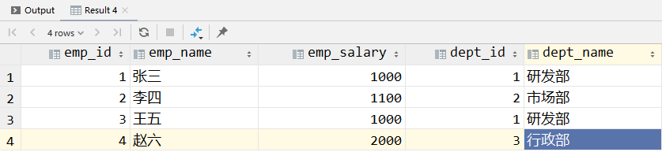
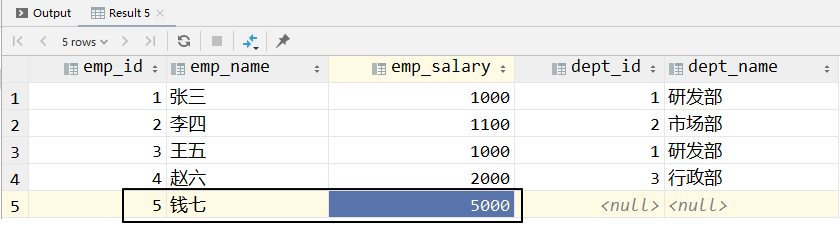
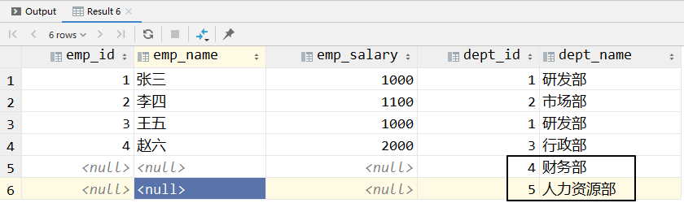
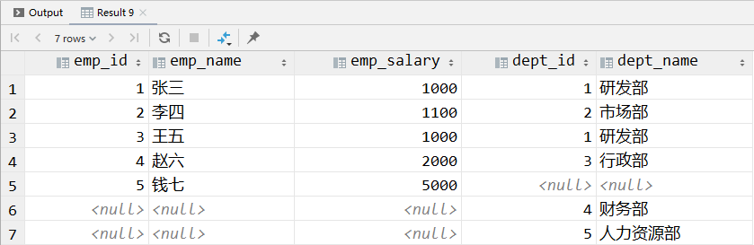
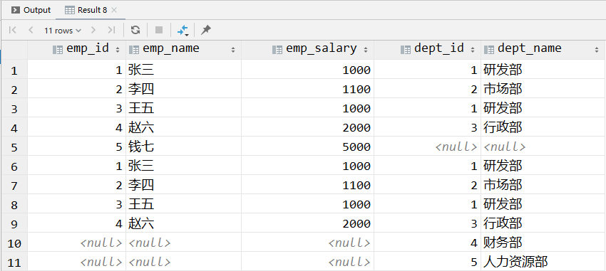
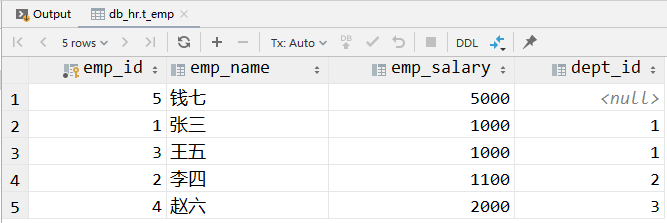
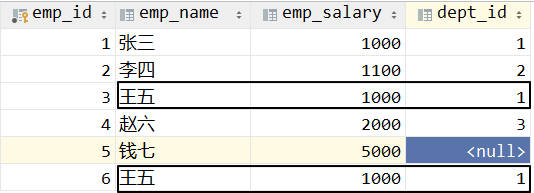
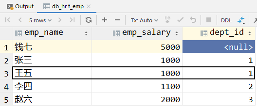
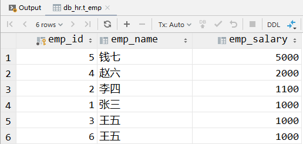

# 第一节 SQL 查询语句语法回顾

## 1、准备测试数据

```sql
CREATE DATABASE db_hr;

USE db_hr;

CREATE TABLE t_emp(
	emp_id INT AUTO_INCREMENT PRIMARY KEY,
	emp_name CHAR(100),
	emp_salary DOUBLE(10,5),
	dept_id INT
);

CREATE TABLE t_dept(
	dept_id INT AUTO_INCREMENT PRIMARY KEY,
	dept_name CHAR(100)
);

INSERT INTO `db_hr`.`t_dept` (`dept_name`) VALUES ('研发部');
INSERT INTO `db_hr`.`t_dept` (`dept_name`) VALUES ('市场部');
INSERT INTO `db_hr`.`t_dept` (`dept_name`) VALUES ('行政部');
INSERT INTO `db_hr`.`t_dept` (`dept_name`) VALUES ('财务部');
INSERT INTO `db_hr`.`t_dept` (`dept_name`) VALUES ('人力资源部');

INSERT INTO `db_hr`.`t_emp` (`emp_name`, `emp_salary`, `dept_id`) VALUES ('张三', '1000.00', '1');
INSERT INTO `db_hr`.`t_emp` (`emp_name`, `emp_salary`, `dept_id`) VALUES ('李四', '1100.00', '2');
INSERT INTO `db_hr`.`t_emp` (`emp_name`, `emp_salary`, `dept_id`) VALUES ('王五', '1000.00', '1');
INSERT INTO `db_hr`.`t_emp` (`emp_name`, `emp_salary`, `dept_id`) VALUES ('赵六', '2000.00', '3');
INSERT INTO `db_hr`.`t_emp` (`emp_name`, `emp_salary`) VALUES ('钱七', '5000.00');
```


## 2、笛卡尔积

```sql
select e.emp_id, e.emp_name, e.emp_salary, d.dept_id, d.dept_name
from t_emp e,
     t_dept d;
```

在 from 子句中，涉及到了两个数据库表：A 表，B 表。笛卡尔积就是使用 A 表中的每一条记录去关联 B 表中的所有记录。所以最终查询结果的总数量 = A 表记录数 × B 表记录数。


## 3、JOIN

为了便于描述语法，我们假设对 A 和 B 两个表做关联查询。


### ①内连接

A 表中所有满足连接条件的记录和 B 表中所有满足连接条件的记录。不论是左表还是右表，不满足查询条件的记录不会出现在查询结果中。

```sql
select e.emp_id, e.emp_name, e.emp_salary, d.dept_id, d.dept_name
from t_emp e
         inner join t_dept d on e.dept_id = d.dept_id;
```




### ②左外连接

相当于在内连接的基础上，把左表中不满足连接条件的记录也加入查询结果——左表完整呈现。

```sql
select e.emp_id, e.emp_name, e.emp_salary, d.dept_id, d.dept_name
from t_emp e
         left outer join t_dept d on e.dept_id = d.dept_id;
```




### ③右外连接

相当于在内连接的基础上，把右表中不满足连接条件的记录也加入查询结果——右表完整呈现。

```sql
select e.emp_id, e.emp_name, e.emp_salary, d.dept_id, d.dept_name
from t_emp e
         right outer join t_dept d on e.dept_id = d.dept_id;
```




## 4、UNION

### ①union

```sql
select e.emp_id, e.emp_name, e.emp_salary, d.dept_id, d.dept_name
from t_emp e
         left outer join t_dept d on e.dept_id = d.dept_id
union
select e.emp_id, e.emp_name, e.emp_salary, d.dept_id, d.dept_name
from t_emp e
         right outer join t_dept d on e.dept_id = d.dept_id;
```

- 参与 union 的多条 SQL 语句返回的查询结果必须有相同的字段。
- union 对合并后的查询结果会自动去重。
- 去重效果是需要由 MySQL 扫描整个合并结果，然后去重，所以也是需要消耗一定的运算资源的。




### ②union all

```sql
select e.emp_id, e.emp_name, e.emp_salary, d.dept_id, d.dept_name
from t_emp e
         left outer join t_dept d on e.dept_id = d.dept_id
union all
select e.emp_id, e.emp_name, e.emp_salary, d.dept_id, d.dept_name
from t_emp e
         right outer join t_dept d on e.dept_id = d.dept_id;
```

- 没有自动去重效果




## 5、Group by

### ①MySQL 5.7 版本后的新语法要求

#### [1]正确写法

```sql
select emp_id,emp_name,emp_salary,dept_id from  t_emp
group by dept_id, emp_id;
```




#### [2]错误写法

```sql
select emp_id,emp_name,emp_salary,dept_id from  t_emp
group by dept_id;
```


错误信息：

> Expression #1 of SELECT list is not in GROUP BY clause and contains nonaggregated column 'db_hr.t_emp.emp_id' which is not functionally dependent on columns in GROUP BY clause; this is incompatible with sql_mode=only_full_group_by
>
> 翻译：SELECT 子句列表中的 #1 表达式没有出现在 GROUP BY 子句中，而且包含非聚集的列：emp_id。这个字段对于 GROUP BY 子句来说没有功能上的依赖。这和 sql_mode=only_full_group_by 配置项不相容。
>
> 结论：解决这个问题有两个办法。
>
> - 办法一：将错误信息中提到的第一个字段加入 GROUP BY 子句。这也是新的语法要求建议的。
> - 办法二：到 MySQL 配置文件中修改 sql_mode 配置项。


### ②GROUP BY 的去重效果

我们首先给员工表增加一条重复记录（除了主键字段之外，其他字段值重复）：




使用 GROUP BY 查询：

```sql
select emp_name,emp_salary,dept_id from  t_emp
group by dept_id,emp_name,emp_salary;
```


查询结果中已经自动实现了去重：




::: tip

所以，如果已经有了 GROUP BY 或 UNION 提供的隐含的去重效果，就不要在使用 DISTINCT 关键词进行去重了。

- 原因1：去重效果已经实现。
- 原因2：DISTINCT 检查重复数据是对整个查询结果做逐条记录扫描，比较消耗性能。

:::


## 6、Order by

### ①基本语法

```sql
select emp_id,emp_name,emp_salary from t_emp
order by emp_salary desc;
```




### ②各子句顺序

在编写 SQL 语句时，各子句顺序应该是：

select →  from → join → where → group by → having → order by →  limit

limit 子句必须在最后。


[回目录](index.html) [下一节](verse02.html)
