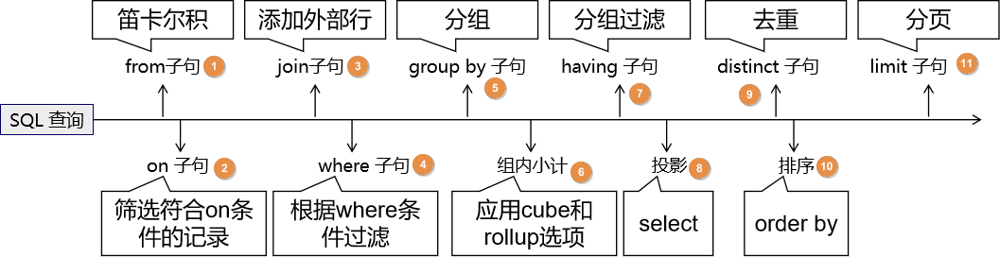
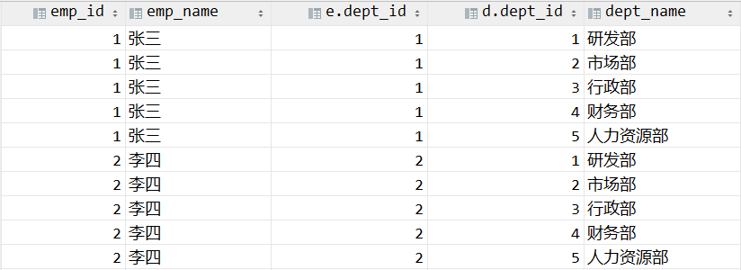
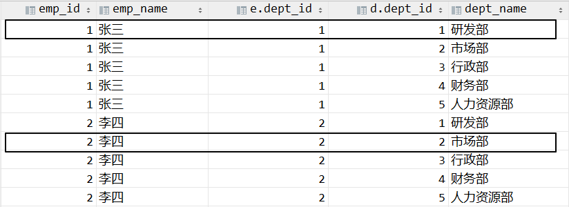
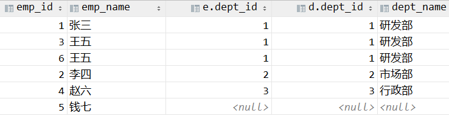
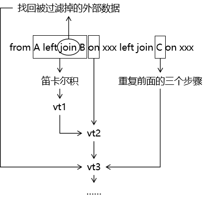

# 第二节 SQL 解析流程分析

## 1、总体说明

- 所有查询语句都是从 from 开始执行的。
- 每一个步骤执行完成的结果都是一张虚拟表。
- 每一个步骤都是以上一步生成的虚拟表作为输入数据来进行运算。

## 2、具体步骤

### ①from 子句

这里使用 from 子句中涉及到多个表这个较复杂的情况来说明：

MySQL 会首先使用 from 子句中指定的多个表中的前两个表做笛卡尔积。将这个笛卡尔积结果作为第一张虚拟表 vt1。而且在做笛卡尔积时，选择相对较小的表作为基础表。

下图是笛卡尔积的部分数据：

### ②应用 on 筛选器

将 on 中的逻辑表达式应用到 vt1 虚拟表中的每一行，筛选出满足 on 表达式的行，生成下一张虚拟表 vt2。

假设现在的 on 中的逻辑表达式是：e.dept_id=d.dept_id，那么在笛卡尔积中我们可以做如下筛选：

### ③添加外部行

如果本条 SQL 语句所做的是内连接，则不需要做这一步；

如果本条 SQL 语句所在的是外连接，则需要执行这一步。执行方式如下：

- 左外连接：从上一步被筛选掉的数据中，把左表数据找回
- 右外连接：从上一步被筛选掉的数据中，把右表数据找回

下图是找回左表数据的举例：

这一步执行完，生成第三张虚拟表 vt3。

### ④重复执行前面步骤

如果 from 子句后面还有更多表，则在 vt3 的基础上循环执行上面的步骤，直到把所有表都处理完。

### ⑤where 筛选器

应用 where 筛选器，对上一步生产的虚拟表应用 where 筛选器，生成虚拟表 vt4

### ⑥group by 分组

在 vt4 的基础上执行 group by 分组。分组操作后，生成虚拟表 vt5。对于后面的所有操作来说，vt5 已经决定了所有的字段和分组中的记录。

有些字段会是聚合函数执行的结果，例如：count、sum、avg等。

而且在分组过程中已经在取值过程中仅仅取唯一值，实现了去重的效果。

### ⑦应用组内小计功能[了解]

- 使用 cube 选项：为每一组中的数据以列为单位进行小计
- 使用 rollup 选项：为每一组中的数据以行为单位进行小计

生成虚拟表：vt6。

### ⑧应用 having 筛选器

应用 having 筛选器，生成 vt7。having 筛选器是第一个也是为唯一一个应用到已分组数据的筛
选器

### ⑨投影

参照 select 子句，将 select 子句中指定的字段从 vt7 的结果中筛选出来。生成 vt8。

### ⑩去重

应用 distinct 子句，vt8 中移除相同的行，生成 vt9。

### ⑪排序

应用 order by 子句。按照 order_by_condition 排序 vt9，此时返回的一个游标，而不是虚拟表。排序是很需要成本的，除非你必须要排序，否则最好不要指定order by，最后，在这一步中是第一个也是唯一一个可以使用select列表中别名的步骤。

::: tip

游标：

SQL 是基于集合的理论的，集合不会预先对他的行排序，它只是成员的逻辑集合，成员的顺序是无关紧要的。

对表进行排序将返回一个对象。

这个对象中包含的是前面查询结果数据的物理地址。

而且这个对象中保存的物理地址是经过排序的。

这就说明 SQL 经过 order by 子句排序后，其实并没有对数据记录行本身执行排序，而仅仅是把数据记录行的物理地址进行排序，然后把物理地址排序的结果封装在一个对象中，这个对象就是游标。

所以使用 order by 子句查询，不能使用表级别的表达式，因为游标中只有物理地址，而没有数据本身。

:::

### ⑫分页

LIMIT 子句是必须出现在整个 SQL 语句最后，在整个查询结果中选取所需要的一段。分页完成后，返回最终查询结果。

[上一节](verse01.html) [回目录](index.html)
