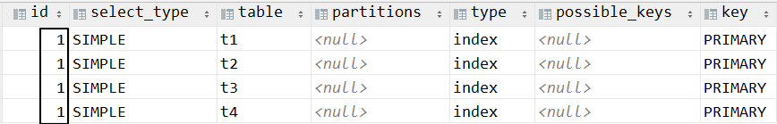
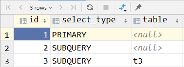
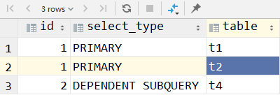
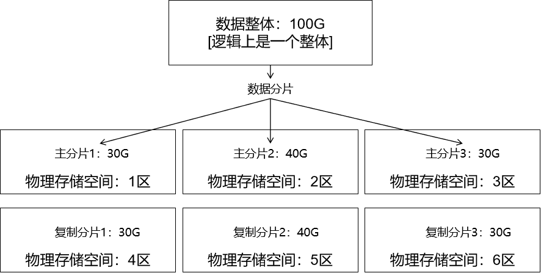
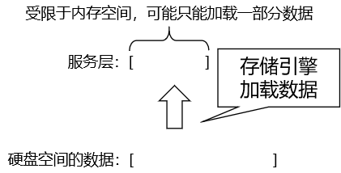

# 第七章 Explain

## 1、概念

### ①MySQL 内优化器

MySQL 体系结构中，包含 SQL 解析器、优化器等组件。SQL 解析器解析 SQL 之后，生成解析树。经过验证，解析树正确后，由优化器进一步优化解析树。


### ②Explain 分析

使用 EXPLAIN 关键字可以模拟优化器执行 SQL 查询语句，从而知道 MySQL 是如何处理你的 SQL 语句的。
分析你的查询语句或是表结构的性能瓶颈。


## 2、准备测试数据

```sql
use db_hr;

CREATE TABLE t1
(
    id      INT(10) AUTO_INCREMENT,
    content VARCHAR(100) NULL,
    PRIMARY KEY (id)
);
CREATE TABLE t2
(
    id      INT(10) AUTO_INCREMENT,
    content VARCHAR(100) NULL,
    PRIMARY KEY (id)
);
CREATE TABLE t3
(
    id      INT(10) AUTO_INCREMENT,
    content VARCHAR(100) NULL,
    PRIMARY KEY (id)
);
CREATE TABLE t4
(
    id      INT(10) AUTO_INCREMENT,
    content VARCHAR(100) NULL,
    PRIMARY KEY (id)
);
INSERT INTO t1(content)
VALUES (CONCAT('t1_', FLOOR(1 + RAND() * 1000)));
INSERT INTO t2(content)
VALUES (CONCAT('t2_', FLOOR(1 + RAND() * 1000)));
INSERT INTO t3(content)
VALUES (CONCAT('t3_', FLOOR(1 + RAND() * 1000)));
INSERT INTO t4(content)
VALUES (CONCAT('t4_', FLOOR(1 + RAND() * 1000)));
```


## 3、分析结果 id 字段

### ①id 字段含义

explain分析结果中 id 字段含义：

- 结果中有四条记录，说明被分析的 SQL 语句需要执行四趟。
- id 值相同：SQL 执行的顺序是按照分析结果中的顺序，从上到下执行
- id 值不同：越大的值越先执行
- id 值的每个号码都代表 SQL 语句的一趟执行，一个 SQL 查询的趟数越少越好


### ②举例

#### [1]id 值相同的情况

SQL 本身：

```sql
select t1.id,t2.id,t3.id,t4.id from t1,t2,t3,t4
```


应用 Explain 分析：

```sql
explain select t1.id,t2.id,t3.id,t4.id from t1,t2,t3,t4
```


部分执行结果：




#### [2]id 值不同的情况

```sql
EXPLAIN
SELECT t1.id
FROM t1
WHERE t1.id = (SELECT t2.id FROM t2 WHERE t2.id = (SELECT t3.id FROM t3 WHERE t3.content = 't3_354'))
```




#### [3]相同的 id 值和不同的 id 值都有

```sql
EXPLAIN
SELECT t1.id, (select t4.id from t4 where t4.id = t1.id) id4
FROM t1,
     t2
```




## 4、分析结果 select_type 字段

| 取值                 | 含义                                                         |
| -------------------- | ------------------------------------------------------------ |
| SIMPLE               | 简单的 select 查询，查询中不包含子查询或者 UNION             |
| PRIMARY              | 查询中若包含任何复杂的子部分，最外层查询则被标记为 primary   |
| SUBQUERY             | 在 SELECT 或 WHERE 列表中包含了子查询                        |
| DEPENDENT SUBQUERY   | 在 SELECT 或 WHERE 列表中包含了子查询，子查询基于外层        |
| UNCACHEABLE SUBQUREY | 表示这个 subquery 的查询要受到外部表查询的影响               |
| DERIVED              | 在 FROM 列表中包含的子查询被标记为 DERIVED(衍生)。MySQL 会递归执行这些子查询，把结果放在临时表里 |
| UNION                | 这是 UNION 语句其中的一个 SQL 元素                           |
| UNION RESULT         | 从 UNION 表获取结果的 SELECT，也就是在 UNION 合并查询结果的基础上，不使用全部字段，选取一部分字段。 |


::: tip

DEPENDENT SUBQUERY 进一步解释

如果整体 SQL 语句执行的顺序是：

- 先执行外层查询
- 再执行内层子查询
- 然后外层查询结果中的每一条再去匹配内层子查询结果的每一条

这样，内外两层的查询结果就是<span style="color:blue;font-weight:bold;">相乘的关系</span>。相乘就有可能导致总的查询操作次数非常大。所以经过 explain 分析后，如果发现查询类型是 DEPENDENT SUBQUERY 就需要引起各位注意了！

:::


## 5、分析结果 table 字段

显示这一步所访问数据库中表名称（显示这一行的数据是关于哪张表的），有时不是真实的表名字，可
能是别名。


## 6、分析结果 partitions 字段

代表分区表中的命中情况。如果是非分区表，该项为 null。逻辑上是一个整体的数据，可以在物理层保存时，拆分成很多个分片。分片在分区中保存。数据分片的好处是：

- 方便在很多个不同分区之间方便的移动分片，分摊负载，弹性扩容。
- 给主分片创建复制分片可以增强数据安全性。




## 7、分析结果 type 字段

对表访问方式，表示MySQL在表中找到所需行的方式，又称“访问类型”。具体取值参见下表（从上到下，性能越来越快）：


| 取值   | 含义                                                         |
| ------ | ------------------------------------------------------------ |
| ALL    | 全表扫描                                                     |
| index  | 在索引表中做全表扫描                                         |
| range  | 在一定范围内查询索引表                                       |
| ref    | 在查询索引表时使用了具体值                                   |
| eq_ref | 和 ref 一样，使用具体值查询索引表，但查询的是唯一索引        |
| const  | 表示通过索引一次性找到所需数据<br />where emp_id=6           |
| system | 表仅有一行记录，这是const类型的特例，查询起来非常迅速        |
| null   | MySQL在优化过程中分解语句，执行时甚至不用访问表或索引，例如从一个索引列里选取最小值可以通过单独索引查找完成。 |


在上述查询方式中，从 eq_ref 开始，条件就很苛刻了，不容易达到。所以实际开发时要求，至少能达到 range 水平，最好能达到 ref。


## 8、分析结果 possible_keys 字段

在查询中有可能会用到的索引列。如果没有任何索引显示 null。


## 9、分析结果 key 字段

key 列显示 MySQL 实际决定使用的键（索引），必然包含在 possible_keys 中。


## 10、分析结果 key_len 字段

key_len 表示索引使用的字节数，根据这个值可以判断索引的使用情况，特别是在组合索引的时候，判断该索引有多少部分被使用到非常重要, 值越大索引的效果越好——因为值越大说明索引被利用的越充分。


字节数计算方式：

- 索引对应字段类型：
  - 数值类型：最终结果就是数值类型字段宽度本身
  - 字符串类型：查看字符集类型
    - UTF-8：需要给字段长度 × 3
    - GBK：需要给字段长度 × 2
  - 如果是 varchar 这样的变长字符串类型：再 + 2
  - 如果是允许为空的字段：再 + 1


举例：customer_name 字段声明的类型是 varchar(200)，允许为空。

200 × 3 + 2 + 1 = 603


## 11、分析结果 ref 字段

显示将哪些列或常量与键列中命名的索引进行比较，以从表中选择行


## 12、分析结果 rows 字段

估算出结果集行数，表示MySQL根据表统计信息及索引选用情况，估算的找到所需的记录所需要读取的行数


## 13、分析结果 filtered 字段

通过存储引擎从硬盘加载数据到服务层时，受限于内存空间，有可能只能加载一部分数据。filtered 字段显示的值是：已加载数据 / 全部数据 的百分比。只是不显示百分号。




## 14、分析结果 extra 字段

下面蓝色字体需要适当留意一下：

| 取值                                                         | 含义                                                         |
| ------------------------------------------------------------ | ------------------------------------------------------------ |
| <span style="color:blue;font-weight:bold;">using where</span> | 不用读取表中所有信息，仅通过索引就可以获取所需数据。<br />言外之意是 select 查询的字段都带有索引。<br />不管 select 查询多少个字段，这些字段都在索引中。 |
| <span style="color:blue;font-weight:bold;">Using temporary</span> | 表示MySQL需要使用临时表来存储结果集，常见于排序和分组查询    |
| <span style="color:blue;font-weight:bold;">Using filesort</span> | 当Query中包含 order by 操作，而且无法利用索引完成的排序操作称为“文件排序”<br />这里的文件指的是保存在硬盘上的文件。<br />之所以会用到硬盘，是因为如果查询的数据量太大，内存空间不够，需要在硬盘上完成排序。<br />如果确实是很大数据量在硬盘执行排序操作，那么速度会非常慢。 |
| Using join buffer                                            | buffer 指缓冲区，该值强调了在获取连接条件时没有使用索引，并且需要连接缓冲区来存储中间结果。如果出现了这个值，那应该注意，根据查询的具体情况可能需要添加索引来改进能。<br />举例来说：where t_name like "%xxx%"，这个条件中的 t_name 字段没有加索引 |
| Impossible where                                             | where 子句中指定的条件查询不到数据的情况                     |
| Select tables optimized away                                 | 这个值表示目前的查询使用了索引，然后经过优化器优化之后，最终执行的是一个聚合函数，从而让最终的查询结果只返回一行 |
| No tables used                                               | 查询语句中使用 from dual 或不含任何 from 子句                |


## 15、使用建议

- EXPLAIN 不会告诉你关于触发器、存储过程的信息或用户自定义函数对查询的影响情况
- EXPLAIN 不考虑各种 Cache
- EXPLAIN 不能显示 MySQL 在执行查询时所作的优化工作
- 部分统计信息是估算的，并非精确值
- EXPALIN 只能解释 SELECT 操作，其他操作要重写为 SELECT 后查看执行计划


[上一章](../chapter06/index.html) [回目录](../index.html) [下一章](../chapter08/index.html)