# 第二节 索引失效

## 1、取消缓存功能

为了便于测试，避免 MySQL 内的缓存机制干扰分析结果，我们在分析 SQL 语句时取消 SQL 语句的缓存功能。

使用 <span style="color:red;font-weight:bold;">SQL_NO_CACHE</span> 关键字：

```sql
EXPLAIN SELECT SQL_NO_CACHE * FROM emp WHERE emp.age=30;
```

当然，实际开发时肯定是不会加的。


## 2、最左原则

### ①有可能用到索引的子句

所有有过滤功能的子句都会将相关字段去和索引尝试匹配：

- ON 子句
- WHERE 子句
- GROUP BY 子句
- HAVING 子句
- LIMIT 子句


### ②最左原则

简单来说就是：MySQL 在决定是否要应用索引时，会对照要 SQL 语句中要过滤的字段的顺序和索引中字段的顺序。那么具体是怎么对照的呢？请看下面的细节：


#### [1]创建索引

```sql
CREATE INDEX idx_age_deptid_name ON emp(age, deptid, NAME);
```

按照这个索引创建方式，索引中字段的顺序是：age、deptid、NAME


#### [2]仅查询 age

```sql
EXPLAIN
SELECT SQL_NO_CACHE *
FROM emp
WHERE emp.age = 30;
```

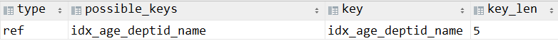

索引<span style="color:blue;font-weight:bold;">生效</span>！


::: tip

key_len 的值为什么是 5 ？

虽然创建表时指定的宽度是 3，但是其实 MySQL 中 INT 类型宽度固定就是 4。又因为 age 字段可以为空，所以 key_len = 4 + 1

:::


#### [3]查询 age 和 deptId

```sql
EXPLAIN
SELECT SQL_NO_CACHE *
FROM emp
WHERE emp.age = 30
  and deptid = 4;
```

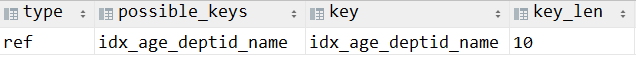

索引<span style="color:blue;font-weight:bold;">生效</span>！


#### [4]查询 age、deptId 和 name

```sql
EXPLAIN
SELECT SQL_NO_CACHE *
FROM emp
WHERE emp.age = 30
  and deptid = 4
  AND emp.name = 'abcd';
```

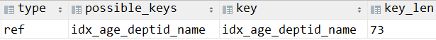

索引<span style="color:blue;font-weight:bold;">生效</span>！


::: tip

<span style="color:blue;font-weight:bold;">单值索引和复合索引的选择</span>

在实际开发中，一个数据库表包含多个字段，其中有若干个字段有很大几率出现在 where 或其他有可能触发索引的子句中。那么我们倾向于创建『复合索引』，而不是『单值索引』。

因为一个复合索引能够涵盖到其中包含的每个字段；而给每一个字段分别创建单值索引会生成更多的索引表，增加切换、磁盘存储、I/O 等方面的开销。

:::


#### [5]查询 deptId、name 和 age

```sql
EXPLAIN
SELECT SQL_NO_CACHE *
FROM emp
WHERE
  deptid = 4
  AND emp.name = 'abcd'
  and  emp.age = 30
;
```


看上去索引是生效的，但是很明显顺序不一致，不满足最左原则，本来是不应该生效的：

- 查询顺序：deptId、name、<span style="color:blue;font-weight:bold;">age</span>
- 索引顺序：<span style="color:blue;font-weight:bold;">age</span>、deptid、NAME

但是为什么索引生效了呢？其实原本是不应该生效的，但是此时是 MySQL 的 SQL 优化器调整了解析树，使查询字段符合了索引顺序，这才让索引生效了。

但是尽管优化器能够帮助我们进行调整，但是调整本身也需要付出代价，产生系统开销。所以我们开发时还是要尽量和索引中字段顺序一致。


#### [6]仅查询 deptId

```sql
EXPLAIN
SELECT SQL_NO_CACHE *
FROM emp
WHERE deptId = 5
;
```

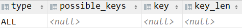

索引<span style="color:blue;font-weight:bold;">没有生效</span>！

但是很奇怪，deptId 这个字段明明是在索引中呀？这是因为本次查询没有满足最左原则。

在索引中，age 字段在最左边，现在查询的 deptId 作为第一个查询的字段不是 age，这就违背了<span style="color:blue;font-weight:bold;">最左原则</span>。


#### [7]查询 deptId 和 name

```sql
EXPLAIN
SELECT SQL_NO_CACHE *
FROM emp
WHERE deptId = 5 and name = "aaa"
;
```

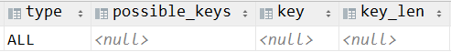

索引<span style="color:blue;font-weight:bold;">没有生效</span>！同样是因为违背了<span style="color:blue;font-weight:bold;">最左原则</span>。


#### [8]查询 deptId 和 name 并按 age 排序

```sql
EXPLAIN
SELECT SQL_NO_CACHE *
FROM emp
WHERE deptId = 5 and name = "aaa" order by age
;
```

索引<span style="color:blue;font-weight:bold;">没有生效</span>！这是因为 order by 没有过滤功能，不会触发索引。相当于查询过程中没有 age 字段参与。


::: tip

回顾我们前面提到的 SQL 解析顺序，order by 是在数据过滤之后才执行的，它仅仅是针对过滤结果进行排序，而不是对数据库表或索引表排序。

:::


#### [9]结论

要遵循最左原则，查询字段中至少要有索引中的最左字段作为过滤条件存在。而且就最左原则本身来说，它要求索引最左字段在查询顺序中也最左。只不过只要最左字段出现，优化器会帮我们调整到查询顺序中的最左。

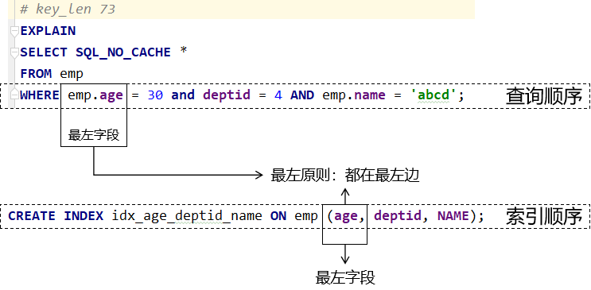


## 3、索引失效的其他情况

### ①在 where 子句条件中使用函数

首先删除上例索引：

```sql
drop index idx_age_deptid_name on emp;
```


创建新索引：

```sql
create index idx_name on emp(name);
```


分析查询：

```sql
EXPLAIN
SELECT SQL_NO_CACHE *
FROM emp
WHERE left(name, 3) = "abc"
;
```

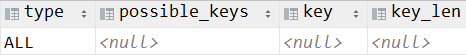


结论：使用了 left() 函数导致了索引失效。


### ②范围查询

首先删除上例索引：

```sql
drop index idx_name on emp;
```


创建新索引：

```sql
CREATE INDEX idx_age_deptid_name ON emp(age, deptid, NAME);
```


分析查询：

```sql
EXPLAIN
SELECT SQL_NO_CACHE *
FROM emp
WHERE emp.age = 30
  AND emp.deptId > 20
  AND emp.name = 'abc';
```


分析结果：

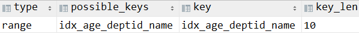


看起来仍然是生效的，但是我们再另外创建一个索引，把范围查询对应的 deptId 放在后面：

```sql
CREATE INDEX idx_age_deptid_name_2 ON emp(age, NAME, deptid);
```


把查询顺序也改一下：

```sql
EXPLAIN
SELECT SQL_NO_CACHE *
FROM emp
WHERE emp.age = 30
  AND emp.name = 'abc'
  AND emp.deptId > 20;
```


分析结果：

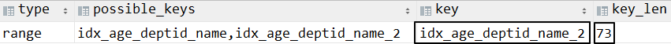


请大家注意两点变化：

- 变化1：MySQL 会优先选择新创建的索引 idx_age_deptid_name_2
- 变化2：key_len 数值变大了很多。


分析：

- key_len 的计算角度：age 字段贡献了 5，deptId 字段贡献了 5，而 name 字段如果应用了索引，那么它应该贡献 63。但是最终 key_len 是 10，说明索引生效的字段是 age 和 deptId
- type 的取值角度：range，说明查询的类型是范围查询，在当前 SQL 语句中 deptId 做的就是范围查询
- 解决方案角度：把 deptId 放在后面，三个字段的索引就都生效了。说明范围查询并不是祸害自己，而是祸害后面的查询条件。


结论：

- 注意点1：创建索引时应该把容易做范围查询的字段往后放
- 注意点2：实际编写 SQL 语句时，做范围查询的字段参照索引中的顺序，也是往后放


### ③不等于

所有不等于操作都会导致索引失效：

- !=
- &lt;&gt;
- not


测试的语句：

```sql
# 删除上例的索引
drop index idx_age_deptid_name on emp;
drop index idx_age_deptid_name_2 on emp;

# 只针对 name 这一个字段创建一个新的索引
create index idx_name on emp(name);

# 分析对 name 查询的 SQL 语句
explain select sql_no_cache * from emp where name != 'aaa';
explain select sql_no_cache * from emp where name <> 'bbb';
explain select sql_no_cache * from emp where name is not null;
```


分析结果：

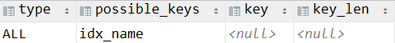


### ④like

并不是所有 like 查询都会导致索引失效：

- 不会导致索引失效的 like 用法：
  - 不使用 %
  - % 放在中间或后面
- 会导致索引失效的 like 用法：% 放在前面


#### [1]情况一：like 条件没有 %

```sql
explain select sql_no_cache * from emp where name like 'aaa';
```

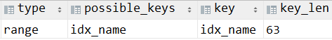

索引<span style="color:blue;font-weight:bold;">生效</span>！


#### [2]情况二：like 条件把 % 放右边

```sql
explain select sql_no_cache * from emp where name like 'aaa%';
```


索引<span style="color:blue;font-weight:bold;">生效</span>！


#### [3]情况三：like 条件把 % 放中间

```sql
explain select sql_no_cache * from emp where name like 'aaa%bbb';
```


索引<span style="color:blue;font-weight:bold;">生效</span>！


#### [4]情况四：like 条件把 % 放左边

```sql
explain select sql_no_cache * from emp where name like '%bbb';
```

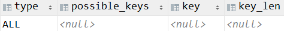

索引<span style="color:blue;font-weight:bold;"><span style="color:red;">没有</span>生效</span>！


当然，左右都有 % 的情况和这里一样。


### ⑤涉及类型转换

所谓类型转换就是指：我们给查询条件传入的参数和原本的类型不一致。但是这种情况不是必然会导致索引失效。

- 失效情况举例：让 char 类型的字段和 123 比较
- 有效情况举例：让 int 类型的字段和 '123' 比较


#### [1]失效情况

```sql
explain select sql_no_cache * from emp
where name=123;
```


分析结果：

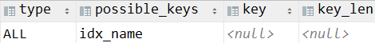


#### [2]仍然有效的情况

```sql
explain
select sql_no_cache *
from emp
where age = '123';
```


分析结果：

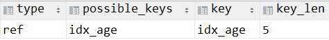


### ⑥对索引顺序来说，查询顺序有间隔

索引的情况：

```sql
create index idx_age_deptid_name on emp(age,name,deptId);
```


分析语句：

```sql
explain select sql_no_cache * from emp
where age=10 and deptId=666;
```


分析结果：


分析：

- 如果 age 和 deptId 两个字段都生效，那么 key_len 应该是 10。
- 现在 key_len 是 5，说明 age 和 deptId 只有一个字段的索引生效了。
- 而现在有索引生效，说明满足最左原则，那么肯定就是 age 生效。
- 说明 deptId 没有生效。


## 4、小练习

假设目前我们有索引的情况是：index(a,b,c)

| Where语句                                                    | 索引是否被使用                                               |
| ------------------------------------------------------------ | ------------------------------------------------------------ |
| where a =  3                                                 | Y,使用到a                                                    |
| where a =  3 and b = 5                                       | Y,使用到a，b                                                 |
| where a =  3 and b = 5 and c = 4                             | Y,使用到a,b,c                                                |
| where b =  3<br />where b = 3 and c =  4<br />where c =  4   | N，<span style="color:blue;font-weight:bold;">违背最左原则</span> |
| where a =  3 and c = 5                                       | 使用到a， 但是c不可以，<span style="color:blue;font-weight:bold;">b中间断了</span> |
| where a =  3 and b > 4 and c = 5                             | 使用到a和b， <span style="color:blue;font-weight:bold;">c不能用在范围之后</span>，c 被 b 断给了 |
| where a is  null and b is <span style="color:blue;font-weight:bold;">not</span> null | is null 支持索引  但是is not null 不支持,所以 a 可以使用索引,但是 b不可以使用 |
| where a  <span style="color:blue;font-weight:bold;"><></span> 3 | 不能使用索引                                                 |
| where  abs(a) =3                                             | 不能使用索引，因为使用了<span style="color:blue;font-weight:bold;">函数</span> |
| where a =  3 and b like 'kk%' and c = 4                      | Y,使用到a,b,c                                                |
| where a =  3 and b like '%kk' and c = 4                      | Y,只用到a, <span style="color:blue;font-weight:bold;">%不能在最左边</span> |
| where a =  3 and b like '%kk%' and c = 4                     | Y,只用到a,<span style="color:blue;font-weight:bold;">%不能在最左边</span> |
| where a =  3 and b like 'k%kk%' and c =  4                   | Y,使用到a,b,c                                                |


## 5、小结

- 对于单键索引，尽量选择过滤性更好的索引（例如：手机号，邮件，身份证）。这样更容易过滤掉大量数据，为后面操作减轻负担。
- 在选择组合索引的时候，过滤性最好的字段在索引字段顺序中，位置越靠前越好。这样可以更早过滤掉大量数据。
- 选择组合索引时，尽量包含where中更多字段的索引。
- 组合索引出现范围查询时，尽量把这个字段放在索引次序的最后面
- 尽量避免造成索引失效的情况


[上一节](verse01.html) [回目录](index.html) [下一节](verse03.html)