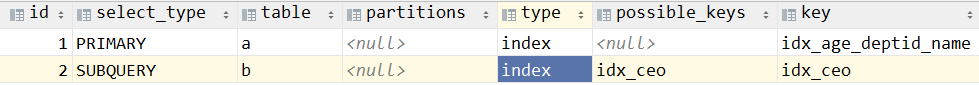
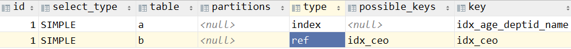

# 第四节 子查询优化

## 1、结论

在实际开发中，能够不用子查询就尽量不用。


## 2、实际测试

### ①测试子查询效果

添加索引：

```sql
create index idx_ceo on dept(ceo);
```


分析语句：

```sql
explain SELECT *
FROM emp a
WHERE a.id NOT IN
      (SELECT b.ceo FROM dept b WHERE b.ceo IS NOT NULL);
```


分析结果：




### ②测试关联查询效果

分析语句：

```sql
explain SELECT a.*
FROM emp a
         LEFT JOIN dept b
                   ON a.id = b.ceo
WHERE b.id IS NULL;
```


分析结果：




### ③综合对比

- 从执行顺序来说：id(1,1) 比 id(1,2) 要好
- 从查询的类型来说：ref 比 index 要好


[上一节](verse03.html) [回目录](index.html) [下一节](verse05.html)