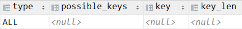
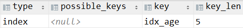
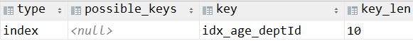
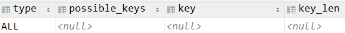

# 第五节 排序分组优化

## 1、排序

### ①结论

order by 子句需要配合 limit 子句才能让索引生效。


### ②测试基本情况

索引情况：


#### [1]只有 order by 的情况

分析语句：

```sql
EXPLAIN  SELECT SQL_NO_CACHE * FROM emp ORDER  BY age;
```


分析结果：




#### [2]配合 limit 子句的情况

分析语句：

```sql
EXPLAIN  SELECT SQL_NO_CACHE * FROM emp ORDER BY age limit 10;
```




### ③测试排序方向的影响

删除上例索引：

```sql
drop index idx_age on emp;
```


创建新索引：

```sql
create index idx_age_deptId on emp(age, deptId);
```


分析语句：排序方向一致的情况

```sql
EXPLAIN  SELECT SQL_NO_CACHE * FROM emp ORDER BY age desc,deptId desc limit 10;
```


分析结果：




分析语句：排序方向不一致的情况

```sql
EXPLAIN  SELECT SQL_NO_CACHE * FROM emp ORDER BY age desc,deptId asc limit 10;
```


分析结果：



 

## 2、双路排序和单路排序

### ①filesort

如果 order by 指定的字段没有建立索引，此时 MySQL 就无法在内存完成排序了，而是执行 filesort——也就是操作硬盘完成排序。


执行 filesort 又分两种不同情况：

- 双路排序：
  - 特征：两批 I/O
  - 对应的 MySQL 版本：4.1 之前
  - 大致工作机制：
    - 第一次读取硬盘：读取『行指针』以及『order by 子句指定的字段』
    - 排序：对已读取的『order by 子句指定的字段』进行排序
    - 第二次读取硬盘：根据『行指针』读取 select 子句中指定的其他字段
  - I/O方式：随机 I/O
- 单路排序：
  - 特征：一批 I/O
  - 对应的 MySQL 版本：4.1 之后
  - 大致工作机制：
    - 读取硬盘：读取 select 子句指定的所有列
    - 排序：按照 order by 列在 buffer 中对它们进行排序
  - I/O方式：顺序I/O


### ②单路排序需要注意的问题

单路排序在内存的缓冲区中执行排序，所以需要更大的内存空间。我们管这个缓冲区叫：sort_buffer。此时需要注意：如果为了排序而取出的数据体积大于 sort_buffer，这就会导致每次只能取 sort_buffer 容量大小的数据。所以这种情况下，数据的加载和排序是分段完成的。在这个过程中，MySQL 会创建临时文件，最后再把每段数据合并到一起。

所以 sort_buffer 容量太小时会导致排序操作产生多次 I/O。单路本来想省一次 I/O 操作，反而导致了大量的 I/O 操作，反而得不偿失。


### ③单路排序的优化

调整下面的三个参数：

| 参数名称                 | 参数含义                                                     | 调整建议 |
| ------------------------ | ------------------------------------------------------------ | -------- |
| sort_buffer_size         | 单路排序缓冲区的大小                                         | 适当增大 |
| max_length_for_sort_data | select 子句要查询的所有字段的总宽度和该参数比较：<br />大于该参数：使用双路排序<br />小于等于该参数且排序字段不是TEXT、BLOB类型：使用单路排序 | 适当增大 |
| select 子句中查询的字段  |                                                              | 尽量减少 |


::: tip

对 sort_buffer_size 的补充说明：

不管用哪种算法，提高这个参数都会提高效率，要根据系统的能力去提高，因为这个参数是针对每个进程（connection）的 1M-8M之间调整。 MySQL5.7，InnoDB 存储引擎默认值是 1048576 字节，1MB。


对 max_length_for_sort_data 的补充说明：

max_length_for_sort_data 不能设的太高，否则数据总容量超出 sort_buffer_size 的概率就增大。明显症状是高的磁盘 I/O 活动和低的处理器使用率。建议设置在 1024-8192 字节之间。

:::


最终目标：

- 尽量能够基于索引执行排序
- 如果确实要执行 filesort，那么尽量使用单路排序，而且尽量让单路排序只做一次 I/O。


### ④select * 会影响排序

在实际业务功能开发过程中，禁止在 select 子句中使用 * 号代表全部字段。如果确实需要查询全部字段，那就把全部字段都写明。其实这个时候更要注意的是：是不是真的要查全部字段。

具体从 SQL 优化的角度来说，select * 会导致我们加载很多没有创建索引的字段到内存中，增加了数据体积超过 sort_buffer_size 的风险。有可能会导致单路排序变成双路排序，性能下降。


## 3、GROUP BY优化

group by 使用索引的原则几乎跟 order by 一致 ，唯一区别：

- group by 先排序再分组，同样遵照最左原则


- 当无法使用索引列，增大 max_length_for_sort_data 和 sort_buffer_size 参数的设置


- where 高于 having，能写在 where 限定的条件就不要写在 having 中了


举个例子帮助大家理解：

- 假设有 100W 条记录待筛选
- 有一个 X 条件能够过滤掉 90W 条
  - X 条件用在 where 子句：后续 GROUP BY 操作针对 10W 条数据操作
  - X 条件用在 having子句：后续 GROUP BY 操作还是针对原来的 100W 条数据操作


所以在整个 SQL 查询语句中，能够将数据过滤掉的条件在不影响查询结果的前提下都要尽早使用，尽早过滤数据，缩小要操作的数据量，让后续操作减轻负担。


[上一节](verse04.html) [回目录](index.html) [下一节](verse06.html)