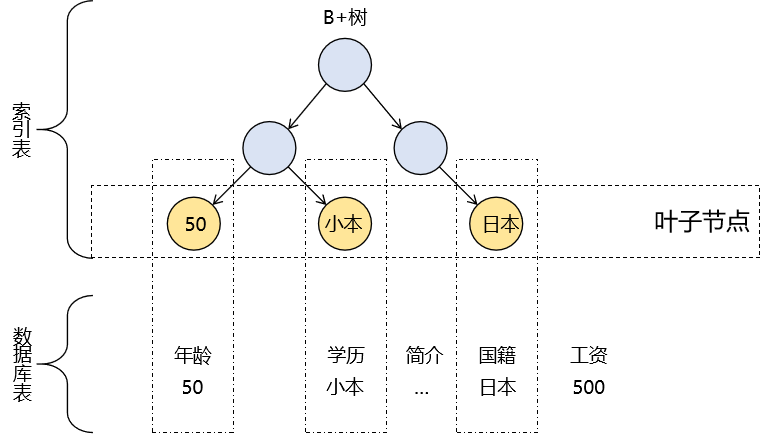

# 第六节 覆盖索引

对于 B+ 树来说，创建索引时，索引字段对应的数据全部在叶子节点中保存。反过来说，如果我们在 select 子句中仅仅查询创建了索引的字段，那么不需要查询数据库就能够得到数据。

再换个角度我们也能发现：每一个字段的索引中包含了这个字段的所有数据，这么看来也可以说索引中保存了整个列。

当一个复合索引能够覆盖 select、where、join on、order by、having 等各个子句中涉及的字段，那么就可以称为：覆盖索引。

[上一节](verse05.html) [回目录](index.html)
