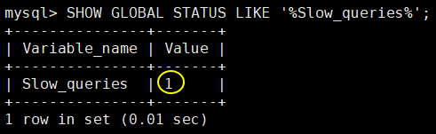
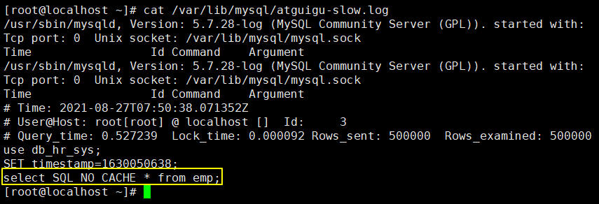

# 第九章 慢查询日志


## 1、需求

在实际开发和项目运行的过程中，需要尽量准确的把查询时间消耗较大的 SQL 语句给找出来。然后有针对性的建立索引，再使用 explain 技术进行分析，找到性能瓶颈，最后调整 SQL 语句。


## 2、慢查询日志介绍

由 MySQL 负责以日志的形式记录那些执行时间超过阈值的 SQL 语句。当然，如果不是调优需要的话，一般不建议启动该参数，因为开启慢查询日志会或多或少带来一定的性能影响。慢查询日志支持将日志记录写入文件。


## 3、查看及开启

慢查询日志记录功能默认关闭。


```sql
#默认情况下slow_query_log的值为OFF
SHOW VARIABLES LIKE '%slow_query_log%';  
```


命令行开启：

```sql
set global slow_query_log=1; 
```


慢查询日志记录long_query_time时间

```sql
SHOW VARIABLES LIKE '%long_query_time%';
SHOW GLOBAL VARIABLES LIKE 'long_query_time';
SET GLOBAL long_query_time=0.1; 
```

**注意: 运行时间正好等于long_query_time的情况，并不会被记录下来。**


永久生效

```properties
修改my.cnf文件，[mysqld]下增加或修改参数slow_query_log 和slow_query_log_file后，然后重启MySQL服务器。也即将如下四行配置进my.cnf文件 
slow_query_log=1
slow_query_log_file=/var/lib/mysql/atguigu-slow.log 
long_query_time=3
log_output=FILE
```


## 4、查看捕获到的记录

### ①查询当前系统中有多少条慢查询记录

```sql
SHOW GLOBAL STATUS LIKE '%Slow_queries%'; 
```

显示结果是：




### ②查看日志信息内容




### ③使用mysqldumpslow命令导出

在生产环境中，如果要手工分析日志，查找、分析SQL，显然是个体力活，MySQL提供了日志分析工具mysqldumpslow。 

-a: 不将数字抽象成N，字符串抽象成S

-s: 是表示按照何种方式排序；

 c: 访问次数

 l: 锁定时间

 r: 返回记录

 t: 查询时间

 al:平均锁定时间

 ar:平均返回记录数

 at:平均查询时间

-t: 即为返回前面多少条的数据；

-g: 后边搭配一个正则匹配模式，大小写不敏感的；

```sql
#得到返回记录集最多的10个SQL
mysqldumpslow -s r -t 10 /var/lib/mysql/atguigu-slow.log
#得到访问次数最多的10个SQL
mysqldumpslow -s c -t 10 /var/lib/mysql/atguigu-slow.log
#得到按照时间排序的前10条里面含有左连接的查询语句
mysqldumpslow -s t -t 10 -g "left join" /var/lib/mysql/atguigu-slow.log
#另外建议在使用这些命令时结合 | 和more 使用 ，否则有可能出现爆屏情况
mysqldumpslow -s r -t 10 /var/lib/mysql/atguigu-slow.log | more
```


[上一章](../chapter08/index.html) [回目录](../index.html) [下一章](../chapter10/index.html)
