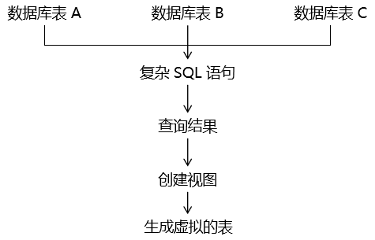

# 第十章 视图


实际开发时，现在越来越多『长、难、复杂』SQL。这种 SQL 语句编写、维护较为困难。所以我们可以将这一的 SQL 语句创建为『视图』，这个视图生成了一张虚拟的表。下次再有需要时，执行这个视图即可得到相同的结果。





视图是将一段查询 SQL 封装为一个虚拟的表。 这个虚拟表只保存了 SQL 逻辑，不会保存任何查询结果。

**主要作用:**

- 封装复杂sql语句，提高复用性
- 逻辑放在数据库上面，更新不需要发布程序，面对频繁的需求变更更灵活

**常用场景:**

- 共用查询结果
- 报表

**语法:**

创建

```sql
CREATE VIEW view_name AS SELECT column_name(s) FROM table_name  WHERE condition  
```

使用

```sql
#查询
select * from view_name 
#更新
CREATE OR REPLACE VIEW view_name 
AS SELECT column_name(s) FROM table_name WHERE condition
```


[上一章](../chapter09/index.html) [回目录](../index.html) [下一章](../chapter11/index.html)