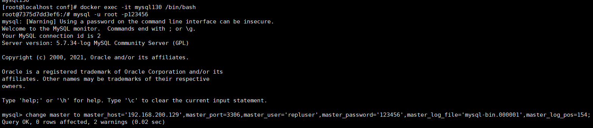
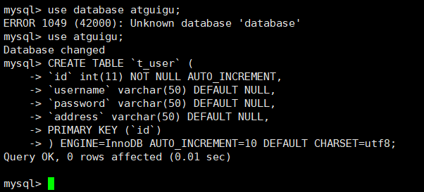
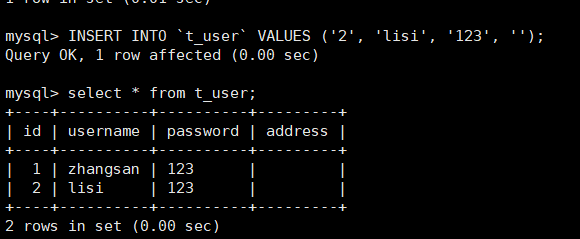
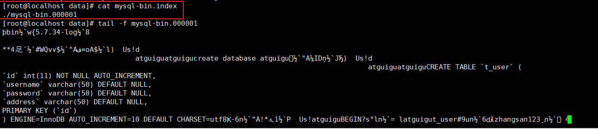
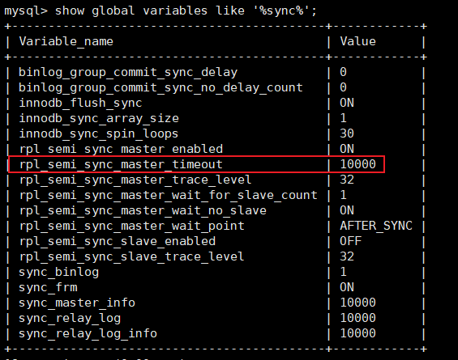

# 第二节 主从模式


## 1、主从简介

主从模式是使用的最多的mysql高可用架构。

存在一台master作为写机，一个或多个slave作为读机,实现读写分离。之所以这么设计是因为在实际的情况下，读的请求量一般是远远大于写请求。架构图如下


**优点:**

读与写的节点分离,数据写入master节点后,再由master节点将数据复制到slave节点上

**缺点:**

- master是单点存在的，如果要对master进行停机维护，无法接收写请求
- master需要将写入数据复制到各个slave节点，复制是有一定的时间延迟的，因此有可能出现查询数据不一致
- 对master进行停机维护，需将某一个slave提升为新的master节点，选举规则需要进行自定义
- 当slave被提升为新的master后，可能会造成新的master节点与旧master的数据不一致

### 1.3.2 主从搭建

在虚拟机中安装docker

```linux
yum install docker
```

若遇到如下问题:


```linux
#编辑yum的配置文件
vi /etc/yum/pluginconf.d/langpacks.conf
将第一行：enable=1改为enable=0

#杀掉进程即可
kill -9 8683
```

查看docker版本

```
docker -v
#开启启动docker
systemctl enable docker
#查看运行状态
systemctl status docker
#启动
systemctl start docker
#停止
systemctl stop docker
#重启
systemctl restart docker
```

搜索mysql镜像

```
docker search mysql
```

下载mysql镜像

```
docker pull docker.io/mysql:5.7
```

安装mysql容器

```bash
#服务一
docker run --name mysqlm1 \
-p 10000:3306 \
--privileged=true \
-it \
-e MYSQL_ROOT_PASSWORD=123456 \
-e MYSQL_USER=user \
-e MYSQL_PASSWORD=pass \
-v /home/mysql/docker-data/m1/conf:/etc/mysql/conf.d \
-v /home/mysql/docker-data/m1/data/:/var/lib/mysql \
-v /home/mysql/docker-data/m1/logs/:/var/log/mysql \
-d mysql:5.7

#服务二
docker run --name mysqls1 \
-p 20000:3306 \
--privileged=true \
-it \
-e MYSQL_ROOT_PASSWORD=123456 \
-e MYSQL_USER=user \
-e MYSQL_PASSWORD=pass \
-v /home/mysql/docker-data/s1/conf:/etc/mysql/conf.d \
-v /home/mysql/docker-data/s1/data/:/var/lib/mysql \
-v /home/mysql/docker-data/s1/logs/:/var/log/mysql \
-d mysql:5.7
```

参数说明：

> -p 参数格式：宿主机端口号:容器内程序的端口号
>
> -e MYSQL_ROOT_PASSWORD 给 MySQL 的 root 用户设置密码
>
> -v 参数指定宿主机内的目录，用来给 docker 容器设定配置文件等等


在两台机器上新增配置文件,路径为/home/mysql/docker-data/m1/conf/my.cnf

```
# For advice on how to change settings please see
# http://dev.mysql.com/doc/refman/5.7/en/server-configuration-defaults.html

[mysqld]
#
# Remove leading # and set to the amount of RAM for the most important data
# cache in MySQL. Start at 70% of total RAM for dedicated server, else 10%.
# innodb_buffer_pool_size = 128M
#
# Remove leading # to turn on a very important data integrity option: logging
# changes to the binary log between backups.
# log_bin
#
# Remove leading # to set options mainly useful for reporting servers.
# The server defaults are faster for transactions and fast SELECTs.
# Adjust sizes as needed, experiment to find the optimal values.
# join_buffer_size = 128M
# sort_buffer_size = 2M
# read_rnd_buffer_size = 2M

character_set_server=utf8
init_connect='SET NAMES utf8'

# Disabling symbolic-links is recommended to prevent assorted security risks
symbolic-links=0

lower_case_table_names=1
#指定主机号，不允许出现重复
server-id=134
#开启binlog
log-bin=mysql-bin
auto_increment_increment=2
auto_increment_offset=1

#rpl_semi_sync_master_enabled=1
#rpl_semi_sync_master_timeout=10000
```

/home/mysql/docker-data/s1/conf/my.cnf

```
# For advice on how to change settings please see
# http://dev.mysql.com/doc/refman/5.7/en/server-configuration-defaults.html

[mysqld]
#
# Remove leading # and set to the amount of RAM for the most important data
# cache in MySQL. Start at 70% of total RAM for dedicated server, else 10%.
# innodb_buffer_pool_size = 128M
#
# Remove leading # to turn on a very important data integrity option: logging
# changes to the binary log between backups.
# log_bin
#
# Remove leading # to set options mainly useful for reporting servers.
# The server defaults are faster for transactions and fast SELECTs.
# Adjust sizes as needed, experiment to find the optimal values.
# join_buffer_size = 128M
# sort_buffer_size = 2M
# read_rnd_buffer_size = 2M

character_set_server=utf8
init_connect='SET NAMES utf8'

# Disabling symbolic-links is recommended to prevent assorted security risks
symbolic-links=0

lower_case_table_names=1
#指定主机号，不允许出现重复
server-id=130
#开启binlog
log-bin=mysql-bin
auto_increment_increment=2
auto_increment_offset=1

#rpl_semi_sync_master_enabled=1
#rpl_semi_sync_master_timeout=10000
```


❤❤❤❤❤❤❤❤❤❤❤❤❤❤❤❤❤❤❤❤❤❤❤❤❤❤❤❤❤❤❤❤❤

修改 my.cnf 后记得<span style="color:blue;font-weight:bold;">重启</span> MySQL 容器！

❤❤❤❤❤❤❤❤❤❤❤❤❤❤❤❤❤❤❤❤❤❤❤❤❤❤❤❤❤❤❤❤❤


在master的docker容器中添加mysql权限，开启备份机复制，并且设置备份用户信息

```
#在134服务中进入mysql容器
docker exec -it mysqlm1 /bin/bash

#登录到 MySQL
mysql -u root -p
EnterPassword:123456

#==================== 在 MySQL 中的操作 ===========================
#添加权限
GRANT REPLICATION SLAVE,FILE,REPLICATION CLIENT ON *.* TO 'repluser'@'%' IDENTIFIED BY '123456';

#刷新权限
FLUSH PRIVILEGES;

#退出MySQL
quit;
#==================== 在 MySQL 中的操作 ===========================

#退出docker容器
exit

#重启容器
docker restart mysqlm1

#查看m1的binlog信息（需要进入docker容器，然后再登录MySQL执行）
show master status;
```


接着在slave中进入到mysql容器，设置master信息，用于标注当前slave的master是谁


```sql
#语法
change master to master_host='master的ip',master_port=master的端口号,master_user='repluser',master_password='123456',master_log_file='master中的binlob文件',master_log_pos=master中的position位置信息;
#命令
change master to master_host='192.168.198.120',master_port=10000,master_user='repluser',master_password='123456',master_log_file='mysql-bin.000001',master_log_pos=154;
```



完成后，还需要开启slave中的**IO**和**SQL**线程，这两个线程主要用于slave中进行数据备份。

- IO 线程：从日志文件中读取数据，其中最关键的就是用来同步数据的 SQL 语句
- SQL 线程：执行从日志文件中读取到的 SQL 语句


可以先查看slave中这两个线程的状态

```sql
show slave status\G;
```


我们发现在slave中，这两个线程是关闭的，需要将这两个线程进行开启

```sql
#开启（在 docker容器中登录 MySQL 后执行）
start slave;
```


到此，mysql主从复制就已经搭建完毕


### 1.3.3 测试

**case1: 查看主从相关信息**

查看slave中的binlog是否已经开启

```sql
show global variables like "%log%";
```


查看master、slave中的进程信息

```sql
#m1和s1分别输入
show processlist;
```

m1节点内容


s1节点内容


**case2: 数据库同步测试**

在m1节点创建一个数据库


在s1节点中查看数据库


**case3: 表同步测试**

在129中创建一张表

```sql
DROP TABLE IF EXISTS `t_user`;
CREATE TABLE `t_user` (
`id` int(11) NOT NULL AUTO_INCREMENT,
`username` varchar(50) DEFAULT NULL,
`password` varchar(50) DEFAULT NULL,
`address` varchar(50) DEFAULT NULL,
PRIMARY KEY (`id`)
) ENGINE=InnoDB AUTO_INCREMENT=10 DEFAULT CHARSET=utf8;
```



在130中查看表


**case4: 数据同步**

在129中新增一条数据

```sql
INSERT INTO `t_user` VALUES ('1', 'zhangsan', '123', '北京');
```


在130中查看数据


==**case5: 反向数据同步**(注意一定不要搞混!!!!!!)==

在s1中新增一条数据

```sql
INSERT INTO `t_user` VALUES ('2', 'lisi', '123', '上海');
```



在129中查看数据


**==结论: 从服务中新增数据无法同步到主服务中去, 主从同步是单向的!==**

## 1.4 主从复制原理


- 异步操作：不需要等待
- 同步操作：需要等待


### 1.4.1 异步复制


1. 写操作举例：insert 语句。
2. 事务提交到master，master确认修改已保存。
3. master接收到应用事务提交请求后，更新内部的binlog日志，让mysql引擎执行事务操作，并返回给客户端执行结果信息。同时在master中会存在一个事件监听，其会一直监听着master中binlog日志文件的改变，一旦发现日志文件发生改变，触发dump线程
4. dump线程被触发后，通知slave中的IO线程：现在有事务操作要进行同步
5. slave中IO线程接收到通知后，会从slave中**relay-log.info**文件中获取slave中的binlog日志文件和pos位置信息。接着会把这部分信息发送给master的dump线程。发送信息的含义是：告诉master，我上次读取到了哪里，这次还从上次读取到的位置继续读取。
6. master的dump线程收到这些信息后，会根据slave发送的binlog日志文件和pos位置，将最新的binlog日志和pos位置后面的内容同步给slave的IO线程
7. slave的IO线程接收到这些信息后，会将这部分内容同步到slave中的relay-bin文件中
8. 当relay-bin文件发生改变后，触发slave线程执行sql操作【异步】
9. 当slave向relay-bin写入完成后，会向master返回一个ACK消息，同步成功。

对于这一系列的操作，可以发现master和slave在进行同步时是以异步的方式完成的，master写入完binlog后，会马上通过引擎进行事务提交并向客户端返回响应，对于与slave同步的操作，则是异步完成的。

**优点:**

效率高

**缺点:**

可能出现数据不一致

### 1.4.2 半同步复制


半同步复制与异步复制的工作流程大体相似

**不同点:** 当master中的binlog日志写入完成后，其不会马上通过引擎进行事务提交，而会处于等待，等到slave同步完成向master返回ACK通知后，才会唤醒等待，继续向下执行。

- 等待的时长，默认为10秒，但该时间可以配置


- 尽量的避免了主从数据不一致，但造成吞吐量的降低


- mysql兜底方案: 使用半同步复制进行备份时slave节点挂掉了，那么当master等待10秒后，仍然会进行引擎提交，同时会将半同步复制切换为异步复制。等到slave节点重启后，又会自动的从异步复制切换到半同步复制。

### 1.4.3 异步复制实现

Mysql在进行复制操作时，默认是基于异步复制完成的。那为了更好的体会异步复制的效果，可以通过mysql日志来查看具体的复制过程效果。

1. **查看master的Mysql日志信息**

```
docker logs -f mysqlm1
```


	根据当前查看的日志信息，在master中已经开启了dump线程连接到了id为130的slave节点，并且该id就是在slave的mysql配置文件中设置的id。同时pos内容包括当前的binlog日志和pos位置。

2. **查看slave的Mysql日志信息**

```
docker logs -f mysqls1
```


根据slave中的日志信息，可以看到，当前slave中已经开启了relay-log日志，其对应文件信息就是xxxxx-relay-bin。其内部保存的就是slave中的相关binlog信息和pos位置信息。

同时在slave中也已经开启了SQL Thread，并且根据信息可以，它会从7375d7dd3ef6-relay-bin.000001文件的4位置开始复制。

同时在slave中也开启了IO Thread，其已经连接到master，并且会从master的binlog日志的154的位置开启复制。

3. **查看master当前的binlog日志信息**

```
cd home/mysql/docker-data/129/data/
#确定当前master正在使用的binlog日志文件
cat mysql-bin.index
#查看当前binlog日志文件内容
tail -f mysql-bin.000001
```



4. **查看slave当前的日志信息**


### 1.4.4 半同步复制实现

1. 进入mysql容器，加载lib，**主从节点都要配置**，因为主从节点间会存在切换。

```sql
# 这两条 install 命令需要在 m1 中都执行一遍，然后在 s1 中也都执行一遍
install plugin rpl_semi_sync_master soname 'semisync_master.so';
install plugin rpl_semi_sync_slave soname 'semisync_slave.so';
#查看插件信息
show plugins;
```


2. 启用半同步**（务必先启用从库，再启用主库）**

```sql
#先启用从库，再启用主库

从库：set global rpl_semi_sync_slave_enabled= 1;   # 1：启用，0：禁止

主库：
     set global rpl_semi_sync_master_enabled= 1;   # 1：启用，0：禁止
     set global rpl_semi_sync_master_timeout=10000;   # 单位为ms
```

3. 从库重启IO Thread

```sql
stop slave io_thread;
start slave io_thread;
```

4. 查看启动状态

```sql
#查询状态信息
show global status like "%sync%";
```


```sql
#查询参数信息
show global variables like '%sync%';
```



5. 半同步复制效果测试

- 正常的向master中添加数据，slave可以进行正常数据更新


- 关闭slave的IO,再次向master中添加数据

```sql
stop slave io_thread;
INSERT INTO `t_user` VALUES ('3', 'ding', '111', '武汉');
```


==**此时复制机制会由半同步复制转换为异步复制，当再次向master中添加数据，不会再次出现等待**==

- slave中重新开启IO Thread

```sql
start slave io_thread;
```

异步复制会再次转换为半同步复制，master中打印日志信息如下：


在slave IO Tthread关闭这段时间内的数据，会同步到slave中，不会出现数据丢失


[上一节](verse01.html) [回目录](index.html) [下一节](verse03.html)

