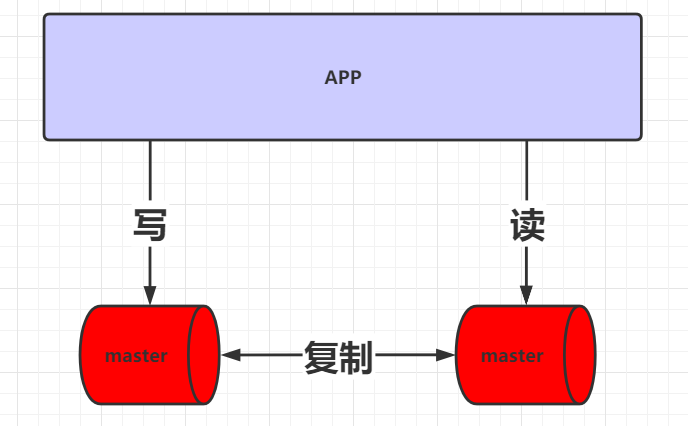

# 第三节 主主复制

## 1、简介

对于主从复制来说，其内部会存在一台master以及一台或多台slave。但有一个非常明显的问题，**master是单点存在**。一旦master宕机，则无法进行数据的写入。为了解决这个问题，可以使用主主复制架构。

在主主复制架构中，会存在两台master，没有slave。并且会对这两台master进行读写分离，两台master会进行相互的复制, 架构图如下:



在此架构中，两台master会进行双向复制，为什么这么做呢？ 因为假设现在负责写的master宕机了，那么写的工作则会交给之前负责读的服务器来完成，相当于它即负责写又负责读。等到原先负责写的master恢复了，其在继续负责写工作。 反之亦然。因此才需要两者间进行双向复制。

**缺点: 读请求的并发量过大，服务可能产生宕机, 主主复制架构直接使用的情况较少。**


## 2、主主搭建

在 docker 中再各自创建一个实例：

```
docker run --name mysqlm2 \
-p 30000:3306 \
--privileged=true \
-it \
-e MYSQL_ROOT_PASSWORD=123456 \
-e MYSQL_USER=user \
-e MYSQL_PASSWORD=pass \
-v /home/mysql/docker-data/m2/conf:/etc/mysql/conf.d \
-v /home/mysql/docker-data/m2/data/:/var/lib/mysql \
-v /home/mysql/docker-data/m2/logs/:/var/log/mysql \
-d mysql:5.7

docker run --name mysqlm3 \
-p 40000:3306 \
--privileged=true \
-it \
-e MYSQL_ROOT_PASSWORD=123456 \
-e MYSQL_USER=user \
-e MYSQL_PASSWORD=pass \
-v /home/mysql/docker-data/m3/conf:/etc/mysql/conf.d \
-v /home/mysql/docker-data/m3/data/:/var/lib/mysql \
-v /home/mysql/docker-data/m3/logs/:/var/log/mysql \
-d mysql:5.7
```


/home/mysql/docker-data/m2/conf/my.cnf

```
# For advice on how to change settings please see
# http://dev.mysql.com/doc/refman/5.7/en/server-configuration-defaults.html

[mysqld]
#
# Remove leading # and set to the amount of RAM for the most important data
# cache in MySQL. Start at 70% of total RAM for dedicated server, else 10%.
# innodb_buffer_pool_size = 128M
#
# Remove leading # to turn on a very important data integrity option: logging
# changes to the binary log between backups.
# log_bin
#
# Remove leading # to set options mainly useful for reporting servers.
# The server defaults are faster for transactions and fast SELECTs.
# Adjust sizes as needed, experiment to find the optimal values.
# join_buffer_size = 128M
# sort_buffer_size = 2M
# read_rnd_buffer_size = 2M

character_set_server=utf8
init_connect='SET NAMES utf8'

# Disabling symbolic-links is recommended to prevent assorted security risks
symbolic-links=0

lower_case_table_names=1
#指定主机号，不允许出现重复
server-id=1341
#开启binlog
log-bin=mysql-bin
auto_increment_increment=2
auto_increment_offset=1

#rpl_semi_sync_master_enabled=1
#rpl_semi_sync_master_timeout=10000
```


/home/mysql/docker-data/m3/conf/my.cnf

```sql
# For advice on how to change settings please see
# http://dev.mysql.com/doc/refman/5.7/en/server-configuration-defaults.html

[mysqld]
#
# Remove leading # and set to the amount of RAM for the most important data
# cache in MySQL. Start at 70% of total RAM for dedicated server, else 10%.
# innodb_buffer_pool_size = 128M
#
# Remove leading # to turn on a very important data integrity option: logging
# changes to the binary log between backups.
# log_bin
#
# Remove leading # to set options mainly useful for reporting servers.
# The server defaults are faster for transactions and fast SELECTs.
# Adjust sizes as needed, experiment to find the optimal values.
# join_buffer_size = 128M
# sort_buffer_size = 2M
# read_rnd_buffer_size = 2M

character_set_server=utf8
init_connect='SET NAMES utf8'

# Disabling symbolic-links is recommended to prevent assorted security risks
symbolic-links=0

lower_case_table_names=1
#指定主机号，不允许出现重复
server-id=666
#开启binlog
log-bin=mysql-bin
auto_increment_increment=2
auto_increment_offset=1

#rpl_semi_sync_master_enabled=1
#rpl_semi_sync_master_timeout=10000
```


❤❤❤❤❤❤❤❤❤❤❤❤❤❤❤❤❤❤❤❤❤❤❤❤❤❤❤❤❤❤❤❤❤

修改 my.cnf 后记得<span style="color:blue;font-weight:bold;">重启</span> MySQL 容器！

❤❤❤❤❤❤❤❤❤❤❤❤❤❤❤❤❤❤❤❤❤❤❤❤❤❤❤❤❤❤❤❤❤


添加slave的相关配置, 虽然是主主模式,也要添加从用户（供从机访问的用户）

```sql
#添加权限
GRANT REPLICATION SLAVE,FILE,REPLICATION CLIENT ON *.* TO 'repluser'@'%' IDENTIFIED BY '123456';
#刷新权限
FLUSH PRIVILEGES;
```


```sql
#在m2/m3服务器上运行
show master status;
#执行主主关联（参考 m2 的状态设置 m3；参考 m3 的状态设置 m2）
#设置m2。因为m2要去连m3，所以这里要设置m3的IP地址和端口号。
change master to master_host='192.168.198.120',master_port=40000,master_user='repluser',master_password='123456',master_log_file='mysql-bin.000001',master_log_pos=1104;

#设置m3。因为m3要去连m2，所以这里要设置m2的IP地址和端口号。
change master to master_host='192.168.198.120',master_port=30000,master_user='repluser',master_password='123456',master_log_file='mysql-bin.000001',master_log_pos=1104;

#主主同步生效
start slave;
```


查看master 129的进程列表：show processlist;


slave131的进程列表：show processlist;


[上一节](verse02.html) [回目录](index.html) [下一节](verse04.html)