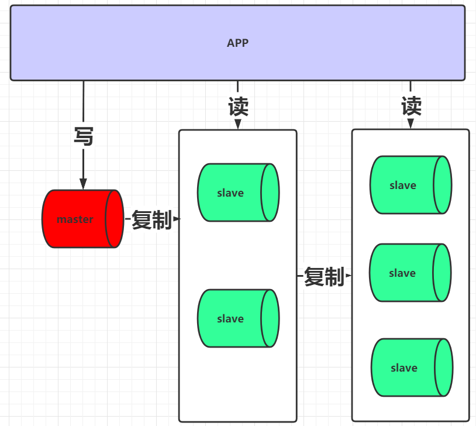
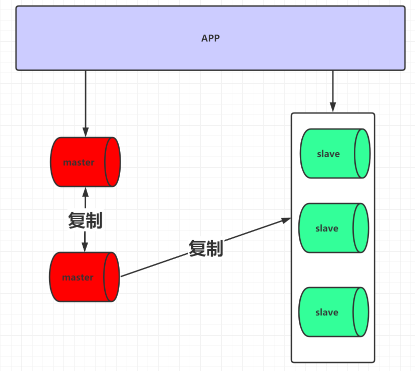

# 第四节 其他模式

## 1、级联复制（了解）

写请求的入口为一个，但当master向slave进行复制时，对于slave可以分为多层， master只要向其中两台slave复制即可，然后再由slave将其数据复制到后面更多的slave中。通过这种方式可以减轻master向slave复制的IO压力。但是这种架构会使slave的延迟会加大,架构如下图:

## 2、双主与级联复制(了解)

对于master在前面几种架构设计中，都存在单点问题， 对于master单点问题的解决，可以采用当前的架构。

通过这种架构不仅可以解决master单点的问题，也可以解决slave延迟的问题, 架构图如下:

[上一节](verse03.html) [回目录](index.html)
