# day07 数组 面向对象-上

## 1、数组总结

| &nbsp;   | 一维数组 | 二维数组 | 集合 |
| -------- | -------- | -------- | ---- |
| 声明变量 | √        | √        | √    |
| 创建对象 | √        | √        | √    |
| 存入数据 | √        | √        | √    |
| 读取数据 | √        | √        | √    |
| 遍历全体 | √        | √        | √    |
| 工具类   | √        | √        | √    |
| 底层原理 | √        | √        | √    |

## 2、数组工具类Arrays

用法举例：

```java
// 1.创建一个数组对象
int[] toBeSortedArr = {22, 33, 5, 7, 2, -6, 13, 99, 82};

// 2.调用工具类的工具方法对上面数组进行排序
// 类名.方法名(传入参数)
Arrays.sort(toBeSortedArr);

// 3.遍历数组
for (int i = 0; i < toBeSortedArr.length; i++) {

    int value = toBeSortedArr[i];

    System.out.println("value = " + value);
}
```

## 3、数组使用中常见的异常

### ①数组下标越界异常

```java
// 1.数组下标越界异常
int[] intArr = new int[5];

// java.lang.ArrayIndexOutOfBoundsException
// intArr[80] = 5;

// java.lang.ArrayIndexOutOfBoundsException
// System.out.println("intArr[5] = " + intArr[5]);
```

### ②空指针异常

```java
// 2.空指针异常
// java.lang.NullPointerException
char[] charArr = null;
System.out.println("charArr[0] = " + charArr[0]);
```

## 4、面向对象思想

### ①面向过程

#### [1]面向过程程序特点

在顺序、分支、循环结构中，操作变量中存储的数据。

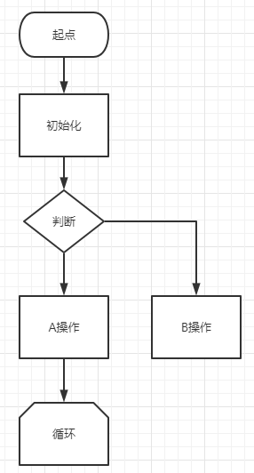

#### [2]面向过程思想对应的问题

面向过程这种程序设计理念，对应现实生活中某一个点上具体的问题，特别是对应解决问题过程中具体的操作步骤。

#### [3]面向过程程序的不足

最大的不足：整个系统各个组成部分之间『耦合』太严重。

- 从开发角度来说：对任何一个细微的地方做修改、调整、升级都会不可避免的影响到其他部分。
- 从运行角度来说：整个系统中有任何一个数据发生了变化，相关的很多部分都要重新运算，非常浪费性能。

#### [4]本质

从面相过程的思想发展到面向对象的思想根本原因就是因为随着时代、市场等方方面面的发展，要求程序员编写更加复杂的程序，设计更加庞大的系统。

由非常多组成部分有机结合在一起的系统是面向过程代码无法容纳的。

### ②面向对象

#### [1]关键

面向对象的设计理念、编程思想非常贴合人平时认识世界、思考问题时的思维方式。

> 一切皆对象：现实世界中的所谓『东西』投射到代码中就是『对象』
>
> - 工业产品：一辆汽车中的各个组成部分、各个部件中各种的零件
> - 日常生活：做饭时使用的厨具、食材、餐具等等“东西”

所以有了面向对象的设计理念和编程思想，我们就可以在开发过程中，大致保持和平时一样的思维方式来设计系统、编写代码。

#### [2]类

程序中的『分类名称』。


#### [3]类和对象的关系

- 从抽象和具体的角度来说：
  - 类：抽象描述
  - 对象：具体实体，所以对象也被称作：『类的实例』
- 从设计图和产品的角度来说：
  - 类：生产产品的设计图
  - 对象：按照设计图生产出来的一个具体的产品

使用汽车设计图可以生产汽车产品。

使用汽车类可以创建汽车对象。

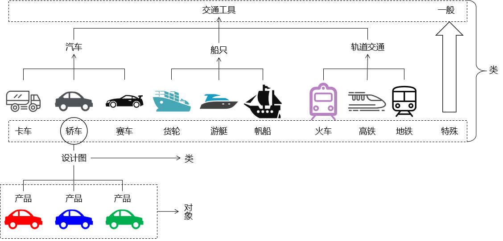


使用月饼模具可以生产月饼产品。

使用月饼类可以创建月饼对象。

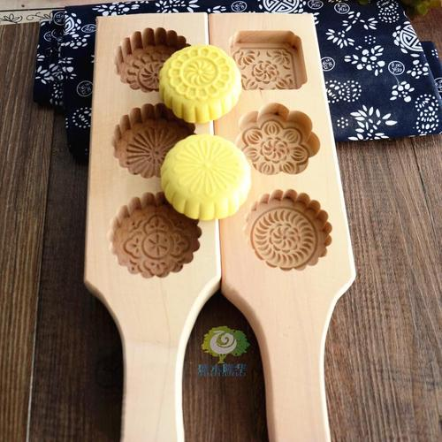

### ③小结

一句话：面向对象的思想最根本的目的就是为了让程序能够更好的『描述』现实世界，程序只有做到了尽量逼真的描述现实世界，才能让程序解决现实生活中真实存在的问题。所以这个思想有两方面最大的好处：

- 更好的描述现实世界
- 更符合人平时的思维方式

## 5、创建类和对象

### ①类的组成部分

#### [1]属性（对应程序中的数据）

通过程序中的各种数据类型，来描述一个类的『特征』，例如：汽车的颜色、汽车的排量、汽车的价格……

#### [2]行为（对应程序中的操作）

通过程序中的方法（也就是面向过程视角中的函数），来执行这个类的对象能够做的『动作』。例如：汽车的行驶、汽车的鸣笛、汽车的启动、汽车的停泊……

| &nbsp; | 属性                                         | 行为                                               |
| ------ | -------------------------------------------- | -------------------------------------------------- |
| 猫     | 毛色<br />品种<br />年龄<br />体重<br />性别 | 吃猫粮<br />抓老鼠<br />走猫步<br />撒娇<br />喵喵 |
| 树     | 品种<br />年龄<br />高度<br />功用           | 生长<br />落叶<br />结果<br />枯萎                 |

| 英文名 | 面向过程角度名称 | 面向对象角度名称 |
| ------ | ---------------- | ---------------- |
| Filed  | 成员变量         | 属性             |
| Method | 成员函数         | 方法             |

### ②声明一个类（空）

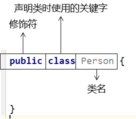

### ③声明一个类（有属性、方法）

```java
public class Person {

    // 属性/成员变量
    // 暂时先不管声明属性的具体规则，像以前一样声明变量先使用
    // 这个成员变量即使没有初始化，系统也会为它分配初始值
    // int类型的初始值是0
    int weight;

    // 方法/成员函数
    // 暂时先不管声明函数的具体规则，先声明一个最简单的
    // public：表示这个方法可以在任何地方被调用
    // void：表示这个方法没有返回值
    // (int food)：声明这个方法在被调用时可以传入的参数
    public void eat(int food) {
        weight = weight + food;
    }

    public void say() {
        System.out.println("我现在的体重是：" + weight);
    }

}
```

### ④声明一个对Person进行测试的类

```java
public class PersonTest {

    public static void main(String[] args) {

        // 1.创建Person类的对象
        // 第一步：声明一个Person类这个类型的变量
        // 第二步：使用new关键字创建Person类的对象，对象赋值给第一步声明的变量
        //          在new关键字后面的，是Person类的『构造器』
        //          构造器在以后还会介绍更多细节，现在大家就按照：类名()的格式写就行
        Person person = new Person();

        // 2.调用Person对象的eat()方法：让这个人吃饭
        // 调用有参数方法的格式：指向对象的那个变量.方法名(参数)
        person.eat(5);

        // 3.调用Person对象的say()方法：让这个人说说他的体重
        // 调用无参数方法的格式：指向对象的那个变量.方法名()
        person.say();

        // 4.直接修改weight属性
        // 在类之外的其他地方是否可以操作类的属性，取决于属性的修饰符
        // 在将来学习了面向对象的『封装』特性后，我们会知道，在类的外部不建议直接操作类的属性
        person.weight = 20;

        person.say();
    }

}
```

## 6、包

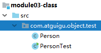

### ①包的作用

#### [1]区分同名的类

包最重要的作用：区分同名的类，例如：

- JDK自带一个Book类：


- 将来我们做书城项目也会创建Book类

如果没有包名，两个Book类就无法区分了。

#### [2]将不同的类放在不同包下

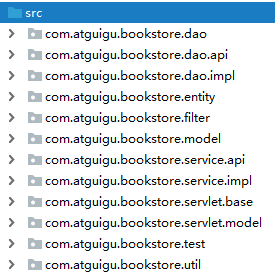

### ②简单类名和全类名

- 简单类名：不带包名的类名
- 全类名：包名.类名

全类名举例：

> com.atguigu.bookstore.entity.Book
>
> java.awt.print.Book

## 7、类中的属性

### ①声明属性的语法格式

> 修饰符 数据类型 属性名;

或

> 修饰符 数据类型 属性名 = 初始化值;

### ②初始化值

声明一个属性时，如果没有明确的对这个属性进行初始化值的设置，那么系统会给这个属性设置默认值。所以如果有确定的需要可以设置属性的默认值，如果没有特殊需要，不设置也行。

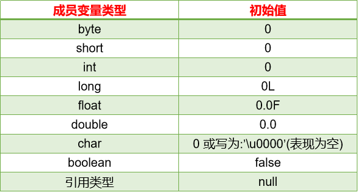

### ③数据类型

- 基本数据类型
- 引用数据类型

### ④权限修饰符

权限修饰符不仅对类的属性有要求，对类中的方法的要求是完全一样的：

| 修饰符名称 | 含义   | 本类 | 同包其他类 | 子类 | 同工程其他类 |
| ---------- | ------ | ---- | ---------- | ---- | ------------ |
| private    | 私有   | √    | ×          | ×    | ×            |
| default    | 缺省   | √    | √          | ×    | ×            |
| protected  | 受保护 | √    | √          | √    | ×            |
| public     | 公共   | √    | √          | √    | √            |

- 同包类访问私有属性：


- 同工程、不同包的类访问缺省权限属性：


- 同工程、不同包的类访问受保护权限属性：


### ⑤属性名

属性也叫成员变量，所以属性名作为标识符适用变量的标识符规则和规范。

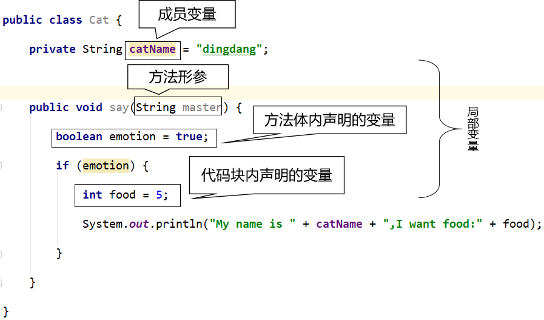

## 8、对象的内存分析

```java
public class Cat {

    private String catName = "dingdang";
    int weight;

    public void say(String master) {

        boolean emotion = true;

        if (emotion) {

            int food = 5;

            System.out.println("My name is " + catName + ",I want food:" + food);

        }

    }

}
```


### ①基本情况

#### [1]声明变量

```java
// 1.声明Cat类型的变量
Cat cat;
```

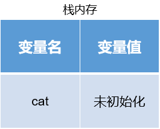

#### [2]创建对象

大家可以记住：只要看见使用了new关键词，就表示在堆内存中一定开辟了新的空间，一定创建了新的对象。

```java
        // 2.给Cat类型的变量赋值一个Cat类型的对象
        cat = new Cat();
```


#### [3]调用方法

```java
        // 3.调用Cat对象的方法
        cat.say("tom");
```

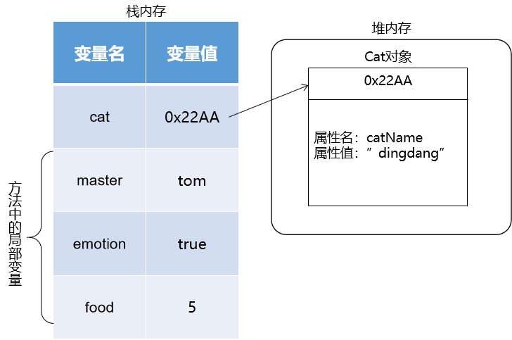

#### [4]say()方法执行完成

局部变量就会被释放掉


#### [5]main()方法执行完成

main()方法中的cat局部变量也会被释放掉。然后Cat对象就成了“断了线的风筝”被垃圾回收机制回收。

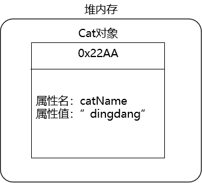

### ②创建两个对象

证明：两个对象在堆空间中分别有自己的副本，分别进行操作时互不影响。

#### [1]创建第一个对象

```java
Cat cat01 = new Cat();
```

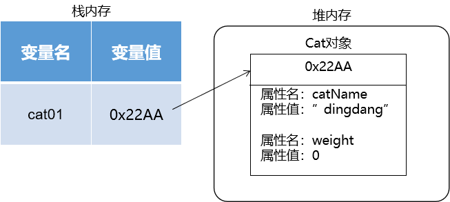

#### [2]创建第二个对象

```java
Cat cat02 = new Cat();
```

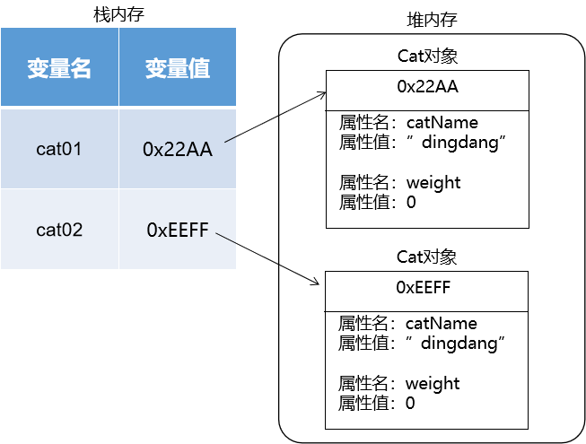

#### [3]第一个变量设置属性

```java
cat01.weight = 10;
```


#### [4]第二个变量设置属性

```java
cat02.weight = 20;
```


### ③两个变量指向同一对象

```java
        Cat cat03 = new Cat();
        Cat cat04 = cat03;
```

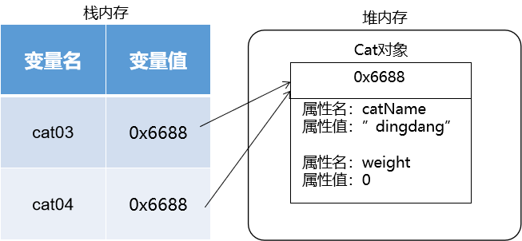

分别用两个变量修改weight属性：

```java
        cat03.weight = 66;
```

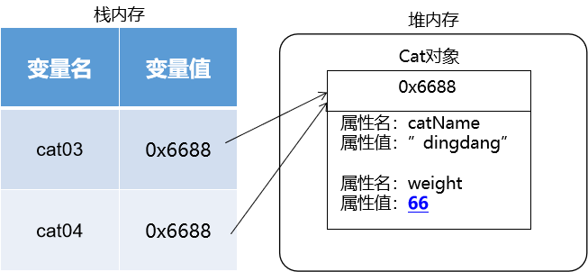

```java
cat04.weight = 88;
```

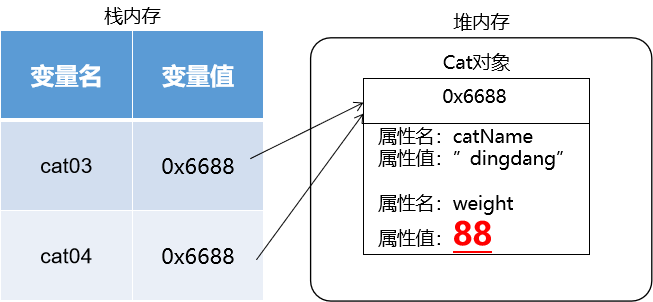

### ④变量置空

#### [1]将cat04置空

```java
cat04 = null;
```

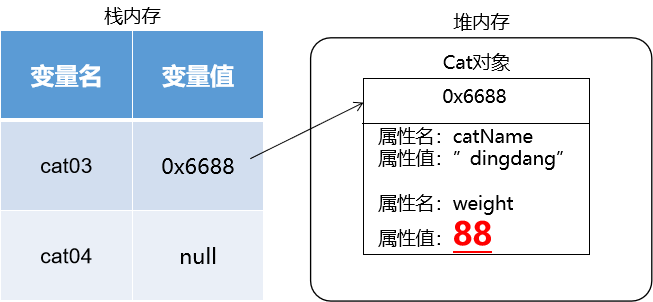

#### [2]将cat03置空

```java
cat03 = null;
```


## 9、方法

### ①概念

#### [1]代码复用


#### [2]参数和返回值

方法的参数和返回值都不是必须有的，根据需要设置。

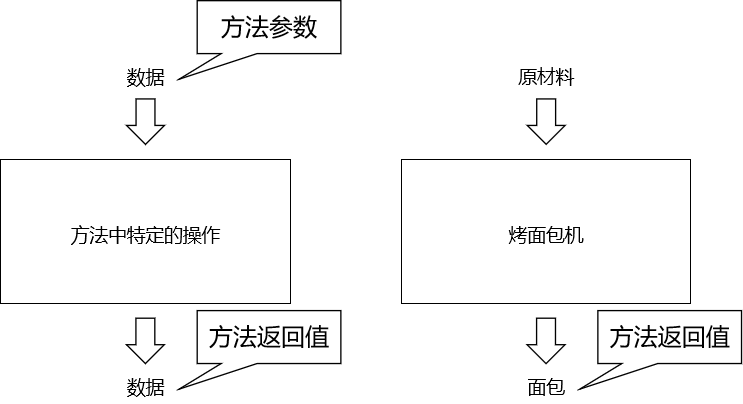

- 方法的参数：我们命令方法替我们干活的时候，有时需要给方法提供一些数据。
  - 形式参数：声明方法时指定的参数，用来说明这个方法可以接受哪些参数（简称形参）
  - 实际参数：调用方法时实际传入的参数，用于方法执行过程中实际的运算（简称实参）
- 方法的返回值：方法执行完成后，给方法的调用者返回的结果数据。

### ②方法的声明和调用

| 洗衣机         | 方法     |
| -------------- | -------- |
| 工厂生产洗衣机 | 声明方法 |
| 用户使用洗衣机 | 调用方法 |

#### [1]声明方法的代码

```java
// 声明一个方法：求两个整数的和
// int a,int b声明方法的参数：形式参数
// public int：表示方法的访问权限是public，返回值是int类型
// 方法名：add
public int add(int a, int b) {

    // 计算a + b的和
    int addResult = a + b;

    // 使用return关键字将a + b的和返回给方法的调用者
    return addResult;
}
```

#### [2]调用方法的代码

```java
// 1.要调用一个方法，需要先创建方法所在类的对象
Calculator calculator = new Calculator();

// 2.通过对象调用方法
// 这里传入给方法的5、11，我们叫做实际参数
int addResult = calculator.add(5, 11);
```

### ③方法相关规则

- 方法调用一次就会执行一次
- 方法必须写在类中，不能独立存在。
- 方法如果没有返回值，方法体内可以没有return；如果写了return，那么表示方法结束。
- 方法声明的返回值类型必须和实际返回的数据类型一致。
- 方法内部不能再声明方法。

