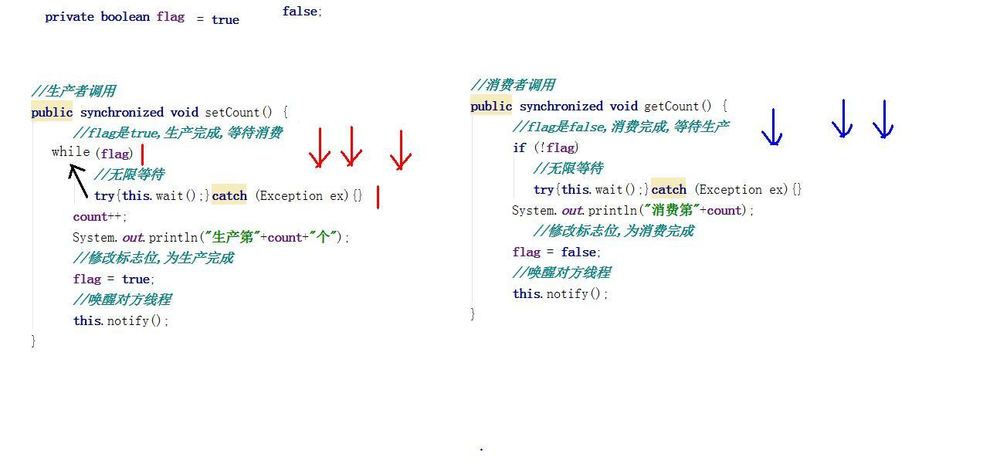
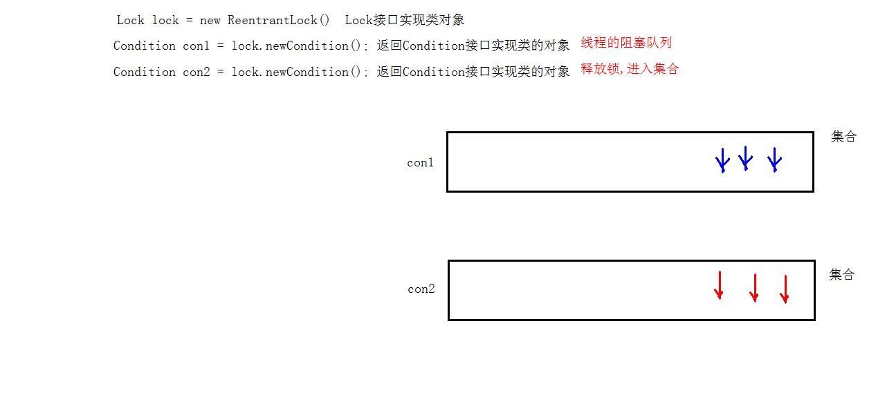
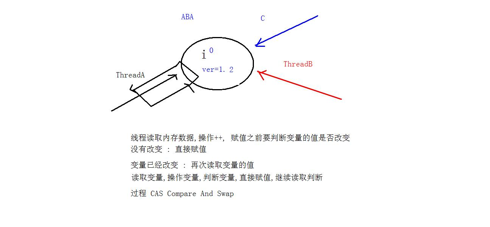

# day19 多线程

- 学习目标
  - 生产者与消费者
  - JDK5特性JUC
  - 单例模式
  - 关键字volatile
  - 线程池
  - ConcurrentHashMap

## 1. 生产者与消费者

### 1.1 安全问题产生

-  线程本身就是一个新创建的方法栈内存 (CPU进来读取数据)
-  线程的notify(),唤醒第一个等待的线程
  - 解决办法 : 全部唤醒 notifyAll()
-  被唤醒线程,已经进行过if判断,一旦醒来继续执行
  - 线程被唤醒后,不能立刻就执行,再次判断标志位,利用循环
  - while(标志位) 标志位是true,永远也出不去

```java
/**
 * 定义资源对象
 *   成员 : 产生商品的计数器
 *          标志位
 */
public class Resource {
   private int count ;
   private boolean flag ;

   //消费者调用
   public synchronized void getCount() {
         //flag是false,消费完成,等待生产
         while (!flag)
            //无限等待
            try{this.wait();}catch (Exception ex){}
         System.out.println("消费第"+count);
            //修改标志位,为消费完成
         flag = false;
         //唤醒对方线程
         this.notifyAll();
   }
   //生产者调用
   public synchronized void setCount() {
         //flag是true,生产完成,等待消费
       while (flag)
            //无限等待
            try{this.wait();}catch (Exception ex){}
         count++;
         System.out.println("生产第"+count+"个");
         //修改标志位,为生产完成
         flag = true;
         //唤醒对方线程
         this.notifyAll();
   }
}

```

```java
/**
 * 生产者线程
 *   资源对象中的变量++
 */
public class Produce implements Runnable{

    private Resource r ;

    public Produce(Resource r) {
        this.r = r;
    }

    @Override
    public void run() {
        while (true) {
            r.setCount();
        }
    }
}
```

```java
/**
 * 消费者线程
 *   资源对象中的变量输出打印
 */
public class Customer implements Runnable{
    private Resource r ;

    public Customer(Resource r) {
        this.r = r;
    }

    @Override
    public void run() {
        while (true) {
            r.getCount();
        }
    }
}
```

```java
    public static void main(String[] args) {
        Resource r = new Resource();
        //接口实现类,生产的,消费的
        Produce produce = new Produce(r);
        Customer customer = new Customer(r);
        //创建线程
        new Thread(produce).start();
        new Thread(produce).start();
        new Thread(produce).start();
        new Thread(produce).start();
        new Thread(produce).start();
        new Thread(produce).start();
        new Thread(customer).start();
        new Thread(customer).start();
        new Thread(customer).start();
        new Thread(customer).start();
        new Thread(customer).start();
        new Thread(customer).start();
    }
```



### 1.2 线程方法sleep和wait的区别

- sleep在休眠的过程中,同步锁不会丢失 ,不释放

- wait()等待的时候,发布监视器的所属权, 释放锁.唤醒后要重新获取锁,才能执行

### 1.3 生产者和消费者案例性能问题

 wait()方法和notify()方法, 本地方法调用OS的功能,和操作系统交互,JVM找OS,把线程停止. 频繁等待与唤醒,导致JVM和OS交互的次数过多.

  notifyAll()唤醒全部的线程,也浪费线程资源,为了一个线程,不得以唤醒的了全部的线程.

### 1.4 Lock接口深入

  Lock接口替换了同步synchronized, 提供了更加灵活,性能更好的锁定操作

- Lock接口中方法 :  newCondition() 方法的返回值是接口 : Condition



### 1.5 生产者与消费者改进为Lock接口

- Condition接口 (线程的阻塞队列)
  - 进入队列的线程,释放锁
  - 出去队列的线程,再次的获取锁
  - 接口的方法 : await() 线程释放锁,进入队列
  - 接口的方法 : signal() 线程出去队列,再次获取锁

>  线程的阻塞队列,依赖Lock接口创建

```java
/**
 *  改进为高性能的Lock接口和线程的阻塞队列
 */
public class Resource {
   private int count ;
   private boolean flag ;
   private Lock lock = new ReentrantLock();//Lock接口实现类对象

    //Lock接口锁,创建出2个线程的阻塞队列
    private Condition prod = lock.newCondition();//生产者线程阻塞队列
    private Condition cust = lock.newCondition();//消费者线程阻塞队列

   //消费者调用
   public  void getCount() {
       lock.lock();//获取锁
         //flag是false,消费完成,等待生产
         while (!flag)
            //无限等待,消费线程等待,执行到这里的线程,释放锁,进入到消费者的阻塞队列
             try{cust.await();}catch (Exception ex){}

         System.out.println("消费第"+count);
            //修改标志位,为消费完成
         flag = false;
         //唤醒生产线程队列中的一个
         prod.signal();
         lock.unlock();//释放锁
   }
   //生产者调用
   public  void setCount() {
       lock.lock();//获取锁
         //flag是true,生产完成,等待消费
       while (flag)
            //无限等待,释放锁,进入到生产线程队列
            try{prod.await();}catch (Exception ex){}
         count++;
         System.out.println("生产第"+count+"个");
         //修改标志位,为生产完成
         flag = true;
         //唤醒消费者线程阻塞队列中年的一个
         cust.signal();
       lock.unlock();//释放锁
   }
}

```

### 1.6 Lock锁的实现原理

  使用技术不开源,技术的名称叫做轻量级锁

  使用的是CAS锁 (Compare And Swap) 自旋锁

  JDK限制 : 当竞争的线程大于等于10,或者单个线程自旋超过10次的时候

  JDK强制CAS锁取消.升级为重量级锁 (OS锁定CPU和内存的通信总线)



## 2. 单例设计模式

  设计模式 : 不是技术,是以前的人开发人员,为了解决某些问题实现的写代码的经验.

  所有的设计模式核心的技术,就是面向对象.

  Java的设计模式有23种,分为3个类别,创建型,行为型,功能型

### 2.1 单例模式

  要求 : 保证一个类的对象在内存中的唯一性

- 实现步骤
  - 私有修饰构造方法
  - 自己创建自己的对象
  - 方法get,返回本类对象

```java
/**
 * - 私有修饰构造方法
 * - 自己创建自己的对象
 * - 方法get,返回本类对象
 */
public class Single {
    private Single(){}
	//饿汉式
    private static Single s = new Single(); // 自己创建自己的对象

//    方法get,返回本类对象
    public static Single getInstance(){
        return s;
    }
}
```

```java
 public static void main(String[] args) {
        //静态方法,获取Single类的对象
        Single instance = Single.getInstance();
        System.out.println("instance = " + instance);
 }
```

实现步骤

- 私有修饰构造方法
- 创建本类的成员变量, 不new对象
- 方法get,返回本类对象

```java
/**
 * - 私有修饰构造方法
 * - 创建本类的成员变量, 不new对象
 * - 方法get,返回本类对象
 */
public class Single {
    private Single(){}
	//懒汉,对象的延迟加载
    private static Single s = null;

    public static Single getInstance(){
        //判断变量s,是null就创建
        if (s == null) {
            s = new Single();
        }
        return s;
    }
}
```

### 2.2 懒汉式的安全问题

  一个线程判断完变量 s=null,还没有执行new对象,被另一个线程抢到CPU资源,同时有2个线程都进行判断变量,对象创建多次

```java
    public static Single getInstance(){
        synchronized (Single.class) {
            //判断变量s,是null就创建
            if (s == null) {
                s = new Single();
            }
        }
        return s;
    }
```

性能问题 : 第一个线程获取锁,创建对象,返回对象. 第二个线程调用方法的时候,变量s已经有对象了,根本就不需要在进同步,不要在判断空,直接return才是最高效的.双重的if判断,提高效率  Double Check Lock

```java
private static volatile Single s = null; 
public static Single getInstance(){
        //再次判断变量,提高效率
        if(s == null) {
            synchronized (Single.class) {
                //判断变量s,是null就创建
                if (s == null) {
                    s = new Single();
                }
            }
        }
        return s;
    }
```

### 2.3 关键字volatile

  成员变量修饰符,不能修饰其它内容

- 关键字作用 : 
  - 保证被修饰的变量,在线程中的可见性
  - 防止指令重排序
    - 单例的模式, 使用了关键字,不使用关键字,可能线程会拿到一个尚未初始化完成看的对象(半初始化)

```java
public class MyRunnable implements Runnable {
    private volatile boolean flag = true;

    @Override
    public void run() {
        m();
    }

    private void m(){
        System.out.println("开始执行");
        while (flag){

        }
        System.out.println("结束执行");
    }


    public void setFlag(boolean flag) {
        this.flag = flag;
    }
}
```

```java
    public static void main(String[] args) throws InterruptedException {
        MyRunnable myRunnable = new MyRunnable();

        new Thread(myRunnable).start();

        Thread.sleep(2000);

        //main线程修改变量
        myRunnable.setFlag(false);
    }
```

## 3. 线程池ThreadPool

  线程的缓冲池,目的就是提高效率. new Thread().start() ,线程是内存中的一个独立的方法栈区,JVM没有能力开辟内存空间,和OS交互.

  JDK5开始内置线程池

### 3.1 Executors类

- 静态方法static newFixedThreadPool(int 线程的个数)
  - 方法的返回值ExecutorService接口的实现类,管理池子里面的线程

- ExecutorService接口的方法
  - submit (Runnable r)提交线程执行的任务

### 3.2 Callable接口

  实现多线程的程序 : 接口特点是有返回值,可以抛出异常 (Runnable没有)

  抽象的方法只有一个, call

  启动线程,线程调用重写方法call

- ExecutorService接口的方法
  - submit (Callable c)提交线程执行的任务
  -  Future submit()方法提交线程任务后,方法有个返回值 Future接口类型
  -  Future接口,获取到线程执行后的返回值结果

```java
public class MyCall implements Callable<String> {
    public String call() throws Exception{
        return "返回字符串";
    }
}
```

```java
    public static void main(String[] args) throws ExecutionException, InterruptedException {
        //创建线程池,线程的个数是2个
       ExecutorService  es =  Executors.newFixedThreadPool(2);
       //线程池管理对象service,调用方法啊submit提交线程的任务
        MyRunnable my = new MyRunnable();
        //提交线程任务,使用Callable接口实现类
        Future<String> future = es.submit(new MyCall());//返回接口类型 Future
        //接口的方法get,获取线程的返回值
        String str = future.get();
        System.out.println("str = " + str);

//        es.submit(my);
//        es.submit(my);
//        es.submit(my);
       // es.shutdown();//销毁线程池
    }
```

## 4. ConcurrentHashMap

  ConcurrentHashMap类本质上Map集合,键值对的集合.使用方式和HashMap没有区别.

  凡是对于此Map集合的操作,不去修改里面的元素,不会锁定

## 5. 线程的状态图-生命周期

  在某一个时刻,线程只能处于其中的一种状态. 这种线程的状态反应的是JVM中的线程状态和OS无关.

## 6. File类

- 文件夹 Directory :  存储文件的容器,防止文件重名而设置,文件归类,文件夹本身不存储任何数据, 计算专业数据称为 目录

- 文件 File : 存储数据的,同一个目录中的文件名不能相同
- 路径 Path : 一个目录或者文件在磁盘中的位置
  - c:\jdk8\jar  是目录的路径,是个文件夹的路径
  - c:\jdk8\bin\javac.exe 是文件的路径
- File类,描述目录文件和路径的对象
- 平台无关性

### 6.1 File类的构造方法

- File (String pathname)传递字符串的路径名
- File(String parent,String child)传递字符串的父路径,字符串的子路径
- File(File parent,String child)传递File类型的父路径,字符串的子路径

```java
 public static void main(String[] args) {
        fileMethod03();
    }
    /**
     * File(File parent,String child)传递File类型的父路径,字符串的子路径
     */
    public static void fileMethod03(){
        File parent = new File("C:/Java/jdk1.8.0_221");
        String child = "bin";
        File file = new File(parent,child);
        System.out.println(file);
    }

    /**
     * File(String parent,String child)传递字符串的父路径,字符串的子路径
     * C:\Java\jdk1.8.0_221\bin
     * C:\Java\jdk1.8.0_221 是 C:\Java\jdk1.8.0_221\bin 的父路径
     */
    public static void fileMethod02(){
        String parent = "C:/Java/jdk1.8.0_221";
        String child = "bin";
        File file = new File(parent,child);
        System.out.println(file);
    }

    /**
     * File (String pathname)传递字符串的路径名
     */
    public static void fileMethod(){
        //字符串的路径,变成File对象
        File file = new File("C:\\Java\\jdk1.8.0_221\\bin");
        System.out.println(file);
    }
```

### 6.2 File类的创建方法

- boolean createNewFile()创建一个文件,文件路径写在File的构造方法中
- boolean mkdirs()创建目录,目录的位置和名字写在File的构造方法中

```java
    //创建文件夹 boolean mkdirs()
    public static void fileMethod02(){
        File file = new File("C://Java//1.txt");
        boolean b = file.mkdirs();
        System.out.println("b = " + b);
    }

    //创建文件 boolean createNewFile()
    public static void fileMethod() throws IOException {
        File file = new File("C://Java//1.txt");
        boolean b = file.createNewFile();
        System.out.println("b = " + b);
    }
```

### 6.3 File类的删除方法

- boolean delete() 删除指定的目录或者文件,路径写在File类的构造方法
  - 不会进入回收站,直接从磁盘中删除了,有风险

```java
    public static void fileMethod03(){
        File file = new File("C:/Java/aaa");
        boolean b = file.delete();
        System.out.println("b = " + b);
    }
```

### 6.4 File类判断方法

- boolean exists() 判断构造方法中的路径是否存在
- boolean isDirectory()判断构造方法中的路径是不是文件夹
- boolean isFile()判断构造方法中的路径是不是文件
- boolean isAbsolute() 判断构造方法中的路径是不是绝对路径


#### 6.4.1 绝对路径

- 绝对路径
  - 在磁盘中的路径具有唯一性
  - Windows系统中,盘符开头 `C:/Java/jdk1.8.0_221/bin/javac.exe`
  - Linux或者Unix系统, /开头,磁盘根 `/usr/local`
  - 互联网路径 :`www.baidu.com`
    - `https://item.jd.com/100007300763.html`
    - `https://pro.jd.com/mall/active/3WA2zN8wkwc9fL9TxAJXHh5Nj79u/index.html`
- 相对路径
  - 必须有参照物
  - `C:/Java/jdk1.8.0_221/bin/javac.exe`
  - bin是参考点 : 父路径 C:/Java/jdk1.8.0_221
  - bin是参考点 : 子路径 javac.txt
  - bin参考点: 父路径使用 ../表示

```java
    /**
     * boolean isAbsolute() 判断构造方法中的路径是不是绝对路径
     * 不写绝对形式的路径,写相对形式的,默认在当前的项目路径下
     */
    public static void fileMethod04(){
        File file = new File("C:/Java/jdk1.8.0_221/bin/javac.exe");
        boolean b = file.isAbsolute();
        System.out.println("b = " + b);

        File file2 = new File("javac.exe");
        b = file2.isAbsolute();
        System.out.println("b = " + b);
    }
```


