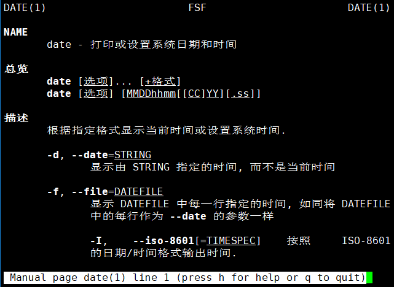
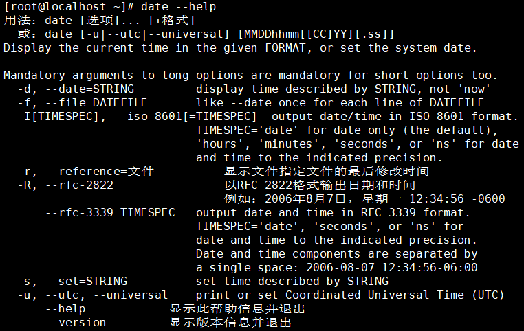
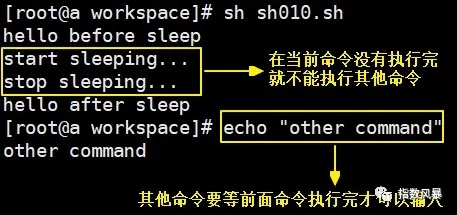
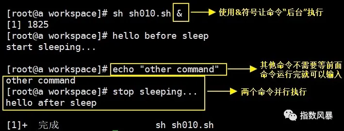

# 常用辅助命令

## 辅助命令：history

作用：查看命令历史

用法：


将命令的运行结果写入文件：

*   覆盖写：命令 > 文件路径
*   追加写：命令 >> 文件路径

这里给大家介绍一个非常有意思的文件：/dev/null。它被称为 Linux 系统的黑洞，因为不管写入多少数据到这个文件，数据都会被销毁。


## 辅助命令：echo

### 1、简介

命令：echo

作用：将数据输出到 standard output（标准输出），主要用来打印环境变量的值


### 2、关于 standard output

#### ① 本质

如果我们说把一条数据打印到标准输出，那么我们就是在说：打印到命令行窗口。

#### ② 对比 Java 代码

```java
System.out.println("Hello World!");
```

上面这行 Java 代码将字符串打印到了控制台，而如果我们我们把这段 Java 程序拿到 Linux 系统来执行，那么它就打印到 standard output 了。

### 3、输出环境变量

#### ①Linux 中引用环境变量

在 Linux 系统中通过$来引用环境变量，例如：$PATH

#### ② 使用 echo 输出环境变量


## 辅助命令：命令帮助

### 1、概述

在我们学习一个新的命令时，Linux 系统自带的官方命令手册就是非常权威的参考文档。而 man 命令和 info 命令都可以调出一个命令对应的文档。区别在于 man 命令阅读体验略好，info 命令文档内容更完整。

### 2、用法

#### ①man 命令

命令：man

对应单词：manual

格式：man [要查询的命令]

控制方式：

| 按键    | 说明                                   |
| ------- | -------------------------------------- |
| 空格    | 向下滚动一屏                           |
| 回车    | 向下滚动一行                           |
| b       | 向上滚动一屏                           |
| q       | 退出                                   |
| /关键词 | 搜索关键词<br />n 向下找<br />N 向上找 |



#### ②info 命令

命令：info

对应单词：information

格式：info [要查询的命令]

控制方式：

| 按键 | 说明                           |
| ---- | ------------------------------ |
| Up   | Move up one line               |
| Down | Move down one line             |
| DEL  | Scroll backward one screenful  |
| SPC  | Scroll forward one screenful   |
| PgUp | Scroll backward in this window |
| PgDn | Scroll forward in this window  |

> 其实 info 命令每次进入的都是同一个文档，只是不同被查询命令进入的是这个文档的不同位置而已。

#### ③ 补充

大部分命令都有--help 参数，也起到参考文档作用。



## 辅助命令：关机重启

### 1、意识

服务器端不要轻易关机！执行关机或重启操作前一定要问自己下面六个问题：

*   我现在操作的具体是哪一台服务器？
*   这台服务器是否是生产服务器？
*   这台服务器可能有哪些人登录？
*   我关机或重启后对其他人是否有影响？
*   这台服务器关机或重启是否会导致其他服务器无法正常工作？
*   我现在的操作是否必须通过关机或重启来实现？

一旦错误的关闭或重启了服务器，有可能会给公司造成无法弥补的损失。如果后果严重是有可能承担法律责任的。

### 2、相关命令

| 命令     | 作用                   |
| -------- | ---------------------- |
| sync     | 将内存数据保存到硬盘上 |
| poweroff | 关机                   |
| reboot   | 重启                   |

## 辅助命令：反斜杠

符号：\

作用：如果一个命令特别长，那么可以使用反斜杠表示到下一行继续输入

示例：

> ./configure \
> --prefix=/usr/local/nginx \
> --pid-path=/var/run/nginx/nginx.pid \
> --lock-path=/var/lock/nginx.lock \
> --error-log-path=/var/log/nginx/error.log \
> --http-log-path=/var/log/nginx/access.log \
> --with-http_gzip_static_module \
> --http-client-body-temp-path=/var/temp/nginx/client \
> --http-proxy-temp-path=/var/temp/nginx/proxy \
> --http-fastcgi-temp-path=/var/temp/nginx/fastcgi \
> --http-uwsgi-temp-path=/var/temp/nginx/uwsgi \
> --http-scgi-temp-path=/var/temp/nginx/scgi

## 辅助命令：curl

命令：curl

对应单词：client url

作用：通过命令给服务器发送请求

官方文档说明节选：

> curl is a tool to transfer data from or to a server, using one of the supported protocols (DICT, FILE, FTP, FTPS, GOPHER, HTTP, HTTPS, IMAP, IMAPS, LDAP, LDAPS, POP3, POP3S, RTMP, RTSP, SCP, SFTP, SMTP, SMTPS, TELNET and TFTP). The command is designed to work without user interaction.

从文档中我们可以看到 curl 命令支持的通信协议非常丰富，其中我们最常用的还是 HTTP 协议。如果有需要 curl 可以通过参数详细设置请求消息头。

用法举例：


通过-X 参数可以指定请求方式：

> curl -X POST [资源的 URL 地址]

## 辅助命令：nohup

### 1、提出问题

我们把一个 SpringBoot 工程导出为 jar 包，jar 包上传到阿里云 ESC 服务器上，使用 java -jar xxx-xxx.jar 命令启动这个 SpringBoot 程序。此时我们本地的 xshell 客户端必须一直开着，一旦 xshell 客户端关闭，java -jar xxx-xxx.jar 进程就会被结束，SpringBoot 程序就访问不了了。

所以我们希望启动 SpringBoot 的 jar 包之后，对应的进程可以一直运行，不会因为 xshell 客户端关闭而被结束。


### 2、命令的前台运行和后台运行

#### ① 前台运行

默认情况下 Linux 命令都是前台运行的，前台运行的特点是前面命令不执行完，命令行就一直被前面的命令占用，不能再输入、执行新的命令。

```shell
##!/bin/bash
echo "hello before sleep"
sleep 20
echo "hello after sleep"
```

前台（默认情况）运行上面脚本的效果是：



后台运行上面脚本的效果是：



但是以后台方式运行并不能解决前面提出的问题：我们的 shell 客户端（例如：xshell）和服务器断开连接后，SpringBoot 进程会随之结束，这显然不满足我们部署运行项目的初衷。

#### ② 不挂断运行

所谓“不挂断”就是指客户端断开连接后，命令启动的进程仍然运行。nohup 命令就是”no hang up“的缩写。使用 nohup 命令启动 SpringBoot 微服务工程的完整写法是：

```shell
nohup java -jar spring-boot-demo.jar>springboot.log 2>&1 &
```


## 辅助命令：wget

命令：wget

作用：下载文件

官方文档说明：GNU Wget is a free utility for non-interactive download of files from the Web. It supports HTTP, HTTPS, and FTP protocols, as well as retrieval through HTTP proxies.

用法：


