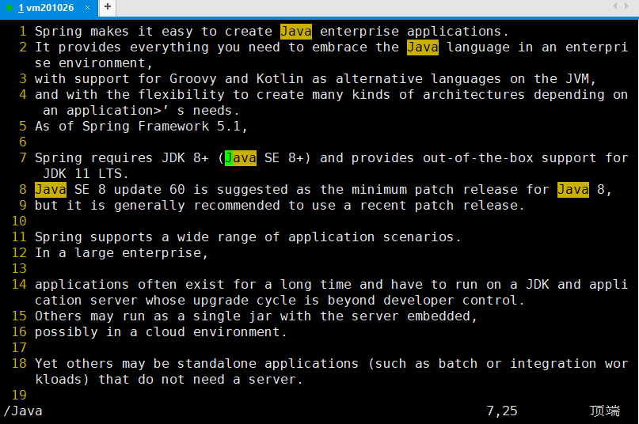
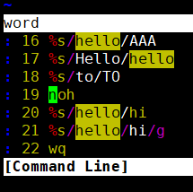
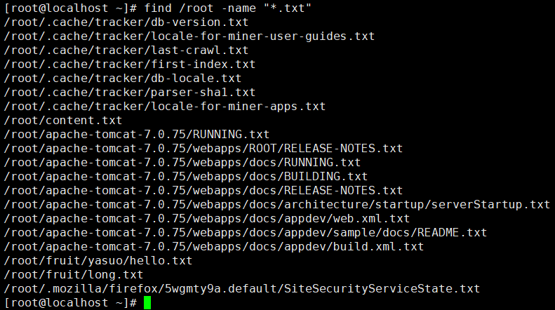
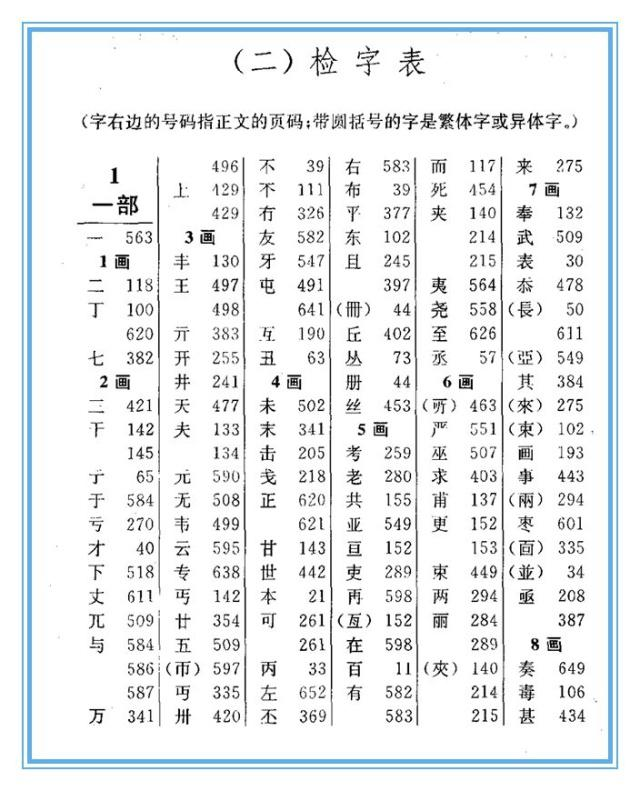
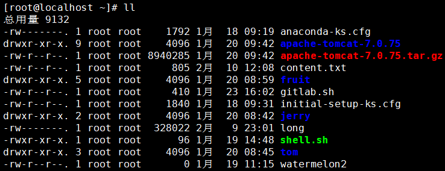

# 文件和目录相关命令

命令行环境下快捷键：

| 按键         | 作用         |
| ------------ | ------------ |
| Ctrl+l       | 清屏         |
| Ctrl+c       | 强制终止程序 |
| Ctrl+Insert  | 复制         |
| Shift+Insert | 粘贴         |
| Ctrl+s       | 锁屏         |
| Ctrl+q       | 解除锁屏     |
| tab          | 自动补全     |

 第二节 文件和目录相关命令：创建目录

命令：mkdir

对应单词：make directory

作用：创建目录

格式：mkdir [OPTION]... DIRECTORY...

创建单层目录：mkdir 新目录的路径

> 单层目录说明：
>
> mkdir aaa/bbb/ccc
>
> 其中aaa/bbb是存在的目录，要创建的仅仅是ccc

创建多层目录：mkdir -p 新目录的路径

> 多层目录说明：
>
> mkdir -p aaa/bbb/ccc/ddd
>
> 其中bbb/ccc/ddd都不存在，现在想一次性把这些目录都建出来

[上一条](verse02-01-hotkey.html) [回目录](verse02-00-index.html) [下一条](verse02-03-cd.html)

 第二节 文件和目录相关命令：进入目录

命令：cd

对应单词：change directory

作用：切换当前目录

格式： cd 目标目录路径

用法1：使用绝对路径

用法2：使用相对路径

用法3：使用~回到家目录

[上一条](verse02-02-mkdir.html) [回目录](verse02-00-index.html) [下一条](verse02-04-ls.html)

 第二节 文件和目录相关命令：查看目录内容

命令：ls

对应单词：list

作用：列出目录中的内容，这里所说的目录可以是当前目录也可以是其他目录（需要指定路径）。

格式：ls [OPTION]... [FILE]...

常用参数

| 参数 | 说明                               |
| ---- | ---------------------------------- |
| -A   | 显示目录内容时把隐藏资源也显示出来 |
| -l   | 以详细信息形式显示资源             |
| -R   | 递归查看目录内容                   |

命令的参数既可以单独使用也可以组合使用。同时ls -l可以简写为ll。

[上一条](verse02-03-cd.html) [回目录](verse02-00-index.html) [下一条](verse02-05-pwd.html)

 第二节 文件和目录相关命令：pwd

命令：pwd

对应单词：print work directory

作用：打印当前所在的目录

举例：

当前目录同样是baby，但是用pwd打印的完整路径却不同

[上一条](verse02-04-ls.html) [回目录](verse02-00-index.html) [下一条](verse02-06-touch.html)

 第二节 文件和目录相关命令：新建文件

命令：touch

作用：创建空文件

格式：touch 新建文件的路径

[上一条](verse02-05-pwd.html) [回目录](verse02-00-index.html) [下一条](verse02-07-cp.html)

 第二节 文件和目录相关命令：复制

命令：cp

对应单词：copy

作用：复制文件或目录

复制文件：cp 被复制的文件的路径  目标目录的路径

复制目录：cp -r 被复制的目录的路径  目标目录的路径

[上一条](verse02-06-touch.html) [回目录](verse02-00-index.html) [下一条](verse02-08-mv.html)

 第二节 文件和目录相关命令：移动

命令：mv

对应单词：move

作用：移动文件或目录

格式：mv 被移动的文件或目录的路径 目标目录

特殊效果：将目录或文件在当前位置移动可以起到重命名的作用

[上一条](verse02-07-cp.html) [回目录](verse02-00-index.html) [下一条](verse02-09-rm.html)

 第二节 文件和目录相关命令：删除

命令：rm

对应单词：remove

作用：删除目录或文件

删除文件：rm 被删除的文件的路径

强制删除文件：rm -f 被删除的文件的路径

递归删除目录：rm -r 被删除的目录的路径

强制删除目录：rm -rf 被删除的目录的路径

[上一条](verse02-08-mv.html) [回目录](verse02-00-index.html) [下一条](verse02-10-vim.html)

 第二节 文件和目录相关命令：vim

 一、简介

命令：vim

作用：在命令行环境下编辑文本文件

提示：在命令行模式下没有鼠标，所以刚开始使用的时候会觉得非常不习惯。但是慢慢的熟练之后你会发现，不需要鼠标全部用键盘就可以操作效率很高。

 二、三种模式

一般模式：通过按键控制VIM工作

编辑模式：可以自由输入

指令模式：通过执行指令完成一些特殊操作

 三、基本操作

 1、打开一个文件

[root@localhost ~] vim content.txt

即使这个文件不存在也没关系，vim知道我们打算新建一个文件。打开后的效果是：

 2、进入编辑模式

进入编辑模式有很多种方法，现在我们先使用其中一种方法：按一下i键。

按键的时候屏幕上是不显示“i”这个字母的，这个需要注意。

然后可以随意输入一些内容。

然后再按Esc键回到一般模式。

 3、显示行号

接着上一步继续，在回到一般模式后，输入英文冒号。我们会看到光标移动到了窗口的底部：

然后输入set nu回车就可以显示行号了。

这时我们其实就使用了一个指令。

 4、保存已修改的内容

当:set nu这个指令执行完成后，vim就又回到了:w指令就可以保存文件。

 5、退出

使用:q指令就可以退出vim了

 6、保存退出

:w是保存，:q是退出，:wq就是保存退出

 7、不保存退出

当我们退出vim时，如果有部分修改还没有保存，那么会看到下面的提示：

当我们想要放弃对文件的修改，不保存直接退出就使用:q!

 四、看

 1、上下左右移动光标

 ①方法一

很容易上手的操作方式，但是距离基准键位较远，熟练使用之后敲击键盘的速度大幅度提升，要移动这么远的举例还是非常不便的。

 ②方法二

就在基准键位上，非常方便。

 2、前往指定行

 ①第一行

输入gg，将光标定位到第一行开头的位置。此时屏幕上并不会显示你输入了什么，需要你自己心里面知道。

 ②最后一行

输入G，将光标定位到最后一行开头的位置。

 ③指定行号

假设我们要去第12行，那么依次输入“1”、“2”、“G”即可。这些也不会在屏幕上的任何地方显示，所以还是要我们自己心里清楚。

 五、改

这里我们说的是在一般模式下通过按键来编辑文件，并不是进入编辑模式。

| 按键   | 效果                                                         |
| ------ | ------------------------------------------------------------ |
| dd     | 删除光标所在的行                                             |
| d5d    | 从光标所在行开始，向下连续删除5行（包括光标所在行）          |
| u      | 撤销刚才的操作                                               |
| Ctrl+r | 重做刚才撤销的操作                                           |
| yy     | 复制光标所在的行                                             |
| p      | 将当前复制的行粘贴到光标所在位置的下一行                     |
| y3y    | 从光标所在行开始，向下连续复制5行（包括光标所在行）          |
| r      | 替换光标所在位置的一个字符 第一步：按一下r键 第二步：输入新的字符 |

 六、编

这次我们要看看有哪些方法可以进入编辑模式

| 按键 | 大小写 说明 | 光标动作                                                     |
| ---- | ---------------- | ------------------------------------------------------------ |
| i    | 小写             | 不动，就在当前位置，开始输入 |
| I    | 大写             | 移动到行的开头，开始输入 |
| a    | 小写             | 光标向后移动一格，然后开始输入 |
| A    | 大写             | 光标移动到行的末尾，然后开始输入 |
| o    | 小写             | 先在光标所在行的下面插入空行 然后把光标移动到空行的开头，再开始输入 |

 七、搜

 1、初始状态

 2、进入指令模式

输入“/”，进入专门用于搜索关键词的指令模式

 3、输入关键词

 4、回车执行搜索

关键词匹配到的内容会被高亮显示

 5、遍历匹配内容

在匹配到搜索结果后，可以逐个遍历各个匹配内容：

* 输入n向下找
* 输入N向上找

 6、取消高亮显示

使用:noh指令即可取消高亮

回车执行后的效果如下图所示：

 八、替

 1、新建文件

> Oh, hello tom! Do you think this is a good time for me to say hello to Lily?
>
> Oh, hello tom! Do you think this is a good time for me to say hello to Lily?
>
> Oh, hello tom! Do you think this is a good time for me to say hello to Lily?
>
> Oh, hello tom! Do you think this is a good time for me to say hello to Lily?
>
> Oh, hello tom! Do you think this is a good time for me to say hello to Lily?
>
> Oh, hello tom! Do you think this is a good time for me to say hello to Lily?
>
> Oh, hello tom! Do you think this is a good time for me to say hello to Lily?
>
> Oh, hello tom! Do you think this is a good time for me to say hello to Lily?
>
> Oh, hello tom! Do you think this is a good time for me to say hello to Lily?

 2、执行替换

将to替换为TO

关键词替换指令格式解析：

 3、效果

这时我们看到每一行只有第一个匹配的内容被替换了，后面的没有被替换。这是因为对正则表达式来说，它是以行为单位查找匹配的内容。每一行只要找到第一个匹配那么就可以判断这一行就是匹配的，没有必要继续向后查找了。如果我们需要将一行中的每一个匹配都替换，可以在指令后加/g

 4、重新替换

先按u键撤销刚才的替换

重新运行替换指令：

效果：

 九、常见问题

 1、另一种形式的指令模式

 ①出现的原因

想进入指令模式时本该先输入冒号，再输入字母。而如果先输入了字母再输入冒号就会看到上面显示的界面。这其实也是正常的指令模式，上面列出了我们执行过的指令，也可以输入新指令。

 ②输入新指令

按照进入编辑模式的方式，按对应的键即可，比如按一下i键，下面显示“——插入——”，此时就可以在光标位置输入新的指令了。

输入新指令后回车执行。

 ③选择历史指令

按上、下键即可在指令历史中选择一个具体指令。

 ④什么都不做直接离开

直接回车即可。

 2、提示存在交换文件

 ①产生原因

vim在打开一个文件的时候会同时创建一个临时文件，命名方式是“. 原文件名.swp”，这就是所谓的交换文件。而当vim正常退出时，这个交换文件会被删除。所以如果正常操作我们是看不到这个提示界面的。

而之所以会出现上面的提示，是因为当前的vim命令在创建新的交换文件之前就已经检测到了已存在的交换文件。

再往前推理一步，为什么会有交换文件残留？

* 可能原因1：其他窗口正在使用vim打开同一个文件
* 可能原因2：非正常关机等原因导致vim没有正常退出

 ②解决办法

先根据最下面的提示输入Q退出，然后检查是否在其他窗口已经用vim打开了这个文件：

* 是：继续在这个vim中编辑文件。
* 否：删除交换文件，重新编辑。

 3、屏幕被锁

在Windows环境下大家已经习惯了使用Ctrl+s保存文档，但是在Linux环境下Ctrl+s是锁屏。如果是因为Ctrl+s锁屏那么可以使用Ctrl+q解锁，然后继续操作。

[上一条](verse02-09-rm.html) [回目录](verse02-00-index.html) [下一条](verse02-11-cat.html)

 第二节 文件和目录相关命令：cat

命令：cat

作用：显示文件全部内容

适用场景：较短小的文件

效果：

[上一条](verse02-10-vim.html) [回目录](verse02-00-index.html) [下一条](verse02-12-less.html)

 第二节 文件和目录相关命令：less

 1、简介

命令：less

作用：分屏查看文件内容

 2、用法

 ①使用less命令打开文件

> [root@localhost ~] less long

 ②less环境

 ③控制方式

| 按键    | 效果                           |
| ------- | ------------------------------ |
| 空格    | 向下滚动一屏                   |
| b       | 向上滚动一屏                   |
| 回车    | 向下滚动一行                   |
| q       | 退出                           |
| /关键词 | 搜索 n向下找 N向上找 |
| =       | 显示详细的文件信息             |

下图是显示详细文件信息的效果：

下图是显示到达文件末尾时的效果：

[上一条](verse02-11-cat.html) [回目录](verse02-00-index.html) [下一条](verse02-13-tail.html)

 第二节 文件和目录相关命令：tail

 1、简介

命令：tail

效果：显示文件末尾的部分内容

 2、基本用法

查看文件末尾5行的内容：

 3、高级用法

实时查看文件末尾新增的内容：

新开一个窗口编辑这个文件：

用vim打开tail命令正在监控的文件：

在文件末尾新增内容并保存：

此时在tail命令所在的窗口下查看实时监控：

使用Ctrl+c退出实时监控。

[上一条](verse02-12-less.html) [回目录](verse02-00-index.html) [下一条](verse02-14-find.html)

 第二节 文件和目录相关命令：find

命令：find

作用：查找文件或目录

用法：find 查找范围 参数 表达式

示例解析：

[上一条](verse02-13-tail.html) [回目录](verse02-00-index.html) [下一条](verse02-15-locate.html)

 第二节 文件和目录相关命令：locate

 1、简介

locate命令同样是用来查询文件或目录，但它是基于索引查询，速度快很多。那什么是索引呢？

 2、索引

建立索引可以极大提升查询的速度。为什么会有这么显著的效果呢？我们拿查字典来举个例子。

* 没有索引：从正文第一页开始翻，在每一页中检查有没有自己要找的字。在最差的情况下需要逐页翻到字典的最后一页，这样做速度非常慢。
* 基于索引：字典正文前的检字表就是正文内容的索引。先从检字表里快速找到那个字，这里没有这个字的详细信息，只有这个字所在的页码。我们根据这个页码就可以直接到正文中直接翻到那一页，这样速度就非常快了。

另一个例子是我们想要到一幢大楼里找某一个房间，肯定是先在一楼看看楼层介绍信息，找到房间号直接去。肯定不能一个房间一个房间找。

 3、locate命令的原理

系统启动时把每一个目录、每一个文件的完整路径保存到索引库中。使用locate命令搜索关键词时，就使用关键词查询索引库，把匹配的路径字符串返回。

而新建的文件或目录不会被系统吧路径存入索引库，那么使用locate命令就搜索不到。此时使用updatedb命令更新一下索引库就行了。

 4、操作演示

 ①使用locate命令

 ②新建文件后再搜索

搜不到

 ③更新索引库后再搜索

搜到了

[上一条](verse02-14-find.html) [回目录](verse02-00-index.html) [下一条](verse02-16-grep.html)

 第二节 文件和目录相关命令：grep

 1、基本用法

命令：grep

作用：将文件内容中匹配的行返回

用法：grep 参数 查找内容 源文件

> 补充：grep命令的关键词匹配和vim中的关键词搜索的区别
>
> - vim需要打开文件进入到vim命令自己的界面中而grep命令不需要
>
> - grep命令显示搜索结果时可以将匹配行抽取出来显示，而vim是在全部文件内容中把关键词高亮显示
>
> - grep命令可以同时搜索多个文件
>
>

>
> - grep命令还有很多更丰富的其他用法
>
> 总之：不同的路径来达到，谁也不能说有了面包就不许吃蛋糕。

 2、特殊用法

下面我们要返回不匹配的行

 ①原始文件

 ②返回匹配的行并显示行号

 ③返回不匹配的行并显示行号

 ④结论

grep命令使用-v参数可以返回不匹配的行

[上一条](verse02-15-locate.html) [回目录](verse02-00-index.html) [下一条](verse02-17-pipe.html)

 第二节 文件和目录相关命令：管道

 1、概述

管道不是命令，而是一个符号：“| 命令B。作用是把命令A的输出作为命令B的输入。

 2、举例

 ①需求

显示当前目录下的所有文件。如果使用“ll”命令那么文件和目录都会显示出来。

 ②文件和目录的特征

在显示的详细信息中，文件是以“-”开头的，目录是以“d”开头的。

 ③按照特征编写正则表达式

匹配以“-“开头的行：^-

 ④完整的命令

 ⑤工作机制解析

 ⑥管道可以多重使用

wc -l命令可以统计文本数据的行数

[上一条](verse02-16-grep.html) [回目录](verse02-00-index.html) [下一条](verse02-18-tar.html)

 第二节 文件和目录相关命令：tar

 1、简介

在Linux系统环境中，很多程序安装包都是以tar包的形式提供下载的：

所以通常我们需要从官网下载这些tar包，再上传到Linux服务器上，然后在Linux系统内解压。

 2、tar包解压命令

> tar -zxvf tar包路径

默认解压到当前目录下，如果当前目录下有直接覆盖，没有任何提示，这一点请大家注意。

参数作用说明：

| 参数名称 | 作用                              |
| -------- | --------------------------------- |
| -z       | 用 gzip 对存档压缩或解压          |
| -x       | 解压                              |
| -v       | 详细显示处理的文件                |
| -f       | 指定存档或设备 (缺省为 /dev/rmt0) |

[上一条](verse02-17-pipe.html) [回目录](verse02-00-index.html) [下一节](verse03-00-index.html)
