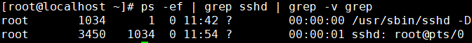
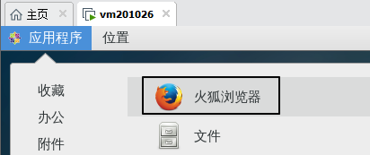
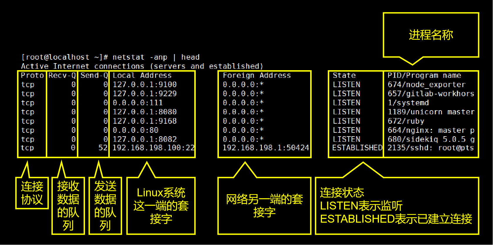

# 进程相关命令

1、简介

命令：ps

对应单词：process status

作用：查看当前正在运行的进程

常用参数组合：ps -ef

-e参数：对应单词entire，表示全部。具体指显示系统中全部的进程信息。

-f参数：对应单词full-formate，表示完整格式。

效果：

 2、进程信息中各列数据说明

| 列名                                                   | 含义                                                     |
| ------------------------------------------------------ | -------------------------------------------------------- |
| UID                                                    | 进程的用户信息                                           |
| PID  | 进程id。由系统分配，不会重复。                           |
| PPID | 父进程的id。父进程和子进程的关系是：父进程启动了子进程。 |
| CMD  | 当前进程所对应的程序。                                   |
| C                                                      | 用整数表示的CPU使用率                                    |
| STIME                                                  | 进程启动时间                                             |
| TTY                                                    | 进程所在终端。所谓终端就是用户输入命令的操作界面。       |
| TIME                                                   | 进程所占用的CPU时间                                      |

 3、父进程和子进程之间的关系

简单来说，父进程和子进程的关系是：父进程启动了子进程。我们可以使用pstree命令查看整个进程树。

 4、和其他命令配合

 ①分屏查看进程信息

全部进程的信息太多了，一屏无法全部显示，所以我们希望可以分屏显示并由我们来控制翻页。为了达到这个目标，我们可以使用管道符号将ps -ef命令的输出数据传送给less命令。

> ps -ef | less

 ②精确查询一个具体进程信息

我们通过Xshell远程连接Linux系统，靠的是sshd这个服务。这个服务如果正在运行中，那么一定会有这个服务对应的进程。所以下面我们来查询一下sshd这个命令的进程。

我们看到这里返回了3条结果，其中前两天都是和sshd服务相关的结果，但是最后一条不是。

> root      72826   3456  0 20:06 pts/0    00:00:00 grep --color=auto sshd

仔细观察一下就能发现，这其实是grep命令本身。因为grep命令运行过程中本身也是一个进程，“grep sshd”正好也匹配sshd，所以就被选中了。但是这是一个干扰项，并不是我们真正要查询的内容，所以需要把它从查询结果中排除。

再用一层管道，使用grep命令的-v参数把匹配grep的行排除，返回不匹配的结果，这就是我们最终想要的。

 第三节 进程相关命令：kill

 1、简介

命令：kill

作用：杀死进程

说明：kill命令本质上是给进程发送信号。

 2、举例

 ①打开火狐浏览器

在Linux系统中打开Linux系统自带的火狐浏览器。

 ②查看火狐浏览器的进程id

另外一个是浏览器插件，不用管。

 ③使用kill命令结束火狐浏览器进程

> kill -s kill 3325

另一种写法是

> kill -9 3325

上面两种写法本质上都是发送kill信号给火狐浏览器进程。

[上一条](verse03-01-ps.html) [回目录](verse03-00-index.html) [下一条](verse03-03-top.html)

 第三节 进程相关命令：top

 1、简介

命令：top

作用：实时查看系统运行情况和健康状态。

 2、细节

 ①命令与参数

| 命令名 | 更新时间间隔（秒） | 不显示任何闲置或者僵死进程 | 通过进程id监控单一进程 |
| ------ | ------------------ | -------------------------- | ---------------------- |
| top    | -d 间隔秒数        | -i                         | -p 进程id              |

 ②操作控制

| 按键 | 功能                             |
| ---- | -------------------------------- |
| P    | 默认值，根据CPU使用率排序        |
| M    | 以内存的使用率排序               |
| N    | 以PID排序                        |
| d    | 设置数据刷新的时间间隔，单位是秒 |
| q    | 退出                             |

在top命令模式下按h键会显示如下的帮助信息：

 ③查询结果字段解释

 [1]第一行信息为任务队列信息

| 内容举例                      | 说明                                                         |
| ----------------------------- | ------------------------------------------------------------ |
| 12:26:49                      | 系统当前时间                                                 |
| up 1 day, 13:32               | 系统的运行时间，前面例子表示本机已经运行1天13小时32分钟      |
| 2 users                       | 当前登录了2个用户                                            |
| load average:0.00, 0.00, 0.00 | 系统在之前1分钟，5分钟，15分钟的平均负载。 一般认为小于1时，负载较小。如果大于1，系统已经超出负荷。 |

 [2]第二行为进程信息

| 内容举例        | 说明                                      |
| --------------- | ----------------------------------------- |
| Tasks: 95 total | 系统中的进程总数                          |
| 1 running       | 正在运行的进程数                          |
| 94 sleeping     | 睡眠的进程                                |
| 0 stopped       | 正在停止的进程                            |
| 0 zombie        | 僵尸进程。如果不是0，需要手工检查僵尸进程 |

 [3]第三行为CPU信息

| 内容举例      | 说明                                                         |
| ------------- | ------------------------------------------------------------ |
| Cpu(s):0.1%us | 用户空间占用的CPU百分比，us对应user                          |
| 0.1%sy        | 内核空间占用的CPU百分比，sy对应system                        |
| 0.0%ni        | 改变过优先级的进程占用的CPU百分比，ni对应niced               |
| 99.7%id       | 空闲CPU的CPU百分比                                           |
| 0.1%wa        | 等待输入/输出的进程的占用CPU百分比，wa对应IO wait            |
| 0.0%hi        | 硬中断请求服务占用的CPU百分比，hi对应hardware IRQ            |
| 0.1%si        | 软中断请求服务占用的CPU百分比，si对应software IRQ            |
| 0.0%st        | st（Steal time）虚拟时间百分比，也叫被hypervisor偷走的时间。 就是当有虚拟机时，虚拟CPU等待实际CPU的时间百分比。 |

 [4]第四行为物理内存信息

| 内容举例          | 说明                   |
| ----------------- | ---------------------- |
| 2031912 total     | 物理内存的总量，单位KB |
| 70496 free        | 空闲的物理内存数量     |
| 1780676 used      | 已经使用的物理内存数量 |
| 174864 buff/cache | 作为缓冲的内存数量     |

使用中的内存总量（used）指的是现在系统内核控制的内存数，空闲内存总量（free）是还未纳入内核管控范围的数量。

纳入内核管理的内存不见得都在使用中，还包括过去使用过的现在可以被重复利用的内存，内核并不把这些可被重新使用的内存还给free，因此Linux系统运行过程中free内存会越来越少，但不影响系统运行。因为这表示更多的空闲内存被内核管理了。

 [5]第五行为交换分区（swap）信息

| 内容举例        | 说明                                             |
| --------------- | ------------------------------------------------ |
| 2097148 total   | 交换分区（虚拟内存）的总大小                     |
| 1137824 free    | 空闲交换分区的大小                               |
| 959324 used     | 已经使用的交互分区的大小                         |
| 58640 avail Mem | 在不交换的情况下，对启动新应用程序可用内存的估计 |

交换分区是一个非常值得关注的地方，如果swap区的used数值持续发生变化那么说明在内核和交换分区之间正在持续发生数据交换，这表示内存不够用了——必须不断把内存中的数据保存到硬盘上。

[上一条](verse03-02-kill.html) [回目录](verse03-00-index.html) [下一条](verse03-04-netstat.html)

 第三节 进程相关命令：netstat

 1、简介

命令：netstat

对应单词：net status

作用：查看网络状态

常用参数：netstat -anp

| 参数名 | 作用                                             |
| ------ | ------------------------------------------------ |
| -a     | 显示所有正在或不在侦听的套接字。                 |
| -n     | 显示数字形式地址而不是去解析主机、端口或用户名。 |
| -p     | 显示套接字所属进程的PID和名称。                  |

 2、说明

netstat命令显示的网络状态信息包含两部分内容：

* 本机和外部的连接状态信息
* 本机系统内部进程间通信信息

 ①网络连接信息

字段含义说明：

 ②进程间通信信息

我们重点关注的是网络连接信息。

 3、使用技巧

 ①分屏查看

> netstat -anp | less

 ②根据进程名称查看网络状态

> netstat -anp | grep sshd

 ③根据端口号查看网络状态

> netstat -anp | grep :22

这里需要注意一下，端口号本身就是一串数字，进程id也是一串数字。那么根据端口号匹配时，很多无关的进程id也会被匹配到，造成大量不必要的干扰。此时给端口号数字前加上冒号就好多了。

[上一条](verse03-03-top.html) [回目录](verse03-00-index.html) [下一节](verse04-00-index.html)
