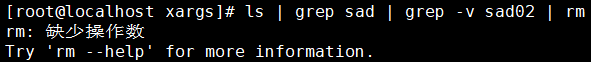
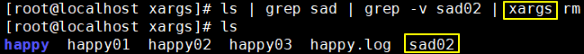

# 字符串处理命令

| 符号     | 含义                     |
| -------- | ------------------------ |
| ^        | 匹配字符串开始位置的字符 |
| $        | 匹配字符串结束位置的字符 |
| .        | 匹配任何一个字符         |
| *        | 匹配前面的字符出现0~n次  |
| [a, m, u]  | 匹配字符a或m或u          |
| [a-z]    | 匹配所有小写字母         |
| [A-Z]    | 匹配所有大写字母         |
| [a-zA-Z] | 匹配所有字母             |
| [0-9]    | 匹配所有数字             |
| \        | 特殊符号转义             |


 第五节 字符串命令：basename

返回路径字符串中的资源（文件或目录本身）部分

```shell
[root@apple w] basename /aa/bb/cc/dd
dd
```

如果指定了后缀，basename会帮我们把后缀部分也去掉

```shell
[root@apple workspace] basename /aa/bb/cc/dd.txt .txt
dd
```

[上一条](verse05-01-regular-expression.html) [回目录](verse05-00-index.html) [下一条](verse05-03-dirname.html)

 第五节 字符串命令：dirname

返回路径字符串中的目录部分

```shell
[root@apple w] dirname /aa/bb/cc/dd
/aa/bb/cc
```

[上一条](verse05-02-basename.html) [回目录](verse05-00-index.html) [下一条](verse05-04-cut.html)

 第五节 字符串命令：cut

根据指定符号拆分字符串并提取。默认根据\t拆分。

* -f参数：指定要提取的列
* -d参数：指定拆分依据的字符

准备测试数据：

```shell
[root@hadoop101 datas]$ touch cut.txt
[root@hadoop101 datas]$ vim cut.txt
dong shen
guan zhen
wo  wo
lai  lai
le  le
```

切割提取第一列：

```shell
[root@hadoop101 datas]$ cut -d " " -f 1 cut.txt
dong
guan
wo
lai
le
```

切割提取第二、第三列：

```shell
[root@apple w] cut -d " " -f 2,3 cut.txt
shen
zhen
 wo
 lai
 la
```

在cut.txt中切出guan

```shell
[root@hadoop101 datas]$ cat cut.txt | grep "guan" | cut -d " " -f 1
guan
```

选取系统PATH变量值，第2个“:”开始后的所有路径：

```shell
[root@hadoop101 datas]$ echo $PATH
/usr/lib64/qt-3.3/bin:/usr/local/bin:/bin:/usr/bin:/usr/local/sbin:/usr/sbin:/sbin:/home/atguigu/bin

[root@hadoop101 datas]$ echo $PATH | cut -d : -f 2-
/usr/local/bin:/bin:/usr/bin:/usr/local/sbin:/usr/sbin:/sbin:/home/atguigu/bin
```

切割ifconfig 后打印的IP地址：

```shell
[root@apple w] ifconfig | grep "netmask" | cut -d "i" -f 2 | cut -d " " -f 2
192.168.41.100
127.0.0.1
192.168.122.1
```

另一种做法：

```shell
[root@apple workspace] ifconfig | grep netmask | cut -d " " -f 10
192.168.41.100
127.0.0.1
192.168.122.1
```

[上一条](verse05-03-dirname.html) [回目录](verse05-00-index.html) [下一条](verse05-05-awk.html)

 第五节 字符串命令：awk

一个强大的文本分析工具，把文件逐行的读入，以空格为默认分隔符将每行切片，切开的部分再进行分析处理。

 1、基本用法

awk [选项参数] ‘pattern1{action1} pattern2{action2}...’ filename<br/>

pattern：表示AWK在数据中查找的内容，就是匹配模式<br/>

action：在找到匹配内容时所执行的一系列命令<br/>

使用-F参数指定分隔符。<br/>

awk命令的内置变量包括：

| 变量名   | 说明                                   |
| -------- | -------------------------------------- |
| FILENAME | 文件名                                 |
| NR       | 已读取的记录                           |
| NF       | 浏览记录的域的个数（切割后，列的个数） |

 2、测试

```shell
 准备数据
[root@hadoop101 datas]$ sudo cp /etc/passwd ./

 搜索passwd文件以root关键字开头的所有行，并输出该行的第7列。
[root@hadoop101 datas]$ awk -F: '/^root/{print $7}' passwd
/bin/bash

 搜索passwd文件以root关键字开头的所有行，并输出该行的第1列和第7列，中间以“，”号分割。
[root@hadoop101 datas]$ awk -F: '/^root/{print $1","$7}' passwd
root,/bin/bash

 只显示/etc/passwd的第一列和第七列，以逗号分割，且在所有行前面添加列名user，shell在最后一行添加"dahaige，/bin/zuishuai"。
[root@hadoop101 datas]$ awk -F : 'BEGIN{print "user, shell"} {print $1","$7} END{print "dahaige,/bin/zuishuai"}' passwd
user, shell
root,/bin/bash
bin,/sbin/nologin
。。。
atguigu,/bin/bash
dahaige,/bin/zuishuai

 将passwd文件中的用户id增加数值1并输出
[root@hadoop101 datas]$ awk -v i=1 -F: '{print $3+i}' passwd
1
2
3
4

 统计passwd文件名，每行的行号，每行的列数
[root@hadoop101 datas]$ awk -F: '{print "filename:"  FILENAME ", linenumber:" NR  ",columns:" NF}' passwd
filename:passwd, linenumber:1,columns:7
filename:passwd, linenumber:2,columns:7
filename:passwd, linenumber:3,columns:7

 切割IP
[root@apple workspace] ifconfig | awk -F " " '/netmask/{print $2}'
192.168.41.100
127.0.0.1
192.168.122.1

 查询sed.txt中空行所在的行号
[root@hadoop101 datas]$ awk '/^$/{print NR}' sed.txt
5
```

PS：如果命令很长，可以使用反斜杠换行输入

```shell
[root@apple workspace] awk -F : \
> 'BEGIN{print "user\t\tshell"} {print $1"\t\t"$7} END{print "dahaige\t\t/bin/zuishuai"}' \
> passwd
```

[上一条](verse05-04-cut.html) [回目录](verse05-00-index.html) [下一条](verse05-06-sort.html)

 第五节 字符串命令：sort

sort命令是在Linux里非常有用，它将文件进行排序，并将排序结果标准输出。

| 参数名 | 作用                     |
| ------ | ------------------------ |
| -n     | 依照数值大小排序         |
| -r     | 相反顺序排序             |
| -t     | 设置排序时使用的分隔字符 |
| -k     | 指定需要排序的列         |

```shell
 准备数据
[root@hadoop101 datas]$ touch sort.sh
[root@hadoop101 datas]$ vim sort.sh
bb:40:5.4
bd:20:4.2
xz:50:2.3
cls:10:3.5
ss:30:1.6
```

```shell
 测试
[root@hadoop101 datas]$ sort -t : -nrk 3  sort.sh
bb:40:5.4
bd:20:4.2
cls:10:3.5
xz:50:2.3
ss:30:1.6

[root@apple workspace] sort -nrt : -k 3 sort.txt
bb:40:5.4
bd:20:4.2
cls:10:3.5
xz:50:2.3
ss:30:1.6
```

[上一条](verse05-05-awk.html) [回目录](verse05-00-index.html) [下一条](verse05-07-xargs.html)

 第五节 字符串命令：xargs

 1、情景举例

 ①初始状态

某目录下包含下列资源：


 ②需求

用一条命令删除所有名称中包含“sad”的资源，但是保留sad02

 ③分步实现

 [1]列出全部资源


 [2]列出名称中包含“sad”的资源


 [3]进一步筛选排除sad02


此时最终筛选的结果打印到了标准输出：standard output。通过管道符号可以将标准输出转换为标准输入：standard input。但是删除命令rm不接受标准输入作为参数，只接受命令行参数。什么意思呢？



rm命令前面的管道符号把前面的stdout转换为了stdin再传输给rm命令，这种方式对于有些命令可以，但是有些命令不行。例如：mkdir、ls、rm等命令都是。什么是命令行参数呢？


 [4]使用xargs命令将stdin转换为命令行参数



 2、结论

xargs命令的作用：命令行参数</span>。

[上一条](verse05-06-sort.html) [回目录](verse05-00-index.html) [下一条](verse05-08-interview.html)
