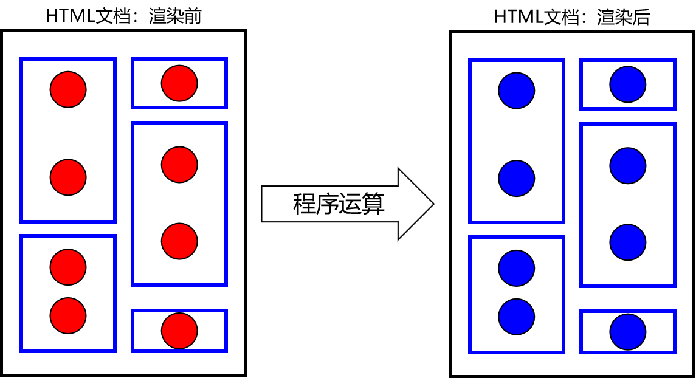
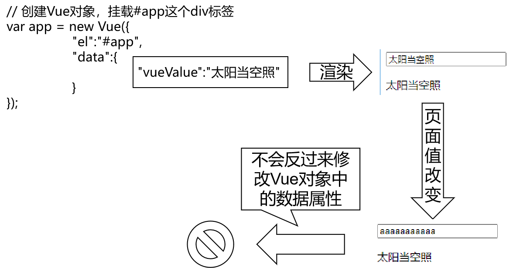
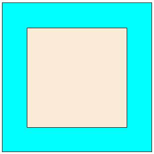
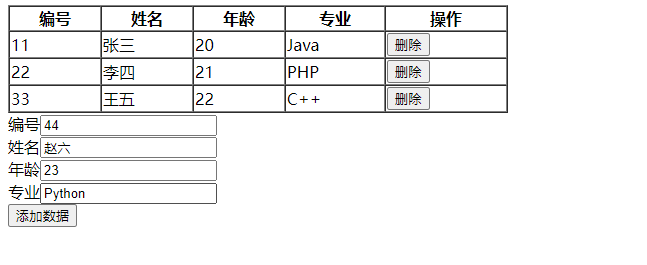
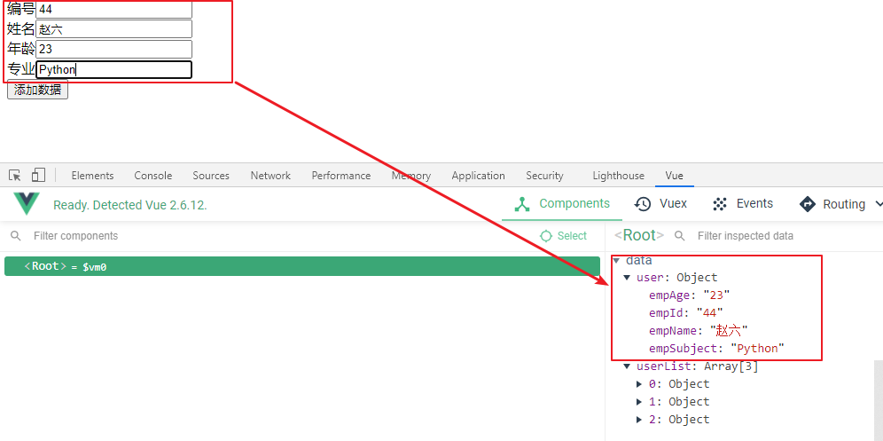

# day03 Vue&书城项目第一阶段

## 第一章 Vue

### 1. 学习目标

* 了解什么是框架
* 了解什么是Vue
* 掌握Vue的基本语法
* 了解Vue的生命周期

### 2. 内容讲解

#### 2.1 什么是框架

任何编程语言在最初的时候都是没有框架的，后来随着在实际开发过程中不断总结『套用固定解决方案』。

于是有人把成熟的『框架』。

在使用框架的过程中，我们往往只需要告诉框架『怎么做（编程）』。

对于Java程序来说，我们使用框架就是导入那些封装了『配置文件』告诉框架做什么，就能够大大简化编码，提高开发效率。我们使用过的junit其实就是一款单元测试框架。

而对于JavaScript程序来说，我们使用框架就是导入那些封装了『js文件』，然后在框架的基础上编码。

> 用洗衣服来类比框架：
>
> 典型应用场景：洗衣服
>
> 输入数据：衣服、洗衣液、水
>
> 不使用框架：手洗
>
> 使用框架：使用洗衣机，对人来说，只需要按键，具体操作是洗衣机完成的。人只是告诉洗衣机做什么，具体的操作是洗衣机完成的。

实际开发中使用框架时，我们也主要是告诉框架要做什么，具体操作是框架完成的。

#### 2.2 Vue的简介

##### 2.2.1 Vue的作者介绍

在为AngularJS工作之后，Vue的作者尤雨溪开Vue.js。他声称自己的思路是提取Angular中自己喜欢的部分，构建出一款相当轻量的框架。

Vue最早发布于2014年2月。作者在Hacker News、Echo JS与 Reddit的JavaScript版块发布了最早的版本。一天之内，Vue 就登上了这三个网站的首页。

Vue是Github上最受欢迎的开源项目之一。同时，在JavaScript框架/函数库中， Vue所获得的星标数已超过React，并高于Backbone.js、Angular 2、jQuery等项目。

##### 2.2.2 Vue的官网介绍

Vue (读音 /vjuː/，类似于**view**) 是一套用于构建用户界面的**渐进式框架**。与其它大型框架不同的是，Vue 被设计为可以自底向上逐层应用。Vue 的核心库只关注视图层，不仅易于上手，还便于与第三方库或既有项目整合。另一方面，当与[现代化的工具链](https://cn.vuejs.org/v2/guide/single-file-components.html)以及各种[支持类库](https://github.com/vuejs/awesome-vue#libraries--plugins)结合使用时，Vue 也完全能够为复杂的单页应用提供驱动。

**官网地址:**https://cn.vuejs.org/

#### 2.3 准备Vue.js环境

1. Vue框架的js文件获取

   官网提供的下载地址：https://cdn.jsdelivr.net/npm/vue/dist/vue.js

2. 创建空vue.js文件,将官网提供的vue.js文件的内容复制粘贴到本地vue.js文件中

#### 2.4 Vue的入门案例

1. 创建工程,导入vue.js文件放入工程的js文件夹中

2. 创建demo01.html(引入vuejs,定义div,创建vue实例)

```html
<!DOCTYPE html>
<html lang="en">
    <head>
        <meta charset="UTF-8">
        <title>Vue的入门</title>
        <script src="../js/vue.js"></script>
    </head>
    <body>
        <div id="app">
            <div>{{message}}</div>
        </div>
        <!--
使用vue获取div中的内容，以及设置div中的内容
使用vue的具体步骤:
1. 指定一个区域，在该区域中使用vue
2. 在该区域下方编写一个script标签，在script标签中创建Vue对象
3. 以json格式给Vue对象传入需要传入的参数
1. "el" 表示哪块区域可以使用vue
2. "data" 表示你需要定义的数据模型
4. 将message这个数据模型绑定给div的标签体: 使用插值表达式进行绑定
-->
        <script>
            var vue = new Vue({
                "el":"#app",
                "data":{
                    "message":"hello vue" //定义了一个数据模型，该数据模型的名字叫"message"
                }
            });
        </script>
    </body>
</html>
```

#### 2.5 声明式渲染

##### 2.5.1 概念

###### 2.5.1.1 声明式

『编程式』而言的。

- 声明式：告诉框架做什么，具体操作由框架完成
- 编程式：自己编写代码完成具体操作

###### 2.5.1.2 渲染



上图含义解释：

- 蓝色方框：HTML标签
- 红色圆形：动态、尚未确定的数据
- 蓝色圆形：经过程序运算以后，计算得到的具体的，可以直接在页面上显示的数据、
- 渲染：程序计算动态数据得到具体数据的过程

##### 2.5.2 案例讲解

**HTML代码**

```html
		<!-- 使用{{}}格式，指定要被渲染的数据 -->
		<div id="app">{{message}}</div>
```

**vue代码**

```html
// 1.创建一个JSON对象，作为new Vue时要使用的参数
var argumentJson = {
	
	// el用于指定Vue对象要关联的HTML元素。el就是element的缩写
	// 通过id属性值指定HTML元素时，语法格式是：#id
	"el":"#app",
	
	// data属性设置了Vue对象中保存的数据
	"data":{
		"message":"Hello Vue!"
	}
};

// 2.创建Vue对象，传入上面准备好的参数
var app = new Vue(argumentJson);
```


##### 2.5.3 查看声明式渲染的响应式效果


通过验证Vue对象的『响应式』效果，我们看到Vue对象和页面上的HTML标签确实是始终保持着关联的关系，同时看到Vue在背后确实是做了大量的工作。

#### 2.6 绑定元素属性

##### 2.6.1 基本语法

v-bind:HTML标签的原始属性名

##### 2.6.2 案例代码

**HTML代码**

```html
<div id="app">
	<!-- v-bind:value表示将value属性交给Vue来进行管理，也就是绑定到Vue对象 -->
	<!-- vueValue是一个用来渲染属性值的表达式，相当于标签体中加{{}}的表达式 -->
	<input type="text" v-bind:value="vueValue" />
	
	<!-- 同样的表达式，在标签体内通过{{}}告诉Vue这里需要渲染； -->
	<!-- 在HTML标签的属性中，通过v-bind:属性名="表达式"的方式告诉Vue这里要渲染 -->
	<p>{{vueValue}}</p>
</div>

```

**Vue代码**

```html
// 创建Vue对象，挂载#app这个div标签
var app = new Vue({
	"el":"#app",
	"data":{
		"vueValue":"太阳当空照"
	}
});
```

**扩展:**

v-bind:属性名="属性值"可以简写成 :属性名="属性值"

#### 2.7 双向数据绑定

##### 2.7.1 提出问题



而使用了双向绑定后，就可以实现：页面上数据被修改后，Vue对象中的数据属性也跟着被修改。

##### 2.7.2 案例代码

**HTML代码**

```html
<div id="app">
	<!-- v-bind:属性名 效果是从Vue对象渲染到页面 -->
	<!-- v-model:属性名 效果不仅是从Vue对象渲染到页面，而且能够在页面上数据修改后反向修改Vue对象中的数据属性 -->
	<input type="text" v-model:value="vueValue" />
	
	<p>{{vueValue}}</p>
</div>
```

**Vue代码**

```html
// 创建Vue对象，挂载#app这个div标签
var app = new Vue({
	"el":"#app",
	"data":{
		"vueValue":"太阳当空照"
	}
});
```

**页面效果**

p标签内的数据能够和文本框中的数据实现同步修改：


**扩展:**

1. v-model:value="值" 可以简写成 v-model="值"

2. trim修饰符

实际开发中，要考虑到用户在输入数据时，有可能会包含前后空格。而这些前后的空格对我们程序运行来说都是干扰因素，要去掉。在v-model后面加上.trim修饰符即可实现。

```html
<input type="text" v-model.trim="vueValue" />
```

Vue会帮助我们在文本框失去焦点时自动去除前后空格。

#### 2.8 条件渲染

根据Vue对象中，数据属性的值来判断是否对HTML页面内容进行渲染。

##### 2.8.1 v-if

**HTML代码**

```html
<div id="app">
	<h3>if</h3>
	
	
</div>
```

**Vue代码**

```html
var app = new Vue({
    "el":"#app",
    "data":{
        "flag":true
    }
});
```

##### 2.8.2 v-if和v-else

**HTML代码**

```html
<div id="app02">
	<h3>if/else</h3>
	
	
</div>
```

**Vue代码**

```html
var app02 = new Vue({
    "el":"#app02",
    "data":{
        "flag":true
    }
});
```

##### 2.8.3 v-show

**HTML代码**

```html
<div id="app03">
	<h3>v-show</h3>
	
</div>
```

**Vue代码**

```html
var app03 = new Vue({
    "el":"#app03",
    "data":{
        "flag":true
    }
});
```

#### 2.9 列表渲染

##### 2.9.1 迭代一个简单的数组

**HTML代码**

```html
<div id="app01">
	<ul>
		<!-- 使用v-for语法遍历数组 -->
		<!-- v-for的值是语法格式是：引用数组元素的变量名 in Vue对象中的数组属性名 -->
		<!-- 在文本标签体中使用{{引用数组元素的变量名}}渲染每一个数组元素 -->
		<li v-for="fruit in fruitList">{{fruit}}</li>
	</ul>
</div>
```

**Vue代码**

```html
var app01 = new Vue({
	"el":"#app01",
	"data":{
		"fruitList": [
			"apple",
			"banana",
			"orange",
			"grape",
			"dragonfruit"
		]
	}
});
```

##### 2.9.2 迭代一个对象数组

**HTML代码**

```html
<div id="app">
	<table>
		<tr>
			<th>编号</th>
			<th>姓名</th>
			<th>年龄</th>
			<th>专业</th>
		</tr>
		<tr v-for="employee in employeeList">
			<td>{{employee.empId}}</td>
			<td>{{employee.empName}}</td>
			<td>{{employee.empAge}}</td>
			<td>{{employee.empSubject}}</td>
		</tr>
	</table>
</div>
```

**Vue代码**

```html
var app = new Vue({
	"el":"#app",
	"data":{
		"employeeList":[
			{
				"empId":11,
				"empName":"tom",
				"empAge":111,
				"empSubject":"java"
			},
			{
				"empId":22,
				"empName":"jerry",
				"empAge":222,
				"empSubject":"php"
			},
			{
				"empId":33,
				"empName":"bob",
				"empAge":333,
				"empSubject":"python"
			}
		]
	}
});
```

#### 2.10 事件驱动

##### 2.10.1 案例一: 字符串顺序反转

**HTML代码**

```html
<div id="app">
	<p>{{message}}</p>
	
	<!-- v-on:事件类型="事件响应函数的函数名" -->
	<button v-on:click="reverseMessage">Click me,reverse message</button>
</div>
```

**Vue代码**

```html
var app = new Vue({
	"el":"#app",
	"data":{
		"message":"Hello Vue!"				
	},
	"methods":{
		"reverseMessage":function(){
			this.message = this.message.split("").reverse().join("");
		}
	}
});
```

##### 2.10.2 案例二:获取鼠标移动时的坐标信息

**HTML代码**

```html
<div id="app">
	<div id="area" v-on:mousemove="recordPosition"></div>
	<p id="showPosition">{{position}}</p>
</div>
```

**Vue代码**

```html
var app = new Vue({
	"el":"#app",
	"data":{
		"position":"暂时没有获取到鼠标的位置信息"
	},
	"methods":{
		"recordPosition":function(event){
			this.position = event.clientX + " " + event.clientY;
		}
	}
});
```

**扩展:**

v-on:事件名="函数"可以简写成@事件名="函数"

##### 2.10.3 取消控件的默认行为

###### 2.10.3.1 控件默认行为

- 点超链接会跳转页面
- 点表单提交按钮会提交表单

本来控件的默认行为是天经地义就该如此的，但是如果我们希望点击之后根据我们判断的结果再看是否要跳转，此时默认行为无脑跳转的做法就不符合我们的预期了。

###### 2.10.3.2 取消方式

调用**事件对象**的**preventDefault()**方法。

**超链接举例**

HTML代码：

```html
<a id="anchor" href="http://www.baidu.com">超链接</a>
```

JavaScript代码：

```html
document.getElementById("anchor").onclick = function() {
    console.log("我点击了一个超链接");
    //event.preventDefault();
}
```

**表单提交按钮举例**

HTML代码：

```
<form action="http://www.baidu.com" method="post">
    <button id="submitBtn" type="submit">提交表单</button>
</form>
```

JavaScript代码：

```
document.getElementById("submitBtn").onclick = function() {
    console.log("我点击了一个表单提交按钮");
    event.preventDefault();
}
```

#####  2.10.4 阻止事件冒泡



图中的两个div，他们的HTML标签是：

```html
<div id="outterDiv">
	<div id="innerDiv"></div>
</div>
```

点击里面的div同时也等于点击了外层的div，此时如果两个div上都绑定了单击响应函数那么就都会被触发：

```html
document.getElementById("outterDiv").onclick = function() {
	console.log("外层div的事件触发了");
}

document.getElementById("innerDiv").onclick = function() {
	console.log("内层div的事件触发了");
}

```

所以事件冒泡就是一个事件会不断向父元素传递，直到window对象。

如果这不是我们想要的效果那么可以使用stopPropagation()函数阻止。

```html
document.getElementById("innerDiv").onclick = function() {
	console.log("内层div的事件触发了");
	
	event.stopPropagation();
}
```

##### 2.10.5 Vue事件修饰符

对于事件修饰符，Vue官网的描述是：

> 在事件处理程序中调用 `event.preventDefault()` 或 `event.stopPropagation()` 是非常常见的需求。尽管我们可以在方法中轻松实现这点，但更好的方式是：方法只有纯粹的数据逻辑，而不是去处理 DOM 事件细节。

###### 2.10.5.1 取消控件的默认行为

控件的默认行为指的是：

- 点击超链接跳转页面
- 点击表单提交按钮提交表单

实现这个需求使用的Vue事件修饰符是：.prevent

```html
<a href="http://www.baidu.com" @click.prevent="clickAnchor">超链接</a>

<form action="http://www.baidu.com" method="post">
	<button type="submit" @click.prevent="clickSubmitBtn">提交表单</button>
</form>
```

###### 2.10.5.2 取消事件冒泡

实现这个需求使用的Vue事件修饰符是：.stop

```html
<div id="outterDiv" @click="clickOutterDiv">
	<div id="innerDiv" @click.stop="clickInnerDiv"></div>
</div>
```


#### 2.11 侦听属性

##### 2.11.1 提出需求

```html
<div id="app">
	<p>尊姓：{{firstName}}</p>
	<p>大名：{{lastName}}</p>
	尊姓：<input type="text" v-model="firstName" /><br/>
	大名：<input type="text" v-model="lastName" /><br/>
	<p>全名：{{fullName}}</p>
</div>
```

在上面代码的基础上，我们希望firstName或lastName属性发生变化时，修改fullName属性。此时需要对firstName或lastName属性进行『侦听』。

具体来说，所谓『侦听』就是对message属性进行监控，当firstName或lastName属性的值发生变化时，调用我们准备好的函数。

##### 2.11.2 Vue代码

在watch属性中声明对firstName和lastName属性进行『侦听』的函数：

```html
var app = new Vue({
	"el":"#app",
	"data":{
		"firstName":"jim",
		"lastName":"green",
		"fullName":"jim green"
	},
	"watch":{
		"firstName":function(inputValue){
			this.fullName = inputValue + " " + this.lastName;
		},
		"lastName":function(inputValue){
			this.fullName = this.firstName + " " + inputValue;
		}
	}
});
```

#### 2.12 案例练习

##### 2.12.1 功能效果演示



##### 2.12.2 任务拆解

- 第一步：显示表格
- 第二步：显示四个文本框
- 第三步：创建一个p标签用来显示用户在文本框中实时输入的内容
- 第四步：点击添加记录按钮实现记录的添加

##### 2.12.3 第一步：显示表格

**HTML标签**

```html
<div id="app">
    <table border="1" cellspacing="0" width="500px">
        <tr>
            <th>编号</th>
            <th>姓名</th>
            <th>年龄</th>
            <th>专业</th>
            <th>操作</th>
        </tr>
        <tr v-for="(user,index) in userList">
            <td>{{user.empId}}</td>
            <td>{{user.empName}}</td>
            <td>{{user.empAge}}</td>
            <td>{{user.empSubject}}</td>
            <td><button>删除</button></td>
        </tr>
    </table>
</div>
```

**Vue代码**

```html
var vue = new Vue({
    "el":"#app",
    "data":{
        "userList":[
            {
                "empId":11,
                "empName":"张三",
                "empAge":20,
                "empSubject":"Java"
            },{
                "empId":22,
                "empName":"李四",
                "empAge":21,
                "empSubject":"PHP"
            },{
                "empId":33,
                "empName":"王五",
                "empAge":22,
                "empSubject":"C++"
            }
        ]
    }
});
</script>
```

##### 2.12.4 第二步：显示四个文本框

**HTML标签**

```html
<div id="app">
    <table border="1" cellspacing="0" width="500px">
        <tr>
            <th>编号</th>
            <th>姓名</th>
            <th>年龄</th>
            <th>专业</th>
            <th>操作</th>
        </tr>
        <tr v-for="(user,index) in userList">
            <td>{{user.empId}}</td>
            <td>{{user.empName}}</td>
            <td>{{user.empAge}}</td>
            <td>{{user.empSubject}}</td>
            <td><button>删除</button></td>
        </tr>
    </table>

    <form action="https://www.baidu.com" method="post">
        编号<input type="text" v-model="user.empId" name="empId"/><br/>
        姓名<input type="text" v-model="user.empName" name="empName"/><br/>
        年龄<input type="text" v-model="user.empAge" name="empAge"/><br/>
        专业<input type="text" v-model="user.empSubject" name="empSubject"/><br/>
        <input type="submit" value="添加数据"/>
    </form>
</div>
```

**Vue代码**

```html
<script>
    var vue = new Vue({
        "el":"#app",
        "data":{
            "user":{}
            ,
            "userList":[
                {
                    "empId":11,
                    "empName":"张三",
                    "empAge":20,
                    "empSubject":"Java"
                },{
                    "empId":22,
                    "empName":"李四",
                    "empAge":21,
                    "empSubject":"PHP"
                },{
                    "empId":33,
                    "empName":"王五",
                    "empAge":22,
                    "empSubject":"C++"
                }
            ]
        }
    });
</script>
```

测试是否正确的方式是：在控制台尝试修改Vue对象的数据属性值：



##### 2.12.5 第四步：点击添加记录按钮

往表格中添加数据其实就是将表单上输入的数据`this.user`加入到数组`this.userList`中

添加完之后清空表单数据，其实就是设置`this.user = {}`

**HTML标签**

```html
<div id="app">
    <table border="1" cellspacing="0" width="500px">
        <tr>
            <th>编号</th>
            <th>姓名</th>
            <th>年龄</th>
            <th>专业</th>
            <th>操作</th>
        </tr>
        <tr v-for="(user,index) in userList">
            <td>{{user.empId}}</td>
            <td>{{user.empName}}</td>
            <td>{{user.empAge}}</td>
            <td>{{user.empSubject}}</td>
            <td><button>删除</button></td>
        </tr>
    </table>

    <form action="https://www.baidu.com" method="post">
        编号<input type="text" v-model="user.empId" name="empId"/><br/>
        姓名<input type="text" v-model="user.empName" name="empName"/><br/>
        年龄<input type="text" v-model="user.empAge" name="empAge"/><br/>
        专业<input type="text" v-model="user.empSubject" name="empSubject"/><br/>
        <input type="submit" value="添加数据" @click.prevent="addUser"/>
    </form>
</div>
```

**Vue代码**

```html
<script>
    var vue = new Vue({
        "el":"#app",
        "data":{
            "user":{}
            ,
            "userList":[
                {
                    "empId":11,
                    "empName":"张三",
                    "empAge":20,
                    "empSubject":"Java"
                },{
                    "empId":22,
                    "empName":"李四",
                    "empAge":21,
                    "empSubject":"PHP"
                },{
                    "empId":33,
                    "empName":"王五",
                    "empAge":22,
                    "empSubject":"C++"
                }
            ]
        },
        "methods":{
            addUser(){
                //1. 获取输入框中的用户信息  就是this.user
                //2. 将用户信息加入到数组中
                this.userList.push(this.user)
                //添加完要清空表单内容
                this.user = {}
            }
        }
    });
</script>
```

##### 2.12.6 第五步: 点击每行的删除按钮删除该行数据

删除该行数据其实就是根据下标从数组`this.userList`中移除元素

**HTML代码**

```html
<div id="app">
    <table border="1" cellspacing="0" width="500px">
        <tr>
            <th>编号</th>
            <th>姓名</th>
            <th>年龄</th>
            <th>专业</th>
            <th>操作</th>
        </tr>
        <tr v-for="(user,index) in userList">
            <td>{{user.empId}}</td>
            <td>{{user.empName}}</td>
            <td>{{user.empAge}}</td>
            <td>{{user.empSubject}}</td>
            <td><button @click="deleteUser(index)">删除</button></td>
        </tr>
    </table>

    <form action="https://www.baidu.com" method="post">
        编号<input type="text" v-model="user.empId" name="empId"/><br/>
        姓名<input type="text" v-model="user.empName" name="empName"/><br/>
        年龄<input type="text" v-model="user.empAge" name="empAge"/><br/>
        专业<input type="text" v-model="user.empSubject" name="empSubject"/><br/>
        <input type="submit" value="添加数据" @click.prevent="addUser"/>
    </form>
</div>
```

**Vue代码**

```html
<script>
    var vue = new Vue({
        "el":"#app",
        "data":{
            "user":{}
            ,
            "userList":[
                {
                    "empId":11,
                    "empName":"张三",
                    "empAge":20,
                    "empSubject":"Java"
                },{
                    "empId":22,
                    "empName":"李四",
                    "empAge":21,
                    "empSubject":"PHP"
                },{
                    "empId":33,
                    "empName":"王五",
                    "empAge":22,
                    "empSubject":"C++"
                }
            ]
        },
        "methods":{
            addUser(){
                //1. 获取输入框中的用户信息  就是this.user
                //2. 将用户信息加入到数组中
                this.userList.push(this.user)
                //添加完要清空表单内容
                this.user = {}
            },
            deleteUser(i){
                //删除其实是从数组中根据下标移除一个元素
                //splice(i,num)表示从下标为i的地方开始删除，一共删除num个元素
                this.userList.splice(i,1)
            }
        }
    });
</script>
```


#### 2.13 Vue的生命周期

##### 2.13.1 概念

在我们各种语言的编程领域中，『生命周期』都是一个非常常见的概念。一个对象从创建、初始化、工作再到释放、清理和销毁，会经历很多环节的演变。比如我们在JavaSE阶段学习过线程的生命周期，今天学习Vue对象的生命周期，将来还要学习Servlet、Filter等Web组件的生命周期。

##### 2.13.2 Vue对象的生命周期


##### 2.13.3 生命周期钩子函数

Vue允许我们在特定的生命周期环节中通过钩子函数来加入我们的代码。

```html
<div id="app">
	<p id="content">{{message}}</p>
	<button @click="changeValue">点我</button>
</div>
```

```html
new Vue({
	"el":"#app",
	"data":{
		"message":"hello"
	},
	"methods":{
		"changeValue":function(){
			this.message = "new hello";
		}
	},
	
	// 1.实例创建之前
	"beforeCreate":function(){
		console.log("beforeCreate:"+this.message);
	},
	
	// 2.实例创建完成
	"created":function(){
		console.log("created:"+this.message);
	},
	
	// 3.数据挂载前
	"beforeMount":function(){
		console.log("beforeMount:"+document.getElementById("content").innerText);
	},
	
	// 4.数据已经挂载
	"mounted":function(){
		console.log("mounted:"+document.getElementById("content").innerText);
	},
	
	// 5.数据更新前
	"beforeUpdate":function(){
		console.log("beforeUpdate:"+document.getElementById("content").innerText);
	},
	
	// 6.数据更新之后
	"updated":function(){
		console.log("updated:"+document.getElementById("content").innerText);
	}
});
```

## 第二章 书城项目第一阶段

### 1. 学习目标

* 实现登录表单校验
* 实现注册表单校验

### 2. 内容讲解

#### 2.1 准备工作

创建目录后，把一整套现成的前端页面复制到新建的目录下，然后把vue.js文件复制到script目录下。

#### 2.2 登录页面的表单验证

##### 2.2.1 规则设定

- 用户名非空
- 密码非空

##### 2.2.2 在login.html页面中加入Vue的环境

```html
<script src="../../static/script/vue.js"></script>
```

##### 2.2.3 案例思路


##### 2.2.4 代码实现

**HTML代码**

```html
<div id="app">
    <div id="login_header">
        <a href="../../index.html">
            
        </a>
    </div>

    <div class="login_banner">
        <div id="l_content">
            <span class="login_word">欢迎登录</span>
        </div>

        <div id="content">
            <div class="login_form">
                <div class="login_box">
                    <div class="tit">
                        <h1>尚硅谷会员</h1>
                    </div>
                    <div class="msg_cont">
                        <b></b>
                        <span class="errorMsg" style="color: red">{{errorMessage}}</span>
                    </div>
                    <div class="form">
                        <form action="login_success.html">
                            <label>用户名称：</label>
                            <input
                                   class="itxt"
                                   type="text"
                                   placeholder="请输入用户名"
                                   autocomplete="off"
                                   tabindex="1"
                                   name="username"
                                   id="username"
                                   v-model="username"
                                   />
                            <br />
                            <br />
                            <label>用户密码：</label>
                            <input
                                   class="itxt"
                                   type="password"
                                   placeholder="请输入密码"
                                   autocomplete="off"
                                   tabindex="1"
                                   name="password"
                                   id="password"
                                   v-model="password"
                                   />
                            <br />
                            <br />
                            <input type="submit" value="登录" id="sub_btn" @click="loginCheck"/>
                        </form>
                        <div class="tit">
                            <a href="regist.html">立即注册</a>
                        </div>
                    </div>
                </div>
            </div>
        </div>
    </div>
    <div id="bottom">
        <span>
            尚硅谷书城.Copyright &copy;2015
        </span>
    </div>
</div>
```

**Vue代码**

```html
var vue = new Vue({
    "el":"#app",
    "data":{
        "username":"",
        "password":"",
        "errorMessage":""
    },
    "methods":{
        loginCheck(){
            //判断用户名和密码是否为空
            if (this.username != "") {
                if (this.password == ""){
                    //就要阻止表单提交
                    event.preventDefault()
                    //加入提示功能
                    this.errorMessage = "密码不能为空"
                }
            }else {
                //就要阻止表单提交
                event.preventDefault()
                //加入提示功能
                this.errorMessage = "用户名不能为空"
            }
        }
    }
});
```

#### 2.3 注册页面的表单验证

##### 2.3.1 在注册页面(register.html)中引入vue

```html
<!--在注册页面引入vue-->
<script src="../../static/script/vue.js"></script>
```

**HTML代码**

```html
<div id="app">
    <div id="login_header">
        <a href="../../index.html">
            
        </a>
    </div>

    <div class="login_banner">
        <div class="register_form">
            <h1>注册尚硅谷会员</h1>
            <form action="regist_success.html">
                <div class="form-item">
                    <div>
                        <label>用户名称:</label>
                        <input type="text" placeholder="请输入用户名" v-model="username" @blur="checkUsername"/>
                    </div>
                    {{usernameErrorMessage}}
                </div>
                <div class="form-item">
                    <div>
                        <label>用户密码:</label>
                        <input type="password" placeholder="请输入密码" v-model="password"/>
                    </div>
                    {{passwordErrorMessage}}
                </div>
                <div class="form-item">
                    <div>
                        <label>确认密码:</label>
                        <input type="password" placeholder="请输入确认密码" v-model="passwordConfirm"/>
                    </div>
                    {{confirmErrorMessage}}
                </div>
                <div class="form-item">
                    <div>
                        <label>用户邮箱:</label>
                        <input type="text" placeholder="请输入邮箱" v-model="email"/>
                    </div>
                    {{emailErrorMessage}}
                </div>
                <div class="form-item">
                    <div>
                        <label>验证码:</label>
                        <div class="verify">
                            <input type="text" placeholder="" v-model="code"/>
                            
                        </div>
                    </div>
                    <!--<span>请输入正确的验证码</span>-->
                </div>
                <button class="btn" @click="registerCheck">注册</button>
            </form>
        </div>
    </div>
    <div id="bottom">
        <span>
            尚硅谷书城.Copyright &copy;2015
        </span>
    </div>
</div>
```

**Vue代码**

```html
<script>
    var vue = new Vue({
        "el":"#app",
        "data":{
            "username":"",//用户名
            "password":"",//密码
            "passwordConfirm":"",//确认密码
            "email":"",//邮箱
            "code":"",//验证码
            "usernameErrorMessage":"",
            "passwordErrorMessage":"",
            "confirmErrorMessage":"",
            "emailErrorMessage":""
        },
        "methods":{
            checkUsername(){
                //校验用户名是否符合规则
                //1. 编写一个正则表达式去描述这个规则
                var usernameRegExp = /^[A-Za-z0-9_]{5,8}$/;
                //2. 使用正则表达式校验用户名输入框里面的内容:this.username
                if (!usernameRegExp.test(this.username)) {
                    //校验不通过
                    this.usernameErrorMessage = "用户名必须是5-8位的数字、字母或者下划线"
                }else {
                    //符合规则了,就重新设置提示信息为空
                    this.usernameErrorMessage = ""
                }
            },
            registerCheck(){
                //注册校验的方法
                //1. 校验用户名
                //1.1 编写一个正则表达式去描述这个规则
                var usernameRegExp = /^[A-Za-z0-9_]{5,8}$/;
                //1.2 校验用户名是否符合规则
                if (!usernameRegExp.test(this.username)) {
                    //用户名不符合规则，那么就阻止默认事件
                    event.preventDefault()

                    this.usernameErrorMessage = "用户名必须是5-8位的数字、字母或者下划线"
                    return
                }
                //2. 校验密码
                //2.1 编写一个正则表达式去描述密码校验的规则
                var passwordRegExp = /^[A-Za-z0-9_]{6,10}$/;
                //2.2 使用正则表达式校验密码
                if (!passwordRegExp.test(this.password)) {
                    //密码不符合规则，那么就阻止默认事件
                    event.preventDefault()

                    this.passwordErrorMessage = "密码必须是6-10位的数字、字母或者下划线"
                    return
                }else {
                    this.passwordErrorMessage = ""
                }
                //3. 校验确认密码
                //3.1 就是对比确认密码输入框的内容和密码输入框的内容是否一样
                if (this.password != this.passwordConfirm) {
                    event.preventDefault()
                    this.confirmErrorMessage = "两次输入的密码必须一致"
                    return
                }else {
                    this.confirmErrorMessage = ""
                }
                //4. 校验邮箱格式
                var emailRegExp = /^[a-zA-Z0-9_\.-]+@([a-zA-Z0-9-]+[\.]{1})+[a-zA-Z]+$/;
                if(!emailRegExp.test(this.email)){
                    event.preventDefault()

                    this.emailErrorMessage = "邮箱格式不正确"
                    return
                }else {
                    this.emailErrorMessage = ""
                }
            }
        }
        /*"watch":{
        //对用户名添加监听
        "username":function (inputValue) {
          //校验用户名是否符合规则
          //1. 编写一个正则表达式去描述这个规则
          var usernameRegExp = /^[A-Za-z0-9_]{5,8}$/;
          //2. 使用正则表达式校验用户名输入框里面的内容:inputValue
          if (!usernameRegExp.test(inputValue)) {
            //校验不通过
            this.usernameErrorMessage = "用户名必须是5-8位的数字、字母或者下划线"
          }else {
            //符合规则了,就重新设置提示信息为空
            this.usernameErrorMessage = ""
          }
        }
      }*/
    });
</script>
```

