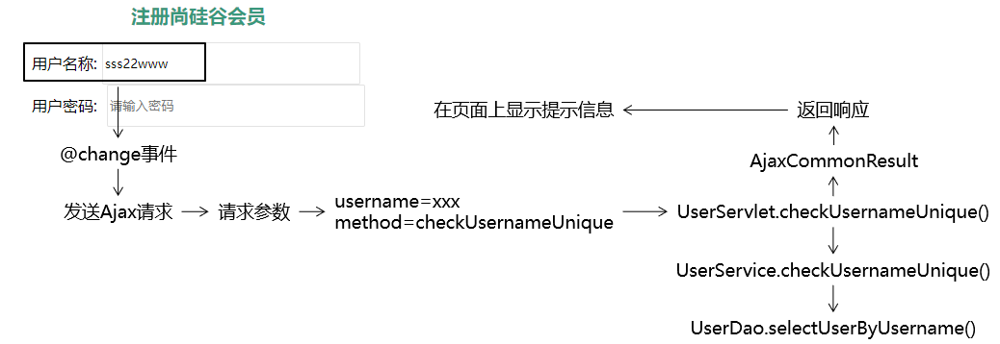
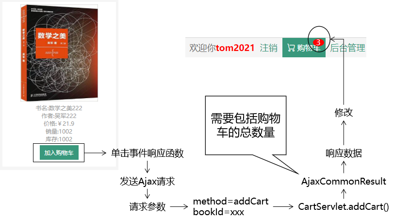

# day14 Ajax&Axios&书城项目第六阶段

## 第一章 Ajax

### 1. 学习目标

* 了解服务器渲染和Ajax渲染的区别
* 了解同步和异步的区别

### 2. 内容讲解

#### 2.1 服务器端渲染


#### 2.2 Ajax渲染（局部更新）


#### 2.3 前后端分离

真正的前后端分离是前端项目和后端项目分服务器部署，在我们这里我们先理解为彻底舍弃服务器端渲染，数据全部通过Ajax方式以JSON格式来传递

#### 2.4 同步与异步

Ajax本身就是Asynchronous JavaScript And XML的缩写，直译为：异步的JavaScript和XML。在实际应用中Ajax指的是：局部更新页面内容的技术。

『异步』是一对相对的概念，那么什么是同步，什么是异步呢？

##### 2.4.1 同步

多个操作串行的。


##### 2.4.2 异步

多个操作相继开始不用等</span>谁。


## 第二章 Axios

### 1. 学习目标

* 了解Axios
* 掌握Axios发送异步请求
* 掌握Axios携带json类型的请求参数
* 掌握服务器端返回json数据

### 2. 内容讲解

#### 2.1 Axios简介

使用原生的JavaScript程序执行Ajax极其繁琐，所以一定要使用框架来完成。而Axios就是目前最流行的前端Ajax框架。

Axios官网：http://www.axios-js.com/


使用Axios和使用Vue一样，导入对应的*.js文件即可。官方提供的script标签引入方式为：

```html
<script src="https://unpkg.com/axios/dist/axios.min.js"></script>
```

我们可以把这个axios.min.js文件下载下来保存到本地来使用。

#### 2.2 Axios基本用法

##### 2.2.1 在前端页面引入开发环境

```html
<script type="text/javascript" src="/demo/static/vue.js"></script>
<script type="text/javascript" src="/demo/static/axios.min.js"></script>
```

##### 2.2.2 发送普通请求参数

###### 2.2.2.1 前端代码

HTML标签：

```html
    <div id="app">
        <button @click="commonParam">普通请求参数</button>
    </div>
```

Vue+axios代码：

```html
new Vue({
    "el":"#app",
    "data":{},
    "methods":{
        "commonParam":function () {
            axios({
                "method":"post",
                "url":"/demo/AjaxServlet?method=commonParam",
                "params":{
                    "userName":"tom",
                    "userPwd":"123456"
                }
            }).then(function (response) {
                console.log(response);
            }).catch(function (error) {
                console.log(error);
            });
        }
    }
});
```

效果：所有请求参数都被放到URL地址后面了，哪怕我们现在用的是POST请求方式。


###### 2.2.2.2 后端代码

```java
public class AjaxServlet extends ModelBaseServlet {
    protected void commonParam(HttpServletRequest request, HttpServletResponse response) throws ServletException, IOException {

        String userName = request.getParameter("userName");
        String userPwd = request.getParameter("userPwd");

        System.out.println("userName = " + userName);
        System.out.println("userPwd = " + userPwd);

        response.setContentType("text/html;charset=UTF-8");
        response.getWriter().write("服务器端返回普通文本字符串作为响应");

    }
}
```

> P.S.：由于我们不需要Thymeleaf了，所以ModelBaseServlet可以跳过ViewBaseServlet直接继承HttpServlet。


###### 2.2.3 axios程序接收到的响应对象结构


| 属性名     | 作用                                             |
| ---------- | ------------------------------------------------ |
| config     | 调用axios(config对象)方法时传入的JSON对象        |
| data       | 服务器端返回的响应体数据                         |
| headers    | 响应消息头                                       |
| request    | 原生JavaScript执行Ajax操作时使用的XMLHttpRequest |
| status     | 响应状态码                                       |
| statusText | 响应状态码的说明文本                             |

###### 2.2.4 服务器端处理请求失败后

```html
catch(function (error) {     // catch()服务器端处理请求出错后，会调用

    console.log(error);         // error就是出错时服务器端返回的响应数据
    console.log(error.response);        // 在服务器端处理请求失败后，获取axios封装的JSON格式的响应数据对象
    console.log(error.response.status); // 在服务器端处理请求失败后，获取响应状态码
    console.log(error.response.statusText); // 在服务器端处理请求失败后，获取响应状态说明文本
    console.log(error.response.data);   // 在服务器端处理请求失败后，获取响应体数据

});
```

在给catch()函数传入的回调函数中，error对象封装了服务器端处理请求失败后相应的错误信息。其中，axios封装的响应数据对象，是error对象的response属性。response属性对象的结构如下图所示：


可以看到，response对象的结构还是和then()函数传入的回调函数中的response是一样的：


> 回调函数：开发人员声明，但是调用时交给系统来调用。像单击响应函数、then()、catch()里面传入的都是回调函数。回调函数是相对于普通函数来说的，普通函数就是开发人员自己声明，自己调用：
>
> ```html
> function sum(a, b) {
>  return a+b;
> }
> 
> var result = sum(3, 2);
> console.log("result="+result);
> ```

#### 2.3 发送请求体JSON

##### 2.3.1 前端代码

HTML代码：

```html
<button @click="requestBodyJSON">请求体JSON</button>
```

Vue+axios代码：

```html
……
"methods":{
    "requestBodyJSON":function () {
        axios({
            "method":"post",
            "url":"/demo/AjaxServlet?method=requestBodyJSON",
            "data":{
                "stuId": 55,
                "stuName": "tom",
                "subjectList": [
                    {
                        "subjectName": "java",
                        "subjectScore": 50.55
                    },
                    {
                        "subjectName": "php",
                        "subjectScore": 30.26
                    }
                ],
                "teacherMap": {
                    "one": {
                        "teacherName":"tom",
                        "tearcherAge":23
                    },
                    "two": {
                        "teacherName":"jerry",
                        "tearcherAge":31
                    },
                },
                "school": {
                    "schoolId": 23,
                    "schoolName": "atguigu"
                }
            }
        }).then(function (response) {
            console.log(response);
        }).catch(function (error) {
            console.log(error);
        });
    }
}
……
```

效果：


> P.S.：Chrome浏览器中将『请求负载』显示为英文：『Request Payload』。

##### 2.3.2 后端代码

###### 2.3.2.1 加入Gson包

Gson是Google研发的一款非常优秀的JSON数据解析和生成工具，它可以帮助我们将数据在JSON字符串和Java对象之间互相转换。


###### 2.3.2.2 Servlet代码

```java
protected void requestBodyJSON(HttpServletRequest request, HttpServletResponse response) throws ServletException, IOException {

    // 1.由于请求体数据有可能很大，所以Servlet标准在设计API的时候要求我们通过输入流来读取
    BufferedReader reader = request.getReader();

    // 2.创建StringBuilder对象来累加存储从请求体中读取到的每一行
    StringBuilder builder = new StringBuilder();

    // 3.声明临时变量
    String bufferStr = null;

    // 4.循环读取
    while((bufferStr = reader.readLine()) != null) {
        builder.append(bufferStr);
    }

    // 5.关闭流
    reader.close();

    // 6.累加的结果就是整个请求体
    String requestBody = builder.toString();

    // 7.创建Gson对象用于解析JSON字符串
    Gson gson = new Gson();

    // 8.将JSON字符串还原为Java对象
    Student student = gson.fromJson(requestBody, Student.class);
    System.out.println("student = " + student);

    System.out.println("requestBody = " + requestBody);

    response.setContentType("text/html;charset=UTF-8");
    response.getWriter().write("服务器端返回普通文本字符串作为响应");
}
```

> P.S.：看着很麻烦是吧？别担心，将来我们有了@RequestBody注解就能够搞定，非常方便！

#### 2.4 服务器端返回JSON数据

##### 2.4.1 前端代码

```html
axios({
    "method":"post",
    "url":"/demo/AjaxServlet?method=responseBodyJSON"
}).then(function (response) {
    console.log(response);
}).catch(function (error) {
    console.log(error);
});
```

then()中获取到的response在控制台打印效果如下：我们需要通过data属性获取响应体数据


##### 2.4.2 后端代码

###### 2.4.2.1 加入Gson包

仍然需要Gson支持，不用多说


###### 2.4.2.2 Servlet代码

```java
protected void responseBodyJSON(HttpServletRequest request, HttpServletResponse response) throws ServletException, IOException {

    // 1.准备数据对象
    Student student = new Student();
    student.setStuId(10);
    student.setStuName("tom");
    student.setSchool(new School(11,"atguigu"));
    student.setSubjectList(Arrays.asList(new Subject("java", 95.5), new Subject("php", 93.3)));

    Map<String, Teacher> teacherMap = new HashMap<>();
    teacherMap.put("t1", new Teacher("lili", 25));
    teacherMap.put("t2", new Teacher("mary", 26));
    teacherMap.put("t3", new Teacher("katty", 27));

    student.setTeacherMap(teacherMap);

    // 2.创建Gson对象
    Gson gson = new Gson();

    // 3.将Java对象转换为JSON对象
    String json = gson.toJson(student);

    // 4.设置响应体的内容类型
    response.setContentType("application/json;charset=UTF-8");
    response.getWriter().write(json);

}
```

## 第三章 书城项目第六阶段

### 功能一 注册页面用户名唯一性检查优化

#### 1. 准备工作

- 创建module
- 迁移代码

#### 2. 加入Ajax开发环境

##### 2.1 前端所需axios库


##### 2.2 后端所需Gson库


#### 3. 封装AjaxCommonsResult

##### 3.1 模型的作用

在整个项目中，凡是涉及到给Ajax请求返回响应，我们都封装到AjaxCommonsResult类型中。

##### 3.2 模型的代码

```java
public class AjaxCommonResult<T> {

    public static final String SUCCESS = "SUCCESS";
    public static final String FAILED = "FAILED";

    private String result;
    private String message;
    private T data;
```

各个属性的含义：

| 属性名  | 含义                                                        |
| ------- | ----------------------------------------------------------- |
| SUCCESS | 代表服务器端处理请求成功                                    |
| FAILED  | 代表服务器端处理请求失败                                    |
| result  | 服务器端处理请求的结果，取值在SUCCESS和FAILED二者中选择一个 |
| message | 失败消息                                                    |
| data    | 针对查询操作返回的数据                                      |


##### 3.3 模型的好处

- 作为整个团队开发过程中，前后端交互时使用的统一的数据格式
- 有利于团队成员之间的协助，提高开发效率


#### 4. 功能实现

##### 4.1 定位功能的位置

在用户输入用户名之后，立即检查这个用户名是否可用。

##### 4.2 思路

###### 4.2.1 给用户名输入框绑定的事件类型

结论：不能在针对username设定的watch中发送Ajax请求。

原因：服务器端响应的速度跟不上用户输入的速度，而且服务器端异步返回响应数据，无法保证和用户输入的顺序完全一致。此时有下面几点问题：

- 给服务器增加不必要的压力
- 用户输入的数据在输入过程中是不断发生变化的
- 响应数据和输入顺序不对应，会发生错乱

解决办法：绑定的事件类型使用『值改变』事件。

###### 4.2.2 流程图



##### 4.3 代码实现

###### 4.3.1 在当前页面引入axios库文件

```html
<script src="static/script/axios.js" type="text/javascript" charset="utf-8"></script>
```


###### 4.3.2 给用户名输入框绑定值改变事件

```html
<input v-model:value="username" @change="usernameUniqueCheck" type="text" name="username" placeholder="请输入用户名" />
```


###### 4.3.3 JavaScript代码

```html
var registerApp = new Vue({
	"el":"#registerForm",
	"data":{
		"username":"[[${param.username}]]",
		"password":"",
		"passwordConfirm":"",
		"email":"[[${param.email}]]",
		"code":"",
		"usernameCheckMessage":""
	},
	"watch":{……},
	"methods":{
		……,
		……,
		"usernameUniqueCheck":function () {

			// 获取用户在文本框中输入的数据
			var username = this.username;

			// 发送Ajax请求执行检查
			axios({
				"method":"post",
				"url":"UserServlet",
				"params":{
					"method":"checkUsernameUnique",
					"username":username
				}
			}).then(function (response) {

				// 1.从响应数据中获取请求处理结果
				var result = response.data.result;

				// 2.判断result的值
				if (result == "SUCCESS") {

					// 3.用户名可用
					// 注意：现在我们在then()的回调函数中，this已经不再指向Vue对象了
					// 所以，我们通过Vue对象的变量名来访问Vue对象
					registerApp.usernameCheckMessage = "用户名可用";

				} else {

					// 4.用户名不可用
					registerApp.usernameCheckMessage = response.data.message;

				}

			}).catch(function (error) {
				console.log(error);
			});

		}
	}
});
```


###### 4.3.4 UserServlet

```java
protected void checkUsernameUnique(HttpServletRequest request, HttpServletResponse response) throws ServletException, IOException {

    AjaxCommonResult<String> ajaxResult = null;

    // 1.从请求参数中获取用户名
    String username = request.getParameter("username");

    try {
        // 2.调用Service方法检查用户名是否被占用
        userService.checkUsernameUnique(username);

        // 3.按照检测成功的结果创建AjaxCommonResult对象
        ajaxResult = new AjaxCommonResult<>(AjaxCommonResult.SUCCESS, null, null);
    } catch (Exception e) {
        e.printStackTrace();

        // 4.按照检测失败的结果创建AjaxCommonResult对象
        ajaxResult = new AjaxCommonResult<>(AjaxCommonResult.FAILED, e.getMessage(), null);
    }

    // 5.根据ajaxResult对象返回响应数据
    // ①创建Gson对象
    Gson gson = new Gson();

    // ②执行JSON数据转换
    String json = gson.toJson(ajaxResult);

    // ③设置响应体内容类型
    response.setContentType("application/json;charset=UTF-8");
    response.getWriter().write(json);

}
```

###### 4.3.5 UserService

```java
@Override
public void checkUsernameUnique(String username) {

    User user = userDao.selectUserByName(username);

    if (user != null) {
        throw new RuntimeException("用户名已经被占用");
    }

}
```

### 功能二 加入购物车

#### 1、思路



#### 2. 代码实现

##### 2.1 加入layer弹层组件


```html
<script type="text/javascript" src="static/script/jquery-1.7.2.js"></script>
<script type="text/javascript" src="static/layer/layer.js"></script>
```


##### 2.2 顶层bar绑定Vue对象

Thymeleaf在服务器端渲染的过程中将购物车总数量计算得到，通过表达式设置写入JavaScript代码，作为Vue对象的初始值。然后由Vue对象通过v-show判断是否显示数量标签。

###### 2.2.1 在HTML标签上标记id

由于要考虑是否登录的情况，所以id加到了两种情况外层的div

```html
<div id="topBarApp" class="w">
    <div class="topbar-left">
        <i>送至:</i>
        <i>北京</i>
        <i class="iconfont icon-ai-arrow-down"></i>
    </div>
    <div class="topbar-right" th:if="${session.user == null}">
        <a href="UserServlet?method=toLoginPage" class="login">登录</a>
        <a href="UserServlet?method=toRegisterPage" class="register">注册</a>
        <a href="protected/CartServlet?method=showCart" class="cart iconfont icon-gouwuche">购物车</a>
        <a href="AdminServlet?method=toPortalPage" class="admin">后台管理</a>
    </div>
    <!--          登录后风格-->
    <div class="topbar-right" th:if="${session.user != null}">
        <span>欢迎你<b th:text="${session.user.userName}">张总</b></span>
        <a href="#" class="register">注销</a>
        <a href="protected/CartServlet?method=showCart" class="cart iconfont icon-gouwuche">
            购物车
            <div class="cart-num" v-show="totalCount > 0">{{totalCount}}</div>
        </a>
        <a href="pages/manager/book_manager.html" class="admin">后台管理</a>
    </div>
</div>
```

###### 2.2.2 创建Vue对象

```html
// topBarApp对象的totalCount属性的初始值是Thymeleaf在服务器端运算出来用表达式设置的
var topBarApp = new Vue({
    "el": "#topBarApp",
    "data": {
        "totalCount": [[${(session.cart == null)?"0":session.cart.totalCount}]]
    }
});
```


##### 2.3 图书列表div绑定Vue对象

###### 2.3.1 在HTML标签上标记id

目的是为了便于创建Vue对象

```html
<div id="bookListApp" class="list-content" th:if="${not #lists.isEmpty(bookList)}">
    <div class="list-item" th:each="book : ${bookList}">
        
        <p>书名:<span th:text="${book.bookName}">活着</span></p>
        <p>作者:<span th:text="${book.author}">余华</span></p>
        <p>价格:￥<span th:text="${book.price}">66.6</span></p>
        <p>销量:<span th:text="${book.sales}">230</span></p>
        <p>库存:<span th:text="${book.stock}">1000</span></p>
        <!--<button>加入购物车</button>-->
        <a th:href="@{/protected/CartServlet(method=addCart,bookId=${book.bookId})}">加入购物车</a>
    </div>
</div>
```

###### 2.3.2 在首页引入Vue和axios库文件

```html
<script src="static/script/vue.js" type="text/javascript" charset="utf-8"></script>
<script src="static/script/axios.js" type="text/javascript" charset="utf-8"></script>
```

###### 2.3.3 创建Vue对象

```html
<script type="text/javascript">
    new Vue({
        "el":"#bookListApp"
    });
</script>
```

###### 2.3.4 绑定单击响应函数

给加入购物车按钮绑定单击响应函数

```html
<button @click="addToCart">加入购物车</button>
```

Vue代码：

```html
new Vue({
    "el":"#bookListApp",
    "methods":{
        "addToCart":function () {
            
        }
    }
});
```

###### 2.3.5 将bookId设置到按钮中

为了便于在按钮的单击响应函数中得到bookId的值

```html
<button th:id="${book.bookId}" @click="addToCart">加入购物车</button>
```


###### 2.3.6 在单击响应函数中发送Ajax请求

```html
new Vue({
    "el":"#bookListApp",
    "methods":{
        "addToCart":function () {

            // event：事件对象
            // event.target：当前事件操作的对象
            // event.target.id：前事件操作的对象的id属性的值
            var bookId = event.target.id;

            axios({
                "method":"post",
                "url":"protected/CartServlet",
                "params":{
                    "method":"addCart",
                    "bookId":bookId
                }
            }).then(function (response) {

                var result = response.data.result;

                if (result == "SUCCESS") {
                    // 给出提示：加入购物车成功
                    layer.msg("加入购物车成功");

                    // 从响应数据中获取购物车总数量
                    // response.data其实就是AjaxCommonResult对象的JSON格式
                    // response.data.data就是访问AjaxCommonResult对象的data属性
                    var totalCount = response.data.data;

                    // 修改页头位置购物车的总数量
                    topBarApp.totalCount = totalCount;

                }else {

                    // 给出提示：response.data.message
                    layer.msg(response.data.message);

                }

            }).catch(function (error) {
                console.log(error);
            });
        }
    }
});
```

##### 2.4 后端代码

CartServlet

```java
protected void addCart(HttpServletRequest request, HttpServletResponse response) throws ServletException, IOException {

    // 1.从请求参数中获取bookId
    String bookId = request.getParameter("bookId");

    // 2.根据bookId查询图书数据
    Book book = bookService.getBookById(bookId);

    // 3.获取Session对象
    HttpSession session = request.getSession();

    // 4.尝试从Session域获取购物车对象
    Cart cart = (Cart) session.getAttribute("cart");

    // 5.判断Cart对象是否存在
    if (cart == null) {

        // 6.如果不存在，则创建新的Cart对象
        cart = new Cart();

        // 7.将新创建的Cart对象存入Session域
        session.setAttribute("cart", cart);
    }

    // 8.添加购物车
    cart.addCartItem(book);

    // 9.给Ajax返回JSON格式响应
    // ①创建AjaxCommonResult对象
    AjaxCommonResult<Integer> result = new AjaxCommonResult<>(AjaxCommonResult.SUCCESS, null, cart.getTotalCount());

    // ②创建Gson对象
    Gson gson = new Gson();

    // ③将AjaxCommonResult对象转换为JSON字符串
    String json = gson.toJson(result);

    // ④设置响应体的内容类型
    response.setContentType("application/json;charset=UTF-8");

    // ⑤返回响应
    response.getWriter().write(json);

}
```

### 功能三 显示购物车数据

#### 1、思路


#### 2. 代码实现

##### 2.1 CartServlet增加getCartJSON()方法

###### 2.1.1 Cart模型的局限性


目前的Cart对象转换为JSON后，没有totalCount、totalAmount这样的属性，Map结构也不如LIst遍历方便。

###### 2.1.2 调整方式

把前端页面需要的属性，存入Map中即可。

###### 2.1.3 方法代码

```java
protected void getCartJSON(HttpServletRequest request, HttpServletResponse response) throws ServletException, IOException {

    AjaxCommonResult<Map<String, Object>> result = null;

    // 1.获取Session对象
    HttpSession session = request.getSession();

    // 2.尝试获取购物车对象
    Cart cart = (Cart) session.getAttribute("cart");

    // 3.检查cart对象是否为空
    if (cart == null) {
        result = new AjaxCommonResult<>(AjaxCommonResult.FAILED, null, null);
    } else {

        Map<String, Object> cartJSONMap = new HashMap<>();
        cartJSONMap.put("totalCount", cart.getTotalCount());
        cartJSONMap.put("totalAmount", cart.getTotalAmount());
        cartJSONMap.put("cartItemList", cart.getCartItemMap().values());

        result = new AjaxCommonResult<Map<String, Object>>(AjaxCommonResult.SUCCESS, null, cartJSONMap);
    }

    // 4.将AjaxCommonResult对象转换为JSON作为响应返回
    Gson gson = new Gson();
    String json = gson.toJson(result);
    response.setContentType("application/json;charset=UTF-8");
    response.getWriter().write(json);

}
```


##### 2.2 前端代码

###### 2.2.1 去除Thymeleaf痕迹

将cart.html页面中，由Thymeleaf渲染数据的部分去掉。

###### 2.2.2 使用Vue对象初步接管页面渲染

```html
    new Vue({
        "el":"#appCart",
        "data":{
            "cart":"empty"
        },
```

HTML标签：

```html
<tbody v-if="cart == 'empty'">
    <tr>
        <td colspan="6">购物车还是空空的，赶紧去添加吧！</td>
    </tr>
</tbody>
```


###### 2.2.3 在mounted生命周期环境发Ajax请求

记得加入axios库：

```html
<script src="static/script/axios.js" type="text/javascript" charset="utf-8"></script>
```


```html
var cartApp = new Vue({
    "el":"#appCart",
    "data":{
        "cart":"empty"
    },
    "mounted":function () {
        axios({
            "method":"post",
            "url":"protected/CartServlet",
            "params":{
                "method":"getCartJSON"
            }
        }).then(function (response) {

            // 1.从响应数据中获取请求处理结果
            var result = response.data.result;

            // 2.检查结果是成功还是失败
            if (result == "SUCCESS") {

                // 3.获取购物车数据并赋值给Vue对象
                cartApp.cart = response.data.data;

                console.log(cartApp.cart);
            }

        }).catch(function (error) {
            console.log(error);
        });
    },
    ……
```

###### 2.2.4 完成Vue页面渲染

```html
<div id="appCart" class="w">
    <table>
        <thead>
        <tr>
            <th>图片</th>
            <th>商品名称</th>
            <th>数量</th>
            <th>单价</th>
            <th>金额</th>
            <th>操作</th>
        </tr>
        </thead>
        <tbody v-if="cart == 'empty'">
            <tr>
                <td colspan="6">购物车还是空空的，赶紧去添加吧！</td>
            </tr>
        </tbody>
        <tbody v-if="cart != 'empty'">
        <tr v-for="cartItem in cart.cartItemList">
            <td>
                
            </td>
            <td>{{cartItem.bookName}}</td>
            <td>
                <input type="hidden" name="bookId" :value="cartItem.bookId" />
                <span @click="itemDecrease" class="count">-</span>
                <input @change="itemCountChange" class="count-num" type="text" :value="cartItem.count"/>
                <span @click="itemIncrease" class="count">+</span>
            </td>
            <td>{{cartItem.price}}</td>
            <td>{{cartItem.amount}}</td>
            <td><a @click="removeConfirm" href="protected/CartServlet">删除</a></td>
        </tr>
        </tbody>
    </table>
    <div class="footer">
        <div class="footer-left">
            <a @click="clearCart" href="protected/CartServlet?method=clearCart" class="clear-cart">清空购物车</a>
            <a href="index.html">继续购物</a>
        </div>
        <div class="footer-right">
            <div>共<span>{{cart.totalCount}}</span>件商品</div>
            <div class="total-price">总金额{{cart.totalAmount}}元</div>
            <a class="pay" href="protected/OrderClientServlet?method=checkout">去结账</a>
        </div>
    </div>
</div>
```
